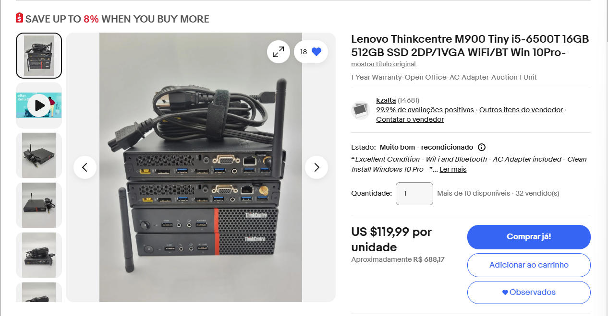
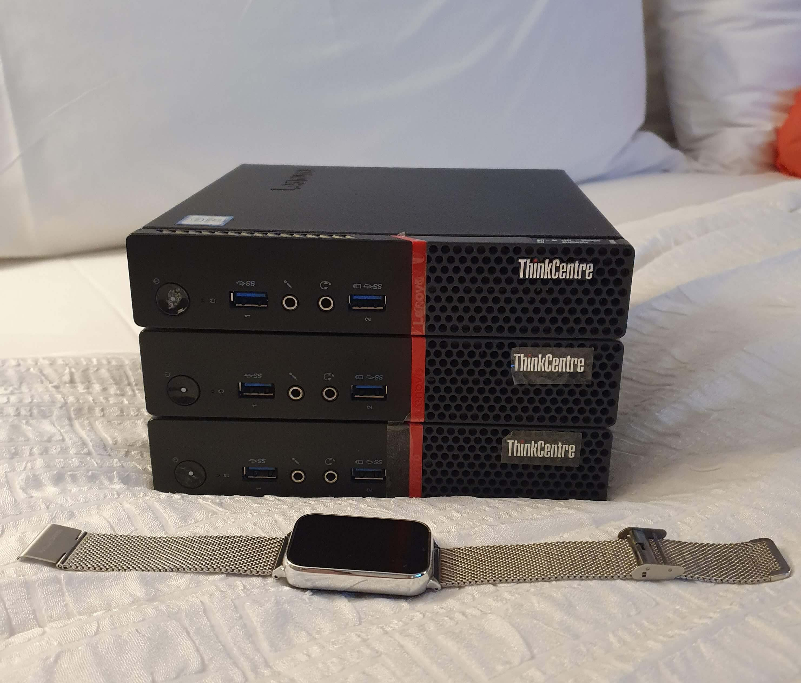
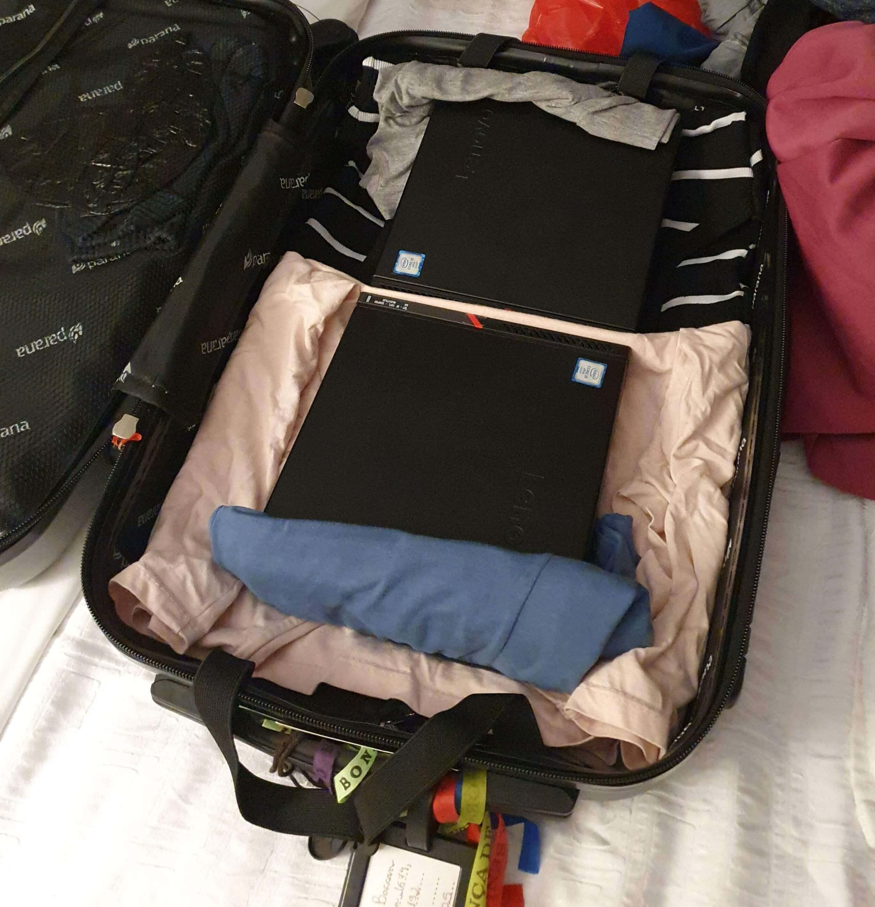

import Center from "@site/src/components/Center";

## Home Lab

Em 2024 eu e minha noiva fizemos uma viagem para o Canadá e Estados Unidos. Como todo bom turista, aproveitei e comprei alguns computadores usados para montar meu [Home Lab](/info/setup#home-lab).

<!-- truncate -->

## Viagem

Pegamos um pacote de 10 dias, e por ser a primeira viagem fora da América do Sul, optamos por passar em varias cidades. Nosso pacote começava em Montreal e terminava em Nova York. As cidade que passamos foram:

- Montreal, Canadá
- Quebec, Canadá
- Mont Tremblant, Canadá
- Ottawa, Canadá
- Toronto, Canadá
- Niagara Falls, Canadá
- Niagara Falls, EUA
- Corning, EUA
- Nova York, EUA

## Dinheiro

Para essa viagem, nós levamos um pouco de dinheiro em espécie, algo em torno de 300 dólares americanos, o que é pouco, mas o suficiente para emergências. O restante do dinheiro foi em cartão de débito, que usamos para pagar a maioria das coisas.

Minha noiva levou o cartão da [Nomad](https://www.nomadglobal.com/), que é um cartão de débito internacional, que estava cadastrado na carteira digital do celular dela. Eu levei o cartão do [Wise](https://wise.com/), que é um cartão de débito internacional, que também estava cadastrado na minha carteira digital, mas eles mandaram um cartão físico, que eu levei junto. Ambos os cartões converteram a moeda local para dólar americano, e a conversão foi feita no momento da compra.

Um ponto importante é que o bom de ter o cartão físico é que deu para sacar dinheiro em caixas eletrônicos (ATMs), pois iria precisar para pagar os computadores que queria.

## Ebay

Minha escolha para comprar os computadores foi o [Ebay](https://www.ebay.com/), pois lá tem muitos vendedores, então filtrei por vendedores na região de Nova York, pois era a última cidade que iria passar e entrei em contato com alguns vendedores.

Fiz o contato ainda no Brasil, falei que iria viajar, que ainda não tinha o nome do hotel, mas que tinha interesse, e começamos a negociar, ele fez $100.00 dólares cada. Ele pediu para eu chamar ele quando estivesse para chegar em Nova York, e assim fiz.

## Entrega

Por ter trocado de pais, não tinha ainda pego um chip de celular, então só conseguia me comunicar pelo Wi-Fi. Combinamos de realizar a entrega no hotel, eu passei o endereço e falei mais ou menos o horário que iria chegar. Porem o ônibus acabou atrasando, e quando chegamos, quando conectei no Wi-Fi, vi que o vendedor tinha mandado mensagem falando que estava já esperando e que se não chegasse em 30 minutos, iria embora.

Corri então pra rua a procura da placa do carro dele, estava a alguns metros do hotel, e quando cheguei, me apresentei e falei que tinha atrasado por conta do ônibus, ele me mostrou os computadores e entreguei o dinheiro a ele, depois ele comentou que pensou que poderia ser um golpe, que ninguém iria aparecer, pois eu era um estranho de outro país, que poderia só pregando uma peça nele.

## Computadores

Comprei 3 Lenovo [ThinkCentre M900 Tiny](/files/m900_tiny_platform_spec.pdf), que são computadores pequenos, que tem um processador [Intel i5-6500T](https://www.intel.com.br/content/www/br/pt/products/sku/88183/intel-core-i56500t-processor-6m-cache-up-to-3-10-ghz/specifications.html) - 4 núcleos / 4 threads (2.5 GHz / 3.1 GHz), 16 GB de RAM (1x16 GB) 2133 mhz (Um deles é 2x8 GB) e 512 GB NVMe (TeamGroup). A intenção é montar um cluster Proxmox com eles e depois montar um cluster Kubernetes.

## Viagem de volta

Na volta, coloquei os computadores na mala, no meio das roupas, para que não batessem e não quebrassem. Eles chegaram bem, e agora estão na minha mesa, esperando para serem configurados.

Chegando no Brasil, no aeroporto, fomos selecionados de forma aleatória para passar por uma revista, pediram o que tinha na mala, falei que eram 3 computadores, e nem pediram para abrir a mala. Foi mais tranquilo do que eu esperava.

:::info Nota
Você pode trazer 1000 dólares em produtos sem pagar imposto, e pode ter até 3 produtos iguai, então eu estava dentro da lei.
:::

## Conclusão

Várias vezes eu ficava pensando se iria dar certo ou não a compra, se iria ser enganado ou roubado, mas no final deu tudo certo, e isso não tirou o brilho da viagem que foi incrível. Deu para conhecer várias cidades, várias culturas e se divertir muito. Já estou ansioso para a próxima viagem.

