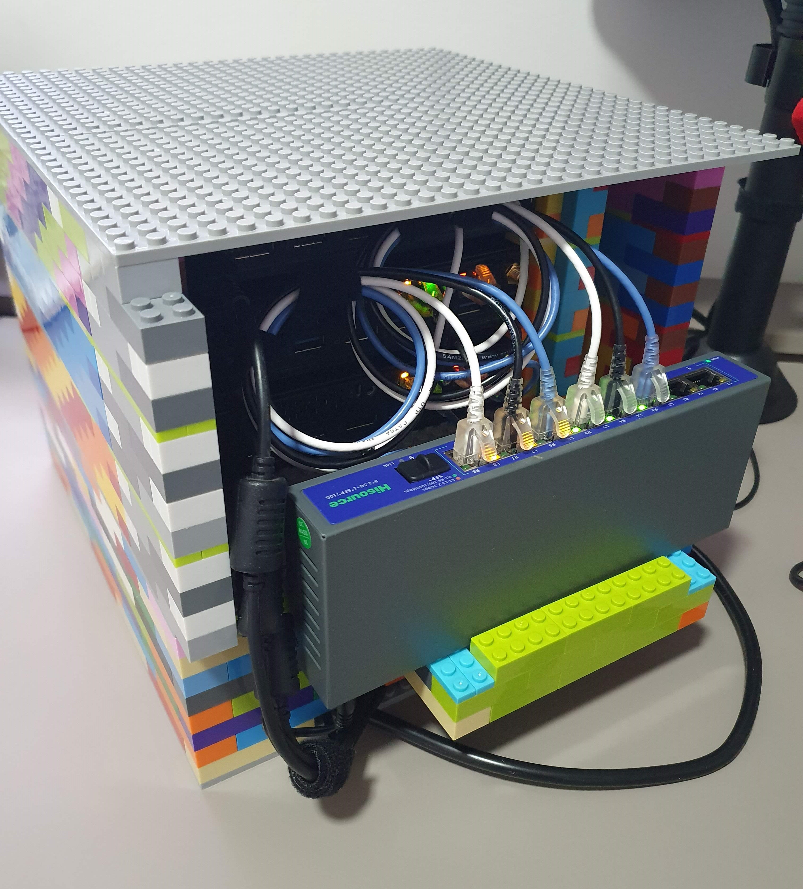

import Center from "@site/src/components/Center";

## Home Lab

No post [anterior](/blog/4), eu comentei que comprei alguns computadores para montar meu Home Lab. Agora quero dar uma atualização de como está o projeto e o que eu fiz até agora.

Eu comprei 3 unidades pensando em montar um cluster, para aprender mais sobre Kubernetes, alta disponibilidade, balanceamento de carga, etc. Para funcionar melhor, eu precisava fazer alguns upgrades, então fiz o seguinte:

<!-- truncate -->

## Upgrades

Depois de comprar, eu fiz algumas mudanças para atender melhor as minhas necessidades. O foco principal era ter um cluster de alta disponibilidade, então eu precisava de mais armazenamento e uma rede mais rápida entre os nós.

### Upgrade armazenamento

Logo que cheguei de viagem, uma das primeiras coisas que fiz foi adicionar mais armazenamento, tinha em casa já 3 SSDs SATA de 240GB Kingston, então coloquei um em cada, já que eles vieram com NVMe, assim o SSD SATA ficava como armazenamento pro host e o SSD NVMe para as maquinas virtuais/Ceph.

### Upgrade rede

Para melhorar a alta disponibilidade, eu precisava que a comunicação entre os nós fosse rápida, e o que estava dentro do orçamento era fazer upgrade para 2.5Gbps, isso iria ajudar com o armazenamento Ceph.

Nessas horas que o Aliexpress nos salva, la eu encontrei tudo que precisava, iria precisar de placas de rede, switch e cabos de rede.

  
[link](https://pt.aliexpress.com/item/1005004171201464.html)

A intenção seria trocar a placa wi-fi e colocar a nova placa de rede, assim os computadores iriam ter 2 placas de rede cabeada.

Além disso, eu precisa de um switch 2.5Gbps para poder fazer a comunicação entre os nós, então comprei um switch também que suporta 2.5Gbps.

[link](https://pt.aliexpress.com/item/1005006102676363.html)

E cabos de rede, e nesse item, minha preocupação era ter cabos finos e pequenos, e a opção que achei acabou sendo Cat6a, mas pelo tamanho, acredito que não importaria muito a categoria do cabo.

[link](https://pt.aliexpress.com/item/33026678139.html)

### Sistema operacional

Os computadores vieram com Windows 10, mas para criar um cluster, eu precisava de um sistema operacional que suportasse isso, então instalei o [Proxmox](https://proxmox.com/), que é um sistema operacional baseado em Debian, voltado para virtualização e gerenciamento de containers.

## Rack

Eu queria organizar os computadores de uma forma prática, então queria colocar eles em um rack, mas por causa do tamanho, é difícil achar um rack para mini computadores, então eu fiz uma versão caseira utilizando blocos de montar estilo Lego.

### Versão 1

Comprei 1000 peças misturadas, e fiz um suporte para os computadores.

  
[link](https://pt.aliexpress.com/item/1005006641465763.html)

Só que esse kit de 1000 peças não veio muitas peças grandes, teve varias que era finas ou 1x1, então não ficou como imaginava.

Essa versão só tinha as laterais, e sustentava cada computador, deixando um espaço entre eles, isso foi o que deu para fazer com as peças, pois o restante era muito pequenas.

### Versão 2

Pensando em melhorar o rack, comprei mais peças para fazer uma versão melhorada, e la vamos nós de novo para o Aliexpress.

  
2X - Placa 32x32 - [link](https://pt.aliexpress.com/item/1005006208979309.html)

  
4X - Placa 16x32 - [link](https://pt.aliexpress.com/item/1005006208979309.html)

  
200X - Blocos 2x4 - [link](https://pt.aliexpress.com/item/1005006264266270.html)

  
300X - Blocos 2x4 - [link](https://pt.aliexpress.com/item/1005006943625796.html)

  
100X - Blocos 2x6 - [link](https://pt.aliexpress.com/item/1005006220254389.html)

  
80X - Blocos 2x4 - Finos - Lisos - [link](https://pt.aliexpress.com/item/32963973002.html)

  
60X - Blocos 2x4 - Finos - [link](https://pt.aliexpress.com/item/1005003305079557.html)

No total foram mais 740 peças compradas, somadas com as 1000 que já tinha, totalizando peças mais do que suficiente para fazer o rack. Aproveitei as duas placas 32x32 para fazer uma caixa, onde tem um filtro de linha e a fonte dos computadores, essa parte é a que fica mais abaixo. No fundo, eu fiz um suporte para o switch. Essa parte fica aberta para poder mexer nos cabos e melhorar a ventilação.

  
Imagem da frente do rack

  
Imagem da lateral do rack

  
Imagem de trás do rack

## Custo / Investimento

Até o momento a conta do home lab está assim:

**Hardware**:

- 3 computadores: R$ 1.545,00 (R$ 545,00 cada / $100,00 cada cotação de R$ 5,15)
- 3 SSDs SATA: R$ 0,00 (Peças que já tinha em casa)
- 3 Placas de rede: R$ 276,53
- 1 Switch: R$ 306,88
- 6 Cabos de rede: R$ 56,89
- 1 Filtro de linha: R$ 0,00 (Peça que já tinha em casa)
- **Total**: R$ 2.185,20

**Rack**:

- 1000 peças aleatórias: R$ 101,71
- 2x Placas 32x32: R$ 48,80
- 4x Placas 16x32: R$ 64,56
- 200X Blocos 2x4: R$ 129,15
- 300X Blocos 2x4: R$ 156,48
- 100X Blocos 2x6: R$ 97,26
- 80X Blocos 2x4 finos e lisos: R$ 24,76
- 60X Blocos 2x4 finos: R$ 87,27
- **Total**: R$ 709,99

Total geral: R$ 2.895,19

Parece muito, mas uma maquina na AWS semelhante (t3a.xlarge / 4vCPU / 16GB RAM / 240GB SSD) custa cerca de $200,00 por mês, cerca de R$ 1.160,00 na cotação de hoje (R$ 5,80), isso para um nó. Então pra mim acabou sendo um bom custo-benefício, já que o cluster tem 3 nós, e ainda posso usar para outras coisas.

## Conclusão

Esse é o projeto até agora, ainda falta fazer algumas coisas, como por exemplo, colocar um cooler para melhorar a ventilação. Todo o conjunto tem 7Kg, e só precisa ligar 1 cabo de energia e 1 cabo de rede.

Estou contente com a evolução do projeto, aprendi muito até o momento e continuarei aprendendo mais.
