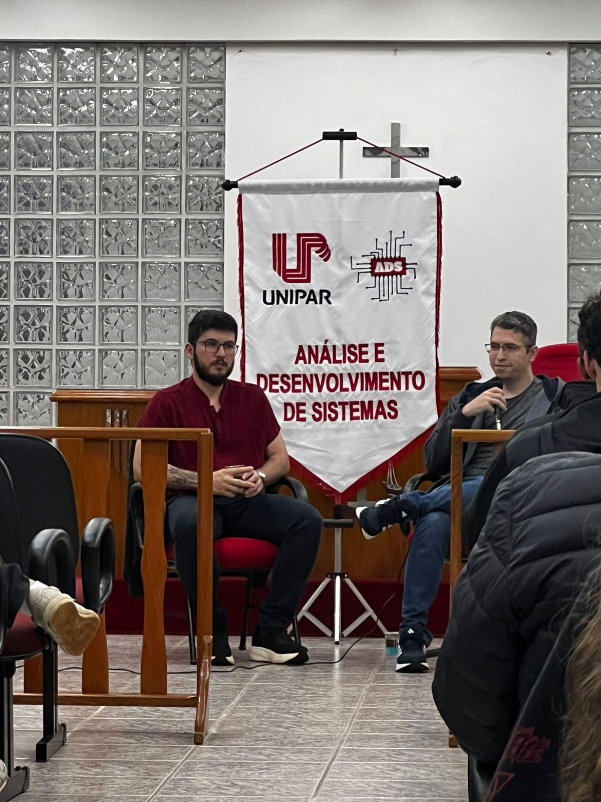
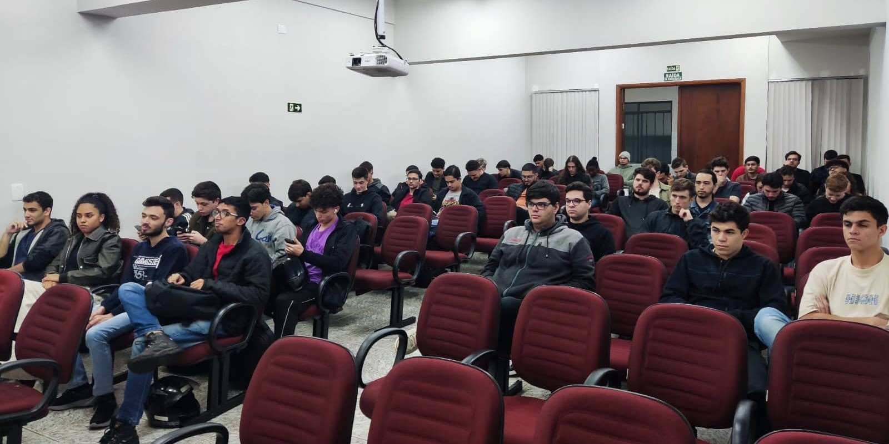
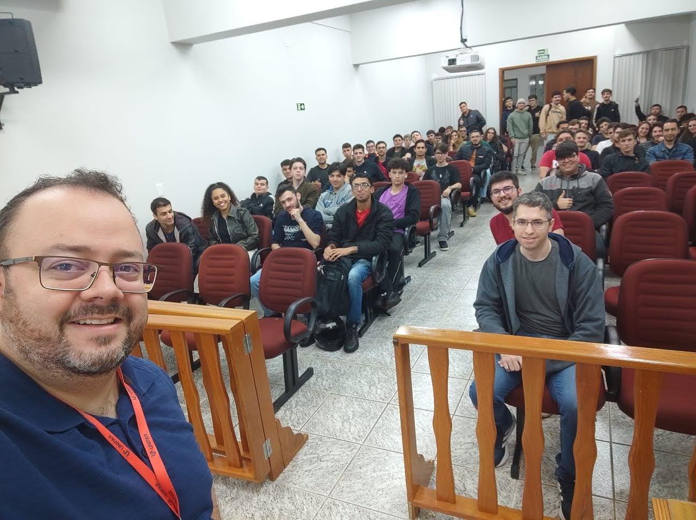

import Center from "@site/src/components/Center";

## Fórum de egressos

Eu fui convidado para participar do fórum de egressos do curso de Análise e Desenvolvimento de Sistemas da UNIPAR (Universidade Paranaense), campus de Toledo. Me formei lá em 2015, 10 anos atrás, bora relembrar essa história!

<!-- truncate -->

Matheus a esquerda e eu à direita no fórum de egressos

## Evento

Eu e o Matheus Gobo, amigo e colega de turma da pós graduação, fomos convidados para participar do evento e contar um pouco sobre nossas trajetórias profissionais após a graduação.

### Trajetórias

Ambos estamos atuando em empresas relacionadas a dinheiro, eu na Matera, que oferece serviços de core banking, e o Matheus na Asaas, Fintech de meios de pagamento.

Ambos estamos trabalhando de forma remota, mas atuamos em áreas diferentes, eu como DevOps e ele como desenvolvedor front-end.

### Acadêmicos

  
Acadêmicos presentes no fórum de egressos

As 3 turmas de ADS (Análise e Desenvolvimento de Sistemas) estavam presentes, e foi muito legal ver os alunos interessados em saber mais sobre o mercado de trabalho e as oportunidades na área de tecnologia.

Diversos alunos fizeram perguntas sobre como é começar na área, se é muito diferente do que é visto na faculdade, e como se preparar para o mercado de trabalho.

### Histórias

Nós conversamos sobre vários temas, tecnologias, carreira e até mesmo sobre a importância de se manter atualizado e aprender constantemente.

Falamos sobre o uso de IA no nosso dia a dia, quais tecnologias estamos utilizando, e como é trabalhar em empresas de tecnologia e dicas para quem está começando.

## Conclusão

Foi muito bom voltar á UNIPAR e ver que o curso de ADS está crescendo e formando profissionais capacitados para o mercado de trabalho. Poder contribuir um pouco com minha experiência foi gratificante, e espero que os alunos tenham aproveitado o evento tanto quanto eu.

Fica meu agradecimento ao Coordenador do Curso, Prof. Me. Fernando Botelho, por me convidar para participar desse momento especial.

  
#Sucesso #UNIPAR #Egressos #ADS #ToledoPR

