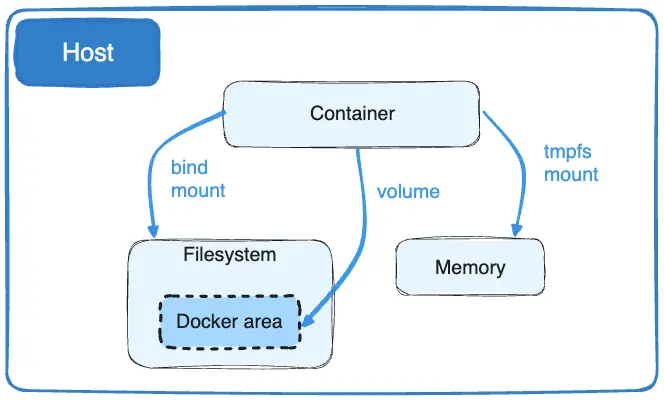

import Center from "@site/src/components/Center";
import Tabs from '@theme/Tabs';
import TabItem from '@theme/TabItem';

## Sumário

- 🎥 Day4 - Introdução ao Day4 - 03:01
- 🎥 Day4 - O que são volumes e seus tipos - 04:49
- 📖 O que são Volumes?
- 🎥 Day4 - Criando um volume do tipo Bind - 11:13
- 📖 Volumes do tipo Bind
- 🎥 Day4 - Gerenciando Volumes do tipo Volume - 14:17
- 📖 Volumes do tipo Volume
- 🎥 Day4 - Conhecendo outras formas de montar volumes e os Storage Drivers - 09:24
- 🎥 Day4 - Criando um Volume do tipo tmpfs - 03:55
- 🎥 Day4 - Encerramento do Day4 - 01:32
- 📝 Exame teórico do Day4 - 14 questões

**Legenda**  
🎥 - Aula gravada
📖 - Material complementar
📝 - Atividade

## Dia 4

Day 4 foi sobre volumes, onde aprendemos o que são volumes, os tipos de volumes, como criar volumes do tipo `Bind`, como gerenciar volumes do tipo `Volume`, outras formas de montar volumes e os Storage Drivers.

### O que são Volumes?

Volumes são mecanismos de persistência de dados no Docker. Eles são usados para armazenar dados gerados por containers, como logs, arquivos de configuração, bancos de dados, etc. Os volumes são independentes do ciclo de vida do container, ou seja, eles persistem mesmo após o container ser removido.

Existem três tipos de volumes no Docker:

- `Bind`: monta um diretório do host no container.
- `Volume`: cria um volume gerenciado pelo Docker.
- `tmpfs`: cria um volume na memória RAM.

<Center>

  
Fonte: [Docker](https://docs.docker.com/storage/volumes/)

</Center>

:::info
Existe a opção `--mount` que é mais flexível e recomendada para criar volumes. A opção `-v` ou `--volume` é mais antiga e menos flexível, mas ambos fazem a mesma coisa.

```bash
docker run -v /path/on/host:/path/on/container image
# ou
docker run --volume /path/on/host:/path/on/container image
# ou
docker run --mount type=bind,source=/path/on/host,target=/path/on/container image
```

O exemplo acima todos os comandos fazem a mesma coisa.
:::

### Volumes do tipo `Bind`

Volumes do tipo `Bind` são usados para montar um diretório do host no container. Eles são úteis para compartilhar arquivos entre o host e o container. Para criar um volume do tipo `Bind`, usamos a opção `-v` ou `--volume` seguida do caminho do diretório no host e do caminho do diretório no container.

```bash
docker run -v /path/on/host:/path/on/container image
# ou
docker run --volume /path/on/host:/path/on/container image
```

### Volumes do tipo `Volume`

Volumes do tipo `Volume` são usados para criar volumes gerenciados pelo Docker. Eles são úteis para armazenar dados de forma persistente e compartilhar dados entre containers. Para criar um volume do tipo `Volume`, usamos a opção `-v` ou `--volume` seguida do nome do volume.

```bash
# Criando um volume gerenciado pelo Docker
docker volume create volume_name
# ou
docker run -v volume_name:/path/on/container image
# ou
docker run --volume volume_name:/path/on/container image
```

### Volumes do tipo `tmpfs`

Volumes do tipo `tmpfs` são usados para criar volumes na memória RAM. Eles são úteis para armazenar dados temporários que não precisam ser persistidos. Para criar um volume do tipo `tmpfs`, usamos a opção `--tmpfs` seguida do caminho do diretório no container.

```bash
docker run --tmpfs /path/on/container image
```

:::warning
Volumes do tipo `tmpfs` são armazenados na memória RAM e não são persistidos. Eles são apagados quando o container é removido, reiniciado ou o Docker é reiniciado.
:::

### Inspecionando Volumes

Se fizemos a ligação de um volume do tipo `Bind` ou `Volume` com um container, podemos inspecionar o container para ver os volumes associados a ele. Dentro da saída do comando `docker inspect`, podemos ver a seção `Mounts` que mostra os volumes associados ao container.

```bash
docker inspect container_id
```

Podemos também inspecionar um volume para ver os detalhes dele. O comando `docker volume inspect` mostra informações sobre um volume, como o nome, o driver, o ponto de montagem, etc.

```bash
docker volume inspect volume_name
```
