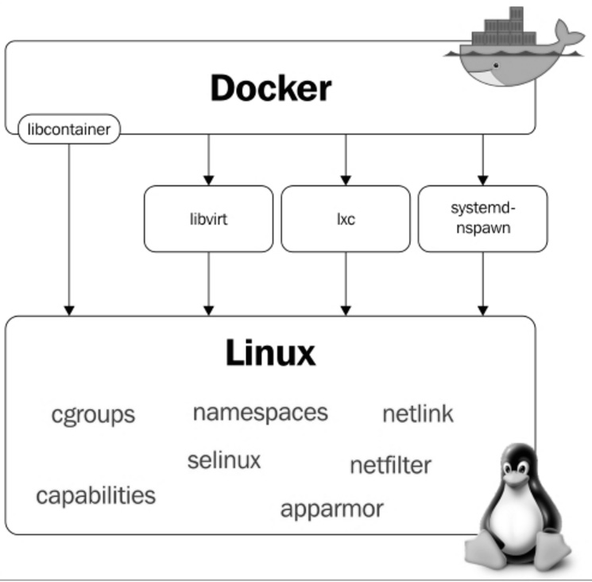

import Center from "@site/src/components/Center";

## Sumário

- 🎥 Day1 - O que iremos ver no dia de hoje? - 01:16
- 🎥 Day1 - O que é container? - 23:20
- 📖 O que é containers?
- 📖 O que é o Docker?
- 🎥 Day1 - Descomplicando Namespaces - 19:35
- 📖 Descomplicando Namespaces
- 🎥 Day1 - Descomplicando Cgroups - 25:24
- 🎥 Day1 - Copy-On-Write e como ele funciona - 12:04
- 📖 O Copy-On-Write
- 🎥 Day1 - O Docker e sua relação com o Kernel Linux - 03:46
- 📖 Docker Internals
- 🎥 Day1 - Instalando o Docker Engine no Linux - 17:17
- 📖 Instalando o Docker
- 🎥 Day1 - Criando e gerenciando os primeiros containers - 18:54
- 🎥 Day1 - Visualizando métricas e a utilização de recursos pelo containers - 13:38
- 🎥 Day1 - Visualizando e inspecionando imagens e containers - 12:19
- 🎥 Day1- Criando um container Dettached e o Docker exec - 19:00
- 📖 Criando e gerenciando nossos containers
- 🎥 Day1 - Encerramento do dia - 02:12
- 📝 Exame teórico do Day-1 - 7 questões
- ⌛ Hora de Refletir sobre a sua resposta no Day1 - 1 questões
- 🎥 Day1 - Desafio prático do Day1 - 01:08
- 📝 Day1 - Desafio
- ⌛ Seu diário - 2 questões

**Legenda**  
🎥 - Aula gravada
📖 - Material complementar
📝 - Atividade
⌛ - Revisão/Reflexão

## Dia 1

No primeiro dia, começamos falando sobre Docker e containers.

### O que é container?

Container ou LXC (Linux Containers), é uma forma de isolar os recursos para que um processo ou aplicação não interfira em outro. É uma forma de virtualização, mas diferente de uma VM, o container compartilha o mesmo kernel do host, e é mais leve e rápido.

Esse isolamento é feito sobre recursos como CPU, memória, rede, e disco, e é possível limitar o uso de cada recurso, e até mesmo fazer com que um container não tenha acesso a um recurso específico. Isso acontece também para os processos, onde um container não tem acesso a outro container, e não tem acesso ao host.

Tudo isso é feito através de cgroups e namespaces, chroot, que são funcionalidades do kernel do Linux, e que são utilizadas para isolar os recursos e processos.

- Namespace: Isola os processos, rede, usuários, processos, e outros recursos.
- Cgroups: Controla o uso de recursos como CPU, memória, rede, e disco.
- Chroot: Muda o diretório raiz do processo, para que ele não tenha acesso a outros diretórios.

O Docker não inventou o container, mas popularizou o uso de containers, e facilitou a criação e gerenciamento de containers, através de uma API e CLI, e de um formato de imagem, que é o Dockerfile. Antes do Docker, já existiam outras formas de criar containers, como o LXC, OpenVZ, Jails e Solaris Zones.

Em seguida o Jeferson faz uma demonstração prática de como que funciona o namespace, cgroups e chroot, e como que é possível isolar um processo em um container, isso tudo sem utilizar o Docker, apenas com comandos do Linux.

### Namespaces

```bash
apt-get update
apt-get install debootstrap -y
debootstrap stable /debian http://deb.debian.org/debian/
unshare --mount --uts --ipc --net --pid --fork --user --map-root-user chroot /debian /bin/bash
mount -t proc none /proc
mount -t sysfs none /sys
mount -t tmpfs none /dev
```

### Cgroups

```bash
# apt-get update
apt-get install cgroup-tools -y
cgcreate -g cpu,cpuacct,memory,blkio,devices,freezer:/giropops
ls /sys/fs/cgroup/cpu/giropops
cgclassify -g cpu,cpuacct,memory,blkio,devices,freezer:giropops <PID>
cat /sys/fs/cgroup/cpu/giropops/cgroup.procs
# Vai ter o PID do processo informado anteriormente
```

Limitar o uso de CPU

```bash
cat /sys/fs/cgroup/cpu/giropops/cpu.cfs_period_us
# 100000
cgset -r cpu.cfs_quota_us=1000 giropops
# 1000 é 1% de 100000
# Testar com dd
dd if=/dev/zero of=/catota.img bs=8k count 256k
```

Limitar o uso de memória

```bash
cat /sys/fs/cgroup/memory/giropops/memory.limit_in_bytes
# 9223372036854771712
cgset -r memory.limit_in_bytes=100m giropops
```

### Copy on Write

Agora o Jeferson explica o que é Copy on Write, que é uma técnica utilizada para otimizar o uso de disco, e que é utilizada em containers, e em sistemas de arquivos como o ZFS e BTRFS.
Essa técnica faz com que um arquivo seja copiado apenas quando ele é modificado, e não quando ele é lido, isso faz com que o uso de disco seja otimizado, e que a criação de containers seja mais rápida.

### Kernel (Docker internals)

Muitas das funcionalidades que o Docker utiliza, são funcionalidades do kernel do Linux, e por isso é importante manter o kernel atualizado, para ter acesso a novas funcionalidades, e correções de segurança. O Docker só é uma camada de abstração, e por baixo dele, está o kernel do Linux, que é quem faz o trabalho pesado.

<Center>



</Center>

### Instalação

O Docker é um software que roda em Linux, Windows e MacOS, e é possível instalar o Docker em cada um desses sistemas operacionais.

O site é https://docs.docker.com/get-docker/

```bash
curl -fsSL https://get.docker.com | bash
```

### Criar e gerenciar containers

```bash
docker container run -it ubuntu
```

Isso faz rodar um container do Ubuntu, e abrir um terminal interativo. Mas se você sair do terminal, o container é encerrado.

Com o container rodando, você pode sair do terminal sem encerrar o container, com `Ctrl + P + Q`.

Para voltar ao terminal do container, você pode usar o comando `docker container attach <ID>`. Para ver o ID do container, você pode usar o comando `docker container ls`.

Você pode nomear um container com o comando `docker container run --name <NOME> -it ubuntu`. Nesse caso, você pode usar o nome ao invés do ID para gerenciar o container, `docker container attach <NOME>`.

Você pode iniciar um container que foi parado com o comando `docker container start <ID>`. E você pode parar um container com o comando `docker container stop <ID>` ou pause com `docker container pause <ID>`. O pouse é diferente do stop, pois o container continua rodando, mas sem consumir recursos, enquanto o stop encerra o container. Para continuar um container pausado, você pode usar o comando `docker container unpause <ID>`. Para remover um container, você pode usar o comando `docker container rm <ID>`.

Você pode apagar todos os containers parados com o comando `docker container prune`.

### Metricas e utilização de recursos

```bash
docker container stats
# ou para não prender o terminal
docker container stats --no-stream
```

Você pode utilizar o `docker container top <ID>` para ver os processos que estão rodando dentro do container.

### Logs

```bash
docker container logs <ID>
# ou para ver em tempo real
docker container logs -f <ID>
# ou para ver os logs das ultimas 10 linhas
docker container logs --tail 10 <ID>
```

### Visualizar imagens e inspecionar containers

A image é o template, e o container é a instância da imagem. A imagem é somente leitura, e o container é a instância que pode ser modificada.

```bash
docker image ls
# ou na versão antiga
docker images
```

Você pode inspecionar um container com o comando `docker container inspect <ID>`. Isso mostra todas as informações do container, como o IP, volumes, variáveis de ambiente, e outros.

### Detached / Deattached / Daemon / Background

Você consegue rodar um container em background com o comando `docker container run -d nginx`. Isso faz com que o container rode em background, e você pode continuar usando o terminal.

Você pode entrar no container com o comando `docker container exec -it <ID> bash`. Isso faz com que você entre no container, e possa rodar comandos dentro do container. Vale lembrar que o container precisa ter o bash instalado.

### Baixar imagens

```bash
docker image pull nginx
# ou
docker pull nginx
```

### Quiz

Com o final da aula, tem um quiz para testar o conhecimento adquirido.

## Desafio

O desafio é feito dentro da plataforma "Instruqt". Ao clicar no link do desafio, já aparece a página para a atividade.

### Objetivos

1. Instalando o Docker no Linux

Você precisa instalar o Docker no servidor Linux da LINUXtips!
Quando finalizar, clica em Check .

2. Executando o nosso primeiro container!

Sem nenhum segredo, apenas coloque o Nginx para rodar! Lembre-se, ele deve rodar na porta 80 do container e do Servidor da LINUXtips.

Você tem duas abas, uma do Terminal Linux e outra com o Navegador!

Quando finalizar, clica em Check .

### Solução

1. Instalando o Docker no Linux

```bash
curl -fsSL https://get.docker.com | bash
docker container run -it ubuntu
```

2. Executando o nosso primeiro container!

```bash
docker container run -d -p 80:80 nginx
```
