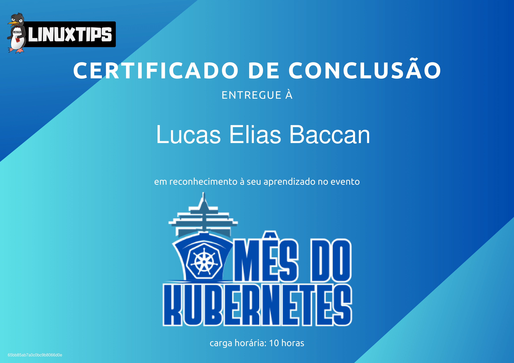
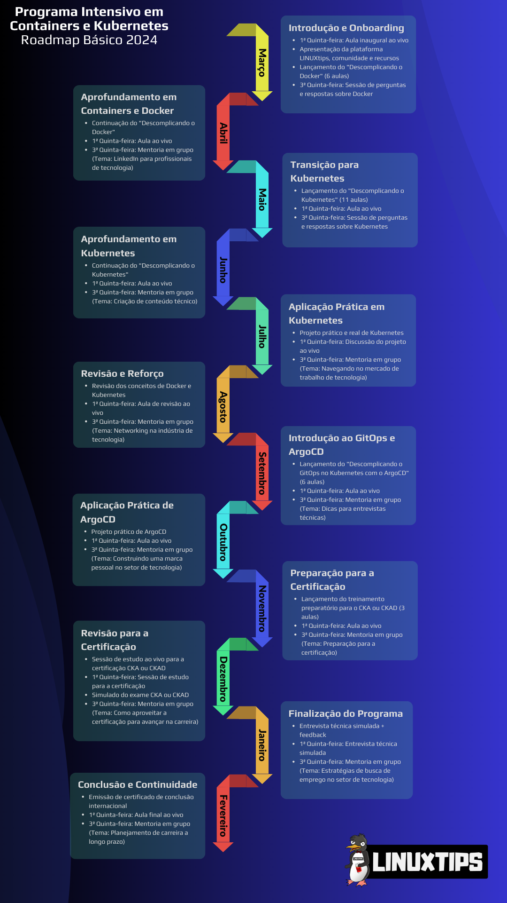

import Center from "@site/src/components/Center";

:::info

<!-- https://web.archive.org/web/20240315000857/https://www.linuxtips.io/pick -->

**Link do curso**: [https://www.linuxtips.io/pick](https://www.linuxtips.io/pick)  
**Preço**: R$ 4.548,00 - 12x de R$ 379,00  
**Instrutor**: [Jeferson Fernando](https://www.youtube.com/@linuxtips)
:::

:::caution Requer autenticação
**Link aluno**: [https://www.linuxtips.io/course/programa-intensivo-em-containers-e-kubernetes-2024](https://www.linuxtips.io/course/programa-intensivo-em-containers-e-kubernetes-2024)
:::

## Descrição

Acompanho o Jeferson Fernando a muito tempo, comecei pelos videos no YouTube sobre Docker e daquele momento em diante, sempre que posso, assisto os videos dele. Eu me inscrevi no curso Pick 2024 após o curso gratuito de Kubernets que ele fez pelo YouTube em Janeiro de 2024.

## Roadmap

O curso tem duração de 12 meses e o roadmap é o seguinte:

## Meu progresso

Vou utilizar o esse site mesmo para registrar meu progresso no curso. Ele está dividido em dias, assim como o curso. Você pode ver o progresso no menu [lateral](/cursos/pick-2024/).

## Updates

**07/03/2024** - As aulas ao vivo eram para ser as quintas-feiras, mas como tem alguns alunos de fora do Brasil, as aulas passaram a ser aos sábados, das 09h as 10h.
