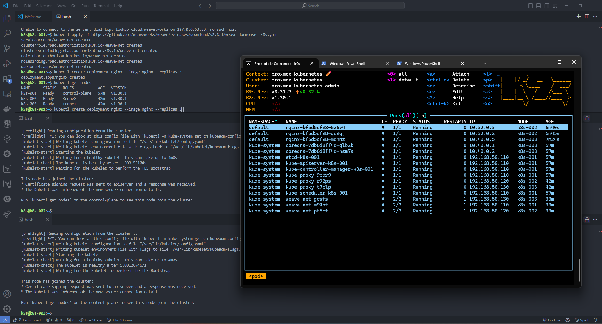

import Center from "@site/src/components/Center";

## Sumário

- 🎥 Intro Day-5 - 02:16
- 📖 O que iremos ver hoje?
- 🎥 O que é um cluster Kubernetes? - 06:22
- 📖 O que é um cluster Kubernetes?
- 🎥 Diferentes formas de instalar um cluster Kubernetes - 09:08
- 📖 Formas de instalar o Kubernetes
- 🎥 Recomendações para criar um cluster Kubernetes - 05:43
- 📖 Recomendações antes de começar
- 🎥 Criando as instâncias para o nosso cluster - 06:44
- 🎥 Configurando os nossos nodes - 09:53
- 📖 Configurando os nossos nodes
- 🎥 Instalando e configurando o Containerd - 09:40
- 📖 Instalando o containerd
- 📖 Configurando as portas
- 🎥 Inicializando o nosso cluster e o admin.conf - 12:12
- 📖 Inicializando o cluster
- 🎥 Adicionando os outros nodes e o que é CNI - 14:50
- 📖 Adicionando os outros nodes e o que é CNI
- 🎥 Visualizando mais informações sobre os nodes - 05:25
- 📖 Visualizando detalhes dos nodes
- 🎥 Encerramento Day-5 - 01:46
- 📖 Encerramento Day-5

**Legenda**  
🎥 - Aula gravada
📖 - Material complementar

## Dia 5

O dia 5 do curso de Kubernetes é focado em como criar um cluster Kubernetes do zero. Vamos aprender sobre as diferentes formas de instalar um cluster Kubernetes, as recomendações antes de começar, como criar as instâncias para o nosso cluster, configurar os nossos nodes, instalar e configurar o Containerd, inicializar o nosso cluster e o admin.conf, adicionar os outros nodes e o que é CNI, visualizar mais informações sobre os nodes e muito mais.

### O que é um cluster Kubernetes?

Um cluster é um conjunto de máquinas que trabalham juntas para executar aplicações e serviços. O Kubernetes é um sistema open-source que automatiza a implantação, o dimensionamento e a gestão de aplicações em contentores.

Um cluster Kubernetes é composto por um conjunto de máquinas virtuais ou físicas que são chamadas de nodes. Existem dois tipos de nodes: os nodes master e os nodes worker. Os nodes master são responsáveis por gerenciar o cluster e os nodes worker são responsáveis por executar as aplicações.

O cluster tem dois tipos de nós:

- `Control Plane`: é responsável por gerenciar o cluster. Ele é composto por vários componentes, como o `kube-apiserver`, `etcd`, `kube-scheduler`, `kube-controller-manager`, `cloud-controller-manager` e `dns`. Ele é responsável por manter o estado do cluster e por tomar decisões sobre o que deve ser feito. Criar recursos, como pods, deployments, services, etc.

- `Worker Nodes`: são responsáveis por executar as aplicações. Eles são compostos por vários componentes, como o `kubelet`, `kube-proxy`, `container runtime` e `CNI`.

### Formas de instalar o Kubernetes

Existem várias formas de instalar o Kubernetes, como:

- `kubeadm`: é uma ferramenta que ajuda a criar um cluster Kubernetes. Ele é usado para inicializar o cluster, adicionar nodes ao cluster e gerenciar o ciclo de vida do cluster.
- `kube-spray`: é uma ferramenta que ajuda a criar, gerenciar e atualizar clusters Kubernetes em qualquer lugar.
- _Cloud Providers_: Os provedores de cloud como AWS, GCP, Azure, etc, Eles oferecem serviços gerenciados (ou não) de Kubernetes.
- `kops`: é uma ferramenta que ajuda a criar, gerenciar e atualizar clusters Kubernetes.
- `minikube`: é uma ferramenta que ajuda a criar um cluster Kubernetes local.
- `kind`: é uma ferramenta que ajuda a criar um cluster Kubernetes local usando containers Docker.

### Recomendações antes de começar

Antes de começar a criar um cluster Kubernetes, é importante ter em mente algumas recomendações, como:

- Sistema operacional: Linux
- 2 CPUs - (Mínimo)
- 2GB de RAM (worker nodes) / 4GB de RAM (master nodes) - (Mínimo)
- 20GB de disco (Mínimo)
- 1 IP
- Portas abertas: 2379-2380, 6443, 10250-10259, 30000-32767
  - 2379-2380: etcd
  - 6443: kube-apiserver
  - 10250: kubelet
  - 10251: kube-scheduler
  - 10252: kube-controller-manager
  - 10255: read-only Kubelet API
  - 10256: Kube Proxy
  - 30000-32767: NodePort Services

### Configurando os nossos nodes

Eu utilizei meu antigo [notebook](/info/setup#notebook), coloquei outro HD para não perder o SO que tenho nele e instalei o Proxmox para criar as máquinas virtuais. Criei 3 maquinas virtuais com as seguintes configurações:

- 2 CPUs
- 4GB de RAM
- 20GB de disco
- Ubuntu 24.04

Depois que elas ligaram, eu configurei o IP de cada para facilitar o acesso.

Copiei a chave SSH publica da minha máquina para as máquinas virtuais para facilitar o acesso.

```bash
ssh-copy-id k8s@192.168.50.110
ssh-copy-id k8s@192.168.50.120
ssh-copy-id k8s@192.168.50.130
```

O IP utilizado foi o IP interno da minha rede local, você deve utilizar o IP da sua rede.

Agora vamos a algumas configurações que precisamos fazer em todas as máquinas.

```bash
# Desabilitar o swap
sudo swapoff -a

# Criar o arquivo de modulos que vamos precisas para o Kubernetes
sudo touch /etc/modules-load.d/k8s.conf
# Adicionar os modulos
echo "overlay" | sudo tee -a /etc/modules-load.d/k8s.conf
echo "br_netfilter" | sudo tee -a /etc/modules-load.d/k8s.conf
# Verificar se os modulos foram adicionados
cat /etc/modules-load.d/k8s.conf
# Carregar os modulos
sudo modprobe overlay
sudo modprobe br_netfilter

# Configurações para o kernel
sudo touch /etc/sysctl.d/k8s.conf
echo "net.bridge.bridge-nf-call-iptables = 1" | sudo tee -a /etc/sysctl.d/k8s.conf
echo "net.bridge.bridge-nf-call-ip6tables = 1" | sudo tee -a /etc/sysctl.d/k8s.conf
echo "net.ipv4.ip_forward = 1" | sudo tee -a /etc/sysctl.d/k8s.conf
# Verificar se as configurações foram adicionadas
cat /etc/sysctl.d/k8s.conf
# Carregar as configurações
sudo sysctl --system

# Baixar os updates do sistema
sudo apt update
# Instalar 'apt-transport-https' e 'curl'
sudo apt install -y apt-transport-https curl

# Adicionar o repositório do Kubernetes
# https://kubernetes.io/docs/tasks/tools/install-kubectl-linux/#install-using-native-package-management
curl -fsSL https://pkgs.k8s.io/core:/stable:/v1.30/deb/Release.key | sudo gpg --dearmor -o /etc/apt/keyrings/kubernetes-apt-keyring.gpg
sudo chmod 644 /etc/apt/keyrings/kubernetes-apt-keyring.gpg

echo 'deb [signed-by=/etc/apt/keyrings/kubernetes-apt-keyring.gpg] https://pkgs.k8s.io/core:/stable:/v1.30/deb/ /' | sudo tee /etc/apt/sources.list.d/kubernetes.list
sudo chmod 644 /etc/apt/sources.list.d/kubernetes.list

# Instalar o kubelet, kubeadm e kubectl
sudo apt update
sudo apt install -y kubelet kubeadm kubectl
# Marcar as versões para não serem atualizadas
sudo apt-mark hold kubelet kubeadm kubectl
```

### Instalando e configurando o Containerd

Agora vamos instalar o Containerd, que é o container runtime que vamos utilizar no nosso cluster.

```bash
# Adicionar o repositório do Containerd
sudo apt update
sudo apt install -y software-properties-common gnupg lsb-release ca-certificates

# Instalar o Containerd
# https://docs.docker.com/engine/install/ubuntu/#install-using-the-repository
sudo install -m 0755 -d /etc/apt/keyrings
sudo curl -fsSL https://download.docker.com/linux/ubuntu/gpg -o /etc/apt/keyrings/docker.asc
sudo chmod a+r /etc/apt/keyrings/docker.asc
echo \
  "deb [arch=$(dpkg --print-architecture) signed-by=/etc/apt/keyrings/docker.asc] https://download.docker.com/linux/ubuntu \
  $(. /etc/os-release && echo "$VERSION_CODENAME") stable" | \
  sudo tee /etc/apt/sources.list.d/docker.list > /dev/null
sudo apt-get update

sudo apt-get install -y containerd.io
```

Agora vamos configurar o Containerd.

```bash
# Criar arquivo de configuração
sudo containerd config default | sudo tee /etc/containerd/config.toml

# Ativar o cgroup (SystemdCgroup = true)
sudo sed -i 's/SystemdCgroup = false/SystemdCgroup = true/g' /etc/containerd/config.toml

# Reiniciar o Containerd
sudo systemctl restart containerd
sudo systemctl enable containerd

# Ativar o kubelet
sudo systemctl enable --now kubelet
```

### Inicializando o nosso cluster e o admin.conf

Agora vamos inicializar o nosso cluster. Essa etapa deve ser feita apenas no control plane. Que é a máquina que vamos utilizar para gerenciar o cluster.

```bash
# Inicializar o cluster
sudo kubeadm init --pod-network-cidr=10.10.0.0/16 --apiserver-advertise-address=192.168.50.110
# --pod-network-cidr é o range de IPs que vamos utilizar para os pods
# --apiserver-advertise-address é o IP do control plane

# Copiar o admin.conf para o usuário k8s
mkdir -p $HOME/.kube
sudo cp -i /etc/kubernetes/admin.conf $HOME/.kube/config
sudo chown $(id -u):$(id -g) $HOME/.kube/config
```

### Adicionando os outros nodes e o que é CNI

Agora vamos adicionar os outros nodes ao cluster. Para isso, vamos utilizar o comando `kubeadm join`.

```bash
# Adicionar os outros nodes, essa linha foi gerada no final do comando 'kubeadm init'
sudo kubeadm join 192.168.50.110:6443 --token i3jsll.4skj9heg68uieeyi --discovery-token-ca-cert-hash sha256:833e2bc98badb074253dea750f16ecb81cd859e88be044f0ae155c0758e35190
```

Se rodarmos no nosso `control plane` o comando `kubectl get nodes`, vamos ver agora os outros nodes no cluster.

```bash
NAME      STATUS     ROLES           AGE   VERSION
k8s-001   NotReady   control-plane   15m   v1.30.1
k8s-002   NotReady   <none>          51s   v1.30.1
k8s-003   NotReady   <none>          44s   v1.30.1
```

Agora vamos instalar o CNI, que é o Container Network Interface. Ele é responsável por fornecer a rede para os pods. Rode o comando abaixo no `control plane`.

```bash
# Instalar o CNI, weaveworks é o CNI que vamos utilizar
kubectl apply -f https://github.com/weaveworks/weave/releases/download/v2.8.1/weave-daemonset-k8s.yaml
```

Para testar, podemos subir um pod de teste.

```bash
# Subir um pod de teste
kubectl create deployment nginx --image nginx --replicas 3
```

### Visualizando mais informações sobre os nodes

Podemos visualizar mais informações sobre o cluster e os nodes utilizando o comando `kubectl get nodes -o wide`.

```bash
# Visualizar mais informações sobre os nodes
kubectl get nodes -o wide
# Ver informações sobre os nodes
kubectl describe node k8s-001
kubectl describe node k8s-002
```

### Encerramento Day-5

O resultado final ficou assim:

<Center>

  
Cluster Kubernetes

</Center>
