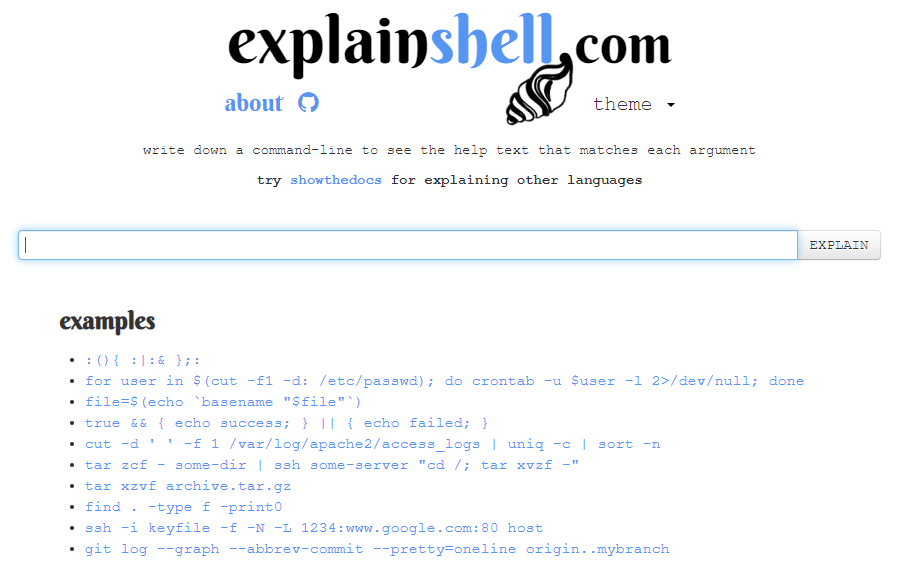
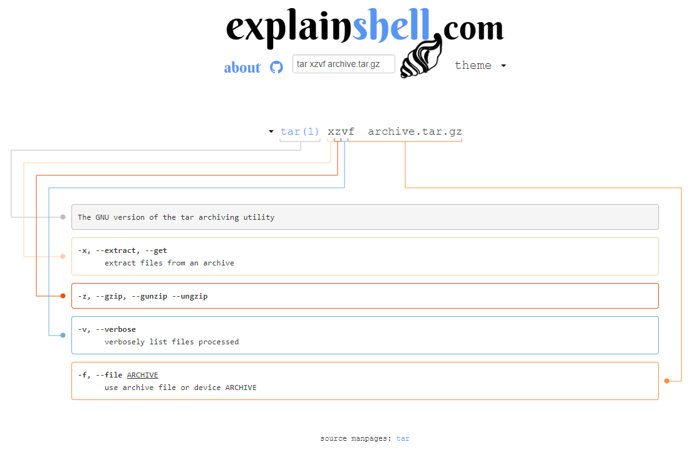

:::tip LINK
**LINK:** [https://explainshell.com/](https://explainshell.com/)
:::

## Sobre

O [explainshell.com](https://explainshell.com/) é um site que explica o que cada comando do terminal faz, ele é muito útil para quem está começando a utilizar o terminal e não sabe o que cada comando faz.

  

## Como utilizar

Na tela inicial do site, já tem uma lista de exemplos de comandos, basta clicar em um deles para ver a explicação ou digitar um comando no campo de busca.

### Exemplo

Se colocarmos o comando `tar xzvf archive.tar.gz` no campo de busca, o site irá mostrar o que cada parâmetro faz. O exemplo abaixo pode ser visto no site no link a seguir:
  - [https://explainshell.com/explain?cmd=tar%20xzvf%20archive.tar.gz](https://explainshell.com/explain?cmd=tar%20xzvf%20archive.tar.gz)

Então explore as opções sem medo, pega aquele comando que você não sabe o que faz e coloca lá para ver a explicação. Boa sorte!