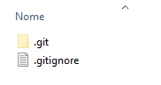
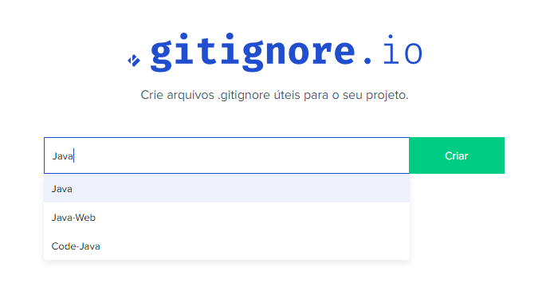
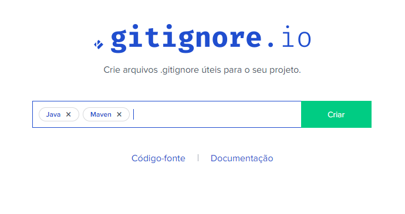

:::tip LINK
**LINK:** [https://gitignore.io/](https://gitignore.io/)
:::

## Git e .gitignore

Quando criamos um novo projeto, é uma boa pratica utilizar uma ferramenta de gerenciamento de código, a mais utilizada atualmente é o [Git](https://git-scm.com/). Quando rodamos `git ini`, é criado uma pasta **.git** e se inicia o processo de versionamento. Além desta pasta, podemos criar um arquivo **.gitignore**, do qual informamos quais arquivos e diretórios **não** queremos que o [Git](https://git-scm.com/) gerencie.

A forma que o Git utiliza para controlar quais arquivos ele **não** deve controlar é utilizando um arquivo **.gitignore**. Este arquivo deve ficar na raiz do projeto.

<div style={{textAlign: 'center'}}>

  

</div>

## Como utilizar


Utilizo o site [https://gitignore.io/](https://gitignore.io/) para gerar o arquivo **.gitignore**, basta informar qual a linguagem ou tecnologias que utiliza no site e gerar um arquivo com as configurações.

<div style={{textAlign: 'center'}}>



</div>

O site gera um arquivo semelhante ao abaixo, nele contem varias configurações para evitar arquivos da linguagem **java**.

```bash title=".gitignore" showLineNumbers={true}
# Created by https://www.toptal.com/developers/gitignore/api/java
# Edit at https://www.toptal.com/developers/gitignore?templates=java

### Java ###
# Compiled class file
*.class

# Log file
*.log

# BlueJ files
*.ctxt

# Mobile Tools for Java (J2ME)
.mtj.tmp/

# Package Files #
*.jar
*.war
*.nar
*.ear
*.zip
*.tar.gz
*.rar
```

### Exemplo de múltiplas linguagens

O site contem diversas opções, e você pode juntar mais de uma opção ao mesmo tempo.

<div style={{textAlign: 'center'}}>



</div>

Então explore as opções sem medo, aposto que vai achar uma solução para seu projeto. Boa sorte!
