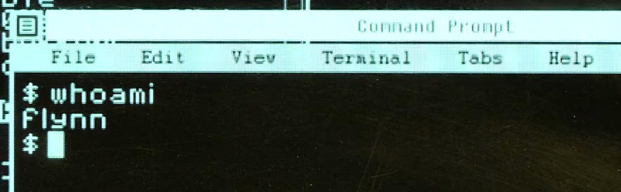

:::tip LINK
**LINK:** [https://www.linux.org/](https://www.linux.org/)
:::

## Sumário

- [Introdução](#introdução)
- [Manipulação de arquivos e diretórios](#manipulação-de-arquivos-e-diretórios)
- [Comandos do sistema](#comandos-do-sistema)
- [Manipulação de processos](#manipulação-de-processos)

## Introdução

Quando falamos de servidores, a grande maioria roda Linux. Por isso, é importante saber como funciona o sistema operacional e seus comandos.

Uma forma fácil de aprender é através do [copy.sh](https://copy.sh/v86/?profile=linux26), um emulador de Linux que roda no navegador, então você pode testar os comandos sem precisar instalar nada.

Além disso, utilize **Cheatsheets** para consultar os comandos mais utilizados, aqui abaixo temos alguns exemplos:

- [Lista 1](https://cheatography.com/davechild/cheat-sheets/linux-command-line/)
- [Lista 2](https://www.linuxtrainingacademy.com/linux-commands-cheat-sheet/)
- [Lista 3](https://www.guru99.com/linux-commands-cheat-sheet.html)

:::note Importante
Abaixo você pode encontrar alguns comandos básicos para começar a utilizar o Linux, nos exemplos você pode ver o comando e em que pasta ele foi executado.

```bash title="Pasta em que o comando foi executado"
Comando que foi executado
```

:::

:::tip Dica
Os comandos abaixo são um pequeno resumo dos comandos mais utilizados, para mais informações, busque o manual do comando.

```bash
comando --help
```

Exemplo:

```bash
ls --help
```

:::

## Distribuições Linux

Existem diversas distribuições Linux, cada uma com suas características e peculiaridades. Algumas das mais populares são:

- [Ubuntu](https://ubuntu.com/)
- [Debian](https://www.debian.org/)
- [Fedora](https://getfedora.org/pt_BR/)
- [Arch Linux](https://www.archlinux.org/)
- [Manjaro](https://manjaro.org/)
- [CentOS](https://www.centos.org/)
- [Red Hat](https://www.redhat.com/pt-br)

Cada uma delas tem seu próprio gerenciador de pacotes, que é um programa que gerencia a instalação, remoção e atualização de programas. Alguns exemplos são:

- [apt](https://wiki.debian.org/pt-br/Apt)
- [yum](https://access.redhat.com/documentation/en-us/red_hat_enterprise_linux/6/html/deployment_guide/s1-yum)
- [pacman](https://wiki.archlinux.org/index.php/Pacman)
- [dnf](https://dnf.readthedocs.io/en/latest/)
- [zypper](https://en.opensuse.org/SDB:Zypper_manual)

Então antes de trabalhar com um servidor Linux, é importante saber qual distribuição está sendo utilizada e qual é o gerenciador de pacotes e em que versão está instalado.

## Manipulação de arquivos e diretórios

Vamos ver alguns comandos para começar a mexer no Linux, começando pela manipulação de arquivos e diretórios.

O sistema de arquivos do Linux segue uma hierarquia, onde o diretório raiz é representado por `/`, e todos os outros diretórios são filhos dele. Todos os arquivos e diretórios são organizados em uma árvore, onde cada nó é um diretório e cada folha é um arquivo. Vamos ver alguns comandos para manipular os arquivos e diretórios.

### `ls` - Lista os arquivos e pastas do diretório atual

Você pode usar o comando `ls` para listar os arquivos e pastas do diretório atual. Por exemplo, se você estiver no diretório `/home/usuario`, ao executar o comando `ls` irá listar todos os arquivos e pastas do diretório `/home/usuario`.

```bash title="/home/usuario"
ls
```

Mas você pode listar os arquivos e pastas de outros diretórios, basta passar o caminho do diretório como parâmetro do comando `ls`. Por exemplo, se você quiser listar os arquivos e pastas do diretório `/home/usuario/Documentos`, basta executar o comando `ls /home/usuario/Documentos`, mesmo que você não esteja no diretório `/home/usuario/Documentos`.

```bash title="/home"
ls /home/usuario/Documentos
```

:::note Argumentos

- `-a` - Lista todos os arquivos e pastas, inclusive os que começam com `.` (ponto).
- `-l` - Lista os arquivos e pastas com mais detalhes.
- `-h` - Lista os arquivos e pastas com o tamanho em formato legível.

Exemplo:

```bash
ls -lah
```

:::

### `cd` - Muda o diretório atual

Você pode usar o comando `cd` para mudar o diretório atual. Por exemplo, se você estiver no diretório `/home/usuario` e quiser mudar para o diretório `/home/usuario/Documentos`, basta executar o comando `cdDocumentos` ou `cd /home/usuario/Documentos`.

```bash title="/home/usuario"
cd Documentos
```

Essa é a forma mais simples de usar o comando `cd`, utilizando os caminhos relativos. Mas você pode usar caminhos absolutos, como no exemplo abaixo:

```bash title="/home"
cd /home/usuario/Documentos
```

### `pwd` - Mostra o diretório atual

Você pode usar o comando `pwd` para mostrar o diretório atual. Por exemplo, se você estiver no diretório `/home/usuario/Documentos`, ao executar o comando `pwd` irá mostrar o caminho `/home/usuario/Documentos`.

```bash
pwd
```

### `mkdir` - Cria um diretório

Você pode usar o comando `mkdir` para criar um diretório. Por exemplo, se você estiver no diretório `/home/usuario/Documentos` e quiser criar um diretório chamado `Projetos`, basta executar o comando `mkdir Projetos`.

```bash title=/home/usuario/Documentos
mkdir Projetos
```

### `touch` - Cria um arquivo

Você pode usar o comando `touch` para criar um arquivo. Por exemplo, se você estiver no diretório `/home/usuario/Documentos` e quiser criar um arquivo chamado `README.md`, basta executar o comando `touch README.md`.

```bash title=/home/usuario/Documentos
touch README.md
```

### `cat` - Mostra o conteúdo de um arquivo

Você pode usar o comando `cat` para mostrar o conteúdo de um arquivo. Por exemplo, se você estiver no diretório `/home/usuario/Documentos` e quiser mostrar o conteúdo do arquivo `README.md`, basta executar o comando `cat README.md`.

```bash title=/home/usuario/Documentos
cat README.md
```

Esse comando é muito útil para mostrar o conteúdo de arquivos sem abrir um editor de texto.

### `cp` - Copia um arquivo ou diretório

Você pode usar o comando `cp` para copiar um arquivo ou diretório. Por exemplo, se você estiver no diretório `/home/usuario/Documentos` e quiser copiar o arquivo `README.md` para o diretório `Projetos`, basta executar o comando `cp README.md Projetos`.

```bash title=/home/usuario/Documentos
cp README.md Projetos
```

Caso você queira copiar um diretório, basta adicionar o argumento `-r` (recursivo).

```bash title=/home/usuario/Documentos
cp -r Projetos Projetos2
```

### `mv` - Move um arquivo ou diretório / Renomeia um arquivo ou diretório

Você pode usar o comando `mv` para mover um arquivo ou diretório. Por exemplo, se você estiver no diretório `/home/usuario/Documentos` e quiser mover o arquivo `README.md` para o diretório `Projetos`, basta executar o comando `mv README.md Projetos`.

```bash title=/home/usuario/Documentos
mv README.md Projetos
```

Caso você queira mover um diretório, basta adicionar o argumento `-r` (recursivo).

```bash title=/home/usuario/Documentos
mv -r Projetos Projetos2
```

### `rm` - Remove um arquivo ou diretório

Você pode usar o comando `rm` para remover um arquivo ou diretório. Por exemplo, se você estiver no diretório `/home/usuario/Documentos` e quiser remover o arquivo `README.md`, basta executar o comando `rm README.md`.

```bash title=/home/usuario/Documentos
rm README.md
```

Para remover um diretório, você precisa passar o parâmetro `-r` para o comando `rm`. Por exemplo, se você estiver no diretório `/home/usuario/Documentos` e quiser remover o diretório `Projetos`, basta executar o comando `rm -r Projetos`.

```bash title=/home/usuario/Documentos
rm -r Projetos
```

:::warning Atenção
Você pode utilizar `rm -rf` para remover um diretório e todos os seus arquivos e subdiretórios, mas tome cuidado ao utilizar esse comando, pois ele não pede confirmação.
:::

## Comandos do sistema

Agora que você já conhece os comandos básicos, vamos ver alguns comandos do sistema.

### `history` - Mostra o histórico de comandos

Você pode usar o comando `history` para mostrar o histórico de comandos. Por exemplo, se você executar o comando `history`, irá mostrar todos os comandos que você executou no terminal.

```bash
history
```

### `clear` - Limpa a tela do terminal

Você pode usar o comando `clear` para limpar a tela do terminal. Por exemplo, se você executar o comando `clear`, irá limpar a tela do terminal.

```bash
clear
```

:::tip
Você pode usar o atalho `Ctrl + L` para limpar a tela do terminal.
:::

### `whoami` - Mostra o nome do usuário atual

Você pode usar o comando `whoami` para mostrar o nome do usuário atual. Por exemplo, se você executar o comando `whoami`, irá mostrar o nome do usuário atual.

```bash
whoami
```

:::note Nota
Esse comando aparece no filme [Tron: Legacy](https://www.imdb.com/title/tt1104001/), quando o personagem Flynn está no terminal do computador do Clu. O personagem Flynn digita o comando `whoami` e o computador do Clu responde com o nome do usuário atual (`Flynn`).


:::

### `which` - Mostra o caminho de um comando

Você pode usar o comando `which` para mostrar o caminho de um comando. Por exemplo, se você executar o comando `which ls`, irá mostrar o caminho do comando `ls`.

```bash
which ls
```

Caso o não seja retornado nenhum resultado, significa que o comando não está instalado no sistema ou que o comando não está no `PATH`.

### `sudo` - Executa um comando como administrador

Você pode usar o comando `sudo` para executar um comando como administrador. Por exemplo, se você quiser instalar um pacote, basta executar o comando `sudo apt install pacote`.

Geralmente, o comando `sudo` é utilizado para dar privilégios de administrador para um usuário comum executar comandos que necessitam de privilégios de administrador.

```bash
sudo apt install pacote
```

### `chmod` - Alterar permissões

O comando `chmod` é usado para alterar as permissões de um arquivo ou diretório. Para alterar as permissões de um arquivo, basta passar o caminho do arquivo como parâmetro.

As permissões são representadas por três números, sendo o primeiro número para o dono do arquivo, o segundo número para o grupo do arquivo e o terceiro número para os outros usuários. Cada número representa as permissões de leitura, escrita e execução.

As permissões são números que vão de 0 a 7.
O número 0 representa que o usuário não tem permissão de leitura, escrita e execução.
O número 1 representa que o usuário tem permissão de execução.
O número 2 representa que o usuário tem permissão de escrita.
O número 3 representa que o usuário tem permissão de escrita e execução.
O número 4 representa que o usuário tem permissão de leitura.
O número 5 representa que o usuário tem permissão de leitura e execução.
O número 6 representa que o usuário tem permissão de leitura e escrita.
O número 7 representa que o usuário tem permissão de leitura, escrita e execução.

Em resumo:

- 0 = Sem permissão
- **1 = Execução** `(x)`
- **2 = Escrita** `(w)`
- 3 = Escrita e execução (2 + 1) `(w + x)`
- **4 = Leitura** `(r)`
- 5 = Leitura e execução (4 + 1) `(r + x)`
- 6 = Leitura e escrita (4 + 2) `(r + w)`
- 7 = Leitura, escrita e execução (4 + 2 + 1) `(r + w + x)`

```bash
chmod 777 /home/root/file.txt
```

Na duvida, utilize sites para converter as permissões.

- [https://chmod-calculator.com/](https://chmod-calculator.com/)
- [https://www.easyunitconverter.com/chmod-calculator](https://www.easyunitconverter.com/chmod-calculator)

### `chown` - Alterar dono

O comando `chown` é usado para alterar o dono de um arquivo ou diretório. Para alterar o dono de um arquivo, basta passar o caminho do arquivo como parâmetro.

```bash
chown root /home/root/file.txt
```

Além disso, é possível alterar o dono e o grupo de um arquivo ou diretório, basta adicionar o grupo após o dono.

```bash
chown root:root /home/root/file.txt
```

### `df` - Exibir espaço em disco

O comando `df` é usado para exibir o espaço em disco. Para exibir o espaço em disco ou um diretório, basta passar o caminho do diretório como parâmetro.

```bash
df
```

```bash
df /home/root
```

### `du` - Exibir tamanho de arquivo ou diretório

O comando `du` é usado para exibir o tamanho de um arquivo ou diretório.

```bash
du
```

Sem parâmetros, o comando `du` exibe o tamanho de todos os arquivos e diretórios do diretório atual. Por isso, é recomendado passar o caminho do diretório como parâmetro além da opção `-h` para exibir o tamanho em formato legível e `--max-depth=1` para exibir o tamanho de apenas um nível de diretórios.

```bash
du -h --max-depth=1 / | sort -h
```

:::tip Dica
Existem outros pacotes que podem ser instalados para exibir o tamanho de arquivos e diretórios de forma mais amigável, como o [`ncdu`](https://dev.yorhel.nl/ncdu) ou o [`dust`](https://github.com/bootandy/dust)
:::

### `find` - Buscar arquivo(s)

O comando `find` é usado para buscar um arquivo ou diretório. Para buscar um arquivo, basta passar o caminho do arquivo como parâmetro.

```bash
find / --name file.txt
```

## Manipulação de processos

### `ps` - Exibir processos

O comando `ps` é usado para exibir os processos. Para exibir os processos, basta passar o caminho do arquivo como parâmetro.

```bash
ps
```

### `top` - Exibir processos em tempo real

O comando `top` é usado para exibir os processos em tempo real. Para exibir os processos em tempo real, basta passar o caminho do arquivo como parâmetro.

```bash
top
```

Em alguns casos, é necessário passar a opção `-u` para exibir os processos de um usuário específico.

```bash
top -u root
```

:::tip Dica
Existem outras alternativas para exibir os processos, [`htop`](https://htop.dev/), ele é um pacote instalado a parte, mas tem uma interface mais agradável.
:::

### `kill` - Finalizar processo

O comando `kill` é usado para finalizar um processo. Para finalizar um processo, basta passar o PID do processo como parâmetro.

```bash
kill 1234
```

Existem algumas opções para finalizar um processo, como `-9` que finaliza o processo imediatamente.

```bash
kill -9 1234
```

## Gerenciamento de serviços

:::warning Aviso
Os comandos abaixo são específicos para o sistema operacional Linux, verifique qual o gerenciador de serviços do seu sistema operacional.
:::

Os principais gerenciadores de serviços são:

- `systemd`
- `init`

### `systemctl` - Gerenciador de serviços do systemd

O comando `systemctl` é usado para gerenciar os serviços do `systemd`.

Para listar os serviços, basta passar a opção `list-units` como parâmetro.

```bash
systemctl list-units
```

Para iniciar um serviço, basta passar a opção `start` e o nome do serviço como parâmetro.

```bash
systemctl start ssh
```

Para parar um serviço, basta passar a opção `stop` e o nome do serviço como parâmetro.

```bash
systemctl stop ssh
```

Para reiniciar um serviço, basta passar a opção `restart` e o nome do serviço como parâmetro.

```bash
systemctl restart ssh
```

Para fazer com que um serviço inicie automaticamente, basta passar a opção `enable` e o nome do serviço como parâmetro.

```bash
systemctl enable ssh
```

Para desabilitar um serviço, basta passar a opção `disable` e o nome do serviço como parâmetro.

```bash
systemctl disable ssh
```

### `service` - Gerenciador de serviços do init

O comando `service` é usado para gerenciar os serviços do `init`.

Para listar os serviços, basta passar a opção `--status-all` como parâmetro.

```bash
service --status-all
# or
/etc/init.d --status-all
```

Para iniciar um serviço, basta passar o nome do serviço como parâmetro.

```bash
service ssh start
# or
/etc/init.d ssh start
```

Para parar um serviço, basta passar o nome do serviço como parâmetro.

```bash
service ssh stop
# or
/etc/init.d ssh stop
```

Para reiniciar um serviço, basta passar o nome do serviço como parâmetro.

```bash
service ssh restart
# or
/etc/init.d ssh restart
```

Para fazer com que um serviço inicie automaticamente, basta passar a opção `--level` e o nome do serviço como parâmetro.

```bash
service ssh --level 2345
# or
/etc/init.d ssh --level 2345
```
