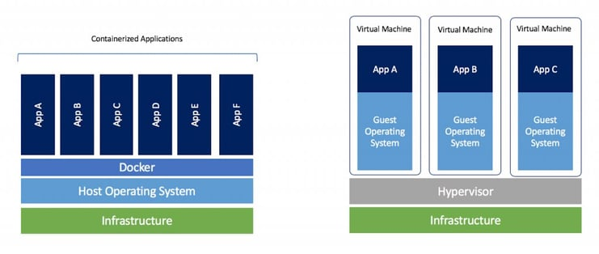

:::tip LINK
**LINK:** [https://www.docker.com/](https://www.docker.com/)
:::

## Sumário

- [Instalação](#instalação)
- [Diferença entre máquina virtual e container](#diferença-entre-máquina-virtual-e-container)
- [Imagens](#imagens)
- [Containers](#containers)
- [Volumes](#volumes)
- [Comandos](#comandos)
- [Docker Compose](#docker-compose)


O Docker é uma ferramenta que permite a criação e o gerenciamento de containers, que são ambientes isolados que possuem suas próprias bibliotecas, arquivos de configuração e sistema operacional. Esses containers são utilizados para executar aplicações de forma isolada, sem a necessidade de instalar o software em uma máquina.

## Instalação

Cada sistema operacional possui uma forma diferente de instalar o Docker, para instalar no Windows, basta acessar o site [https://docs.docker.com/docker-for-windows/install/](https://docs.docker.com/docker-for-windows/install/) e baixar o instalador.

## Diferença entre máquina virtual e container

Abaixo é possível ver a diferença entre uma máquina virtual e um container:

<div style={{textAlign: 'center', fontSize: '15px', color: '#999'}}>

<<<<<<< HEAD

=======
<br />
>>>>>>> origin/master
Fonte: [https://www.sdxcentral.com/cloud/containers/definitions/containers-vs-vms/](https://www.sdxcentral.com/cloud/containers/definitions/containers-vs-vms/)

</div>

Enquanto uma máquina virtual possui um sistema operacional completo, um container compartilha o sistema operacional da máquina hospedeira, isso faz com que o container seja mais leve e rápido. Além disso, o container é isolado da máquina hospedeira, o que faz com que ele não tenha acesso aos arquivos da máquina hospedeira, a menos que seja especificado.

## Imagens

As imagens são arquivos que contém o sistema operacional e as bibliotecas necessárias para executar uma aplicação, isso quer dizer que não é necessário instalar o sistema operacional e as bibliotecas em uma máquina, basta baixar a imagem e executar o container.

As imagens podem ser salvas em um repositório, que é um local onde as imagens são armazenadas, o Docker possui um repositório público chamado Docker Hub, que pode ser acessado em [https://hub.docker.com/](https://hub.docker.com/).

## Containers

Os containers são instâncias de uma imagem, eles são criados a partir de uma imagem e possuem um sistema operacional completo, bibliotecas e arquivos de configuração. Os containers são isolados da máquina hospedeira, o que faz com que eles não tenham acesso aos arquivos da máquina hospedeira, a menos que seja especificado.

Por padrão os container rodam e morrem quando o script é finalizado, para que o container fique rodando é necessário especificar que ele deve ficar rodando.

Você pode ter vários containers rodando ao mesmo tempo, cada um com uma aplicação diferente ou com a mesma aplicação.

## Volumes

Por padrão os arquivos criados dentro de um container são perdidos quando o container é finalizado, para que os arquivos criados dentro do container sejam mantidos é necessário criar um volume, que é um local onde os arquivos criados dentro do container são armazenados.

Podemos criar dois tipos de volumes:

- **Volumes locais:** você vai fazer o mapeamento de um diretório da máquina hospedeira para um diretório do container, assim os arquivos criados dentro do container serão armazenados no diretório da máquina hospedeira e vice-versa.

- **Volumes do Docker:** o Docker vai criar um diretório na máquina hospedeira e fazer o mapeamento com o diretório do container, assim os arquivos criados dentro do container serão armazenados no diretório do Docker e vice-versa. Essa forma você deixa com que o Docker salve os arquivos em um local específico, sem precisar especificar o diretório.

## Comandos

Os comandos do Docker são executados no terminal, para executar um comando é necessário digitar `docker` seguido do comando desejado.

### docker run

O comando `docker run` é utilizado para criar um container a partir de uma imagem, ele possui as seguintes opções:

- `-d`: Executa o container em background, ou seja, o container fica rodando mesmo após o script ser finalizado.
- `-p`: Mapeia uma porta do container para uma porta da máquina hospedeira, por exemplo, se você mapear a porta 80 do container para a porta 8080 da máquina hospedeira, ao acessar a porta 8080 da máquina hospedeira, você estará acessando a porta 80 do container.
- `-v`: Mapeia um diretório do container para um diretório da máquina hospedeira, por exemplo, se você mapear o diretório `/var/www` do container para o diretório `C:\www` da máquina hospedeira, ao acessar o diretório `C:\www` da máquina hospedeira, você estará acessando o diretório `/var/www` do container.
- `--name`: Define o nome do container.
- `--rm`: Remove o container após o script ser finalizado.

### docker start

O comando `docker start` é utilizado para iniciar um container que está parado, ele possui as seguintes opções:

- `-a`: Exibe o log do container.
- `-i`: Permite interagir com o container.

### docker stop

O comando `docker stop` é utilizado para parar um container que está rodando, ele possui as seguintes opções:

- `-t`: Tempo para parar o container, por padrão é 10 segundos.

### docker ps

O comando `docker ps` é utilizado para listar os containers que estão rodando, ele possui as seguintes opções:

- `-a`: Lista todos os containers, inclusive os que estão parados.
- `-q`: Lista apenas o ID dos containers.

### docker rm

O comando `docker rm` é utilizado para remover um container, ele possui as seguintes opções:

- `-f`: Remove o container mesmo que ele esteja rodando.

### docker rmi

O comando `docker rmi` é utilizado para remover uma imagem, ele possui as seguintes opções:

- `-f`: Remove a imagem mesmo que ela esteja sendo utilizada por algum container.

### docker exec

O comando `docker exec` é utilizado para executar um comando em um container que está rodando, ele possui as seguintes opções:

- `-it`: Permite interagir com o container.

### docker logs

O comando `docker logs` é utilizado para exibir o log de um container, ele possui as seguintes opções:

- `-f`: Exibe o log em tempo real.

### docker pull

O comando `docker pull` é utilizado para baixar uma imagem do repositório.

:::info Observação
Por padrão quando você executa o comando `docker run` ele baixa a imagem do repositório caso ela não exista na máquina.
:::

## Exemplos

Para criar um container a partir de uma imagem, execute o comando `docker run` seguido do nome da imagem, por exemplo, para criar um container a partir da imagem `nginx`, execute o comando `docker run nginx`.

Se não existir nenhuma imagem com o nome `nginx` na máquina, o Docker irá baixar a imagem do repositório. Por padrão, as imagens são baixadas do `hub.docker.com`, na versão `latest`. Caso queira especificar a versão da imagem, basta adicionar o número da versão após o nome da imagem, por exemplo, para baixar a imagem `nginx` na versão `1.15.8`, execute o comando `docker run nginx:1.15.8`.

<<<<<<< HEAD
=======
### Dockerfile

O Dockerfile é um arquivo de configuração que possui as instruções para criar uma imagem, ele é utilizado para automatizar a criação de imagens.

```yml title=Dockerfile
FROM ubuntu:18.04
RUN apt-get update && apt-get install -y nginx
CMD ["nginx", "-g", "daemon off;"]
```

>>>>>>> origin/master
## Docker Compose

O Docker Compose é uma ferramenta que permite criar e gerenciar vários containers ao mesmo tempo, ele é utilizado para criar ambientes de desenvolvimento, testes e produção.

O Docker Compose é executado através de um arquivo de configuração chamado `docker-compose.yml`, que possui as configurações dos containers.

## Comandos

Os comandos do Docker Compose são executados no terminal, para executar um comando é necessário digitar `docker-compose` seguido do comando desejado.

### docker-compose up

O comando `docker-compose up` é utilizado para criar e iniciar os containers, ele possui as seguintes opções:

- `-d`: Executa os containers em background, ou seja, os containers ficam rodando mesmo após o script ser finalizado.

- `--build`: Recria os containers, ou seja, ele remove os containers e as imagens e cria novamente.

### docker-compose start

O comando `docker-compose start` é utilizado para iniciar os containers que estão parados.

### docker-compose stop

O comando `docker-compose stop` é utilizado para parar os containers que estão rodando, ele possui as seguintes opções:

- `-t`: Tempo para parar os containers, por padrão é 10 segundos.

### docker-compose restart

O comando `docker-compose restart` é utilizado para reiniciar os containers.

## Exemplo

<<<<<<< HEAD
=======
### docker-compose.yml

>>>>>>> origin/master
Para criar um ambiente de desenvolvimento com o Docker Compose, crie um arquivo chamado `docker-compose.yml` com o seguinte conteúdo:

```yml title="docker-compose.yml"
version: '3.7'

services:
  web:
    image: nginx:1.15.8
    ports:
      - 8080:80
    volumes:
      - ./www:/var/www
```