import Center from "@site/src/components/Center";
import Tabs from '@theme/Tabs';
import TabItem from '@theme/TabItem';

:::info Observação
🚧 Em construção 🚧
:::

Fala pessoal, tudo bem? Hoje quero falar um pouco sobre Docker, na minha opinião uma das ferramentas mais importantes para um desenvolvedor, logo após o [Git](/tutorial/git/), pois permite que você crie ambientes isolados para suas aplicações, facilitando o desenvolvimento, testes e deploy de suas aplicações, padronizando ambientes e evitando o famoso "na minha máquina funciona".

<Center>

  
Docker + Container = ❤️

</Center>

## O que é Docker?

Na [documentação oficial](https://docs.docker.com/get-started/docker-overview/) do Docker, temos a seguinte definição:

> Docker is an open platform for developing, shipping, and running applications. Docker enables you to separate your applications from your infrastructure so you can deliver software quickly. With Docker, you can manage your infrastructure in the same ways you manage your applications. By taking advantage of Docker's methodologies for shipping, testing, and deploying code, you can significantly reduce the delay between writing code and running it in production.

Que em uma tradução livre seria:

> Docker é uma plataforma aberta para desenvolver, enviar e executar aplicações. Docker permite que você separe suas aplicações da sua infraestrutura para que você possa entregar software rapidamente. Com Docker, você pode gerenciar sua infraestrutura da mesma forma que gerencia suas aplicações. Ao aproveitar as metodologias do Docker para enviar, testar e implantar código, você pode reduzir significativamente o atraso entre escrever o código e executá-lo em produção.

## História e evolução do Docker

O Docker utiliza tecnologias existentes no Linux, como **namespaces** e **cgroups**, para criar, executar e gerenciar containers. O Docker foi criado em 2013 por Solomon Hykes, como um projeto interno da dotCloud, uma empresa de PaaS (Platform as a Service). Em 2013, o Docker foi lançado como um projeto open-source, e em 2014, a dotCloud mudou o nome para Docker Inc., para focar no desenvolvimento e suporte do Docker.

O conceito de **Linux Containers (LXC)** já existia antes do Docker, mas o Docker adicionou uma camada de abstração para facilitar a criação, execução e gerenciamento de containers, além de adicionar funcionalidades como Dockerfile, Docker Compose e Docker Hub.

:::info Observação

Existem outras tecnologias de containers, como **rkt (Rocket)**, **Podman**, **LXD**, **containerd**, **CRI-O**, **Kubernetes**, etc. Nesse tutorial, vamos focar no Docker, que é a tecnologia de containers mais conhecida e utilizada.

:::

## Vantagens do uso de containers

- **Leveza**: Containers compartilham o mesmo kernel do host, então eles são mais leves que máquinas virtuais.
- **Rápido**: Containers são mais rápidos para iniciar e parar que máquinas virtuais.
- **Portabilidade**: Containers podem ser executados em qualquer lugar, desde o seu laptop até o ambiente de produção.
- **Padronização**: Com Docker, você pode padronizar os ambientes de desenvolvimento, teste e produção.
- **Isolamento**: Containers são isolados do host e de outros containers, então você pode executar várias aplicações no mesmo host sem interferência.
- **Escalabilidade**: Com Docker, você pode escalar sua aplicação facilmente, adicionando ou removendo containers.
- **Reprodutibilidade**: Com Docker, você pode reproduzir o ambiente de desenvolvimento, teste e produção facilmente.
- **Segurança**: Containers são isolados do host e de outros containers, então você pode executar aplicações de terceiros com segurança.

## Docker vs Máquina Virtual

Antes de continuarmos, é importante entender a diferença entre Docker e Máquina Virtual.

<Center>

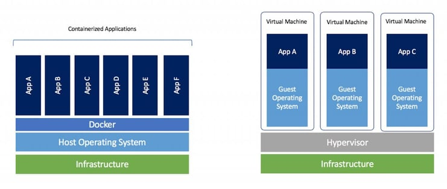  
Fonte: https://www.sdxcentral.com/cloud/containers/definitions/containers-vs-vms/

</Center>

### Máquina Virtual

- Utiliza um Hypervisor para virtualizar o hardware.
- Cada máquina virtual possui seu próprio sistema operacional.
- Cada máquina virtual possui seu próprio kernel.
- Cada máquina virtual possui seu próprio sistema de arquivos.
- Cada máquina virtual possui seu próprio consumo de memória e CPU.
- Cada máquina virtual é isolada da outra.

Em resumo, a Máquina Virtual é uma máquina dentro de outra máquina, e isso consome mais recursos computacionais, visto que cada máquina virtual possui seu próprio sistema operacional, kernel, sistema de arquivos.

### Docker

- Utiliza o Docker Engine para gerenciar containers e a comunicação com o host.
- Todos os containers compartilham o mesmo sistema operacional.
- Todos os containers compartilham o mesmo kernel.
- Todos os containers compartilham o mesmo sistema de arquivos.
- Todos os containers compartilham o mesmo consumo de memória e CPU do host. Mas cada container pode ter limites de memória e CPU individuais.
- Cada container é isolado do outro.

Em resumo, o Docker compartilha o sistema operacional e kernel do host, e isso consome menos recursos computacionais, somente a aplicação e suas dependências são isoladas do host e dos outros containers.

## Conceitos básicos

Antes de começar a prática, é importante entender alguns conceitos básicos do Docker, assim você vai se familiarizar com os termos e funcionalidades do Docker e ver como ele pode te ajudar no dia a dia.

### Image (Imagem)

Uma image/imagem é um pacote que contém tudo o que é necessário para executar uma aplicação, incluindo o código, as bibliotecas, as dependências, as variáveis de ambiente e as configurações. **Uma imagem é somente leitura e é usada para criar containers.**

**Exemplo**: A imagem `nginx:latest` contém o servidor web Nginx, suas dependências e configurações. Com essa imagem, você pode criar e executar containers com o servidor web Nginx facilmente.

### Container

Utilizando a imagem, você criar um container, é ele que vai executar a aplicação. Ele utiliza como base a imagem e adiciona uma camada de escrita, e é essa camada que vai permitir que a aplicação escreva dados, crie arquivos, etc. Por padrão todos os dados do container são perdidos quando ele é finalizado, mas você pode persistir os dados utilizando volumes. O container é isolado do host e de outros containers (por padrão), então você pode executar várias aplicações no mesmo host sem interferência de um container com outro container.

**Exemplo**: Utilizando a imagem `nginx:latest`, você pode criar e executar um ou mais containers com o servidor web Nginx, cada container é isolado do outro, então você pode executar várias instâncias do Nginx no mesmo host sem interferência, desde que cada container utilize uma porta diferente.

### Tag

Uma tag é uma referência a uma imagem. **Uma imagem pode ter várias tags, e cada tag pode ser usada para identificar uma versão da imagem.** Por padrão, uma imagem sem tag é considerada a tag `latest`. Então você pode utilizar tags para identificar versões específicas da imagem, como `latest`, `1.0`, `1.1`, `1.2`, etc.

**Exemplo**:

- `ubuntu`: Última versão da imagem Ubuntu. O mesmo que `ubuntu:latest`.
- `ubuntu:latest`: Última versão da imagem Ubuntu. O mesmo que `ubuntu`.
- `ubuntu:24.04`: Versão 24.04 da imagem Ubuntu.
- `ubuntu:18.04`: Versão 18.04 da imagem Ubuntu.

### Docker Hub / Docker Registry

Docker Hub é um serviço na nuvem que permite que você compartilhe imagens Docker publicamente ou privadamente. **Docker Hub é o repositório oficial de imagens Docker, é o que conhecemos como _Docker Registry_.** No Docker Hub, você pode encontrar imagens oficiais de várias tecnologias, como Ubuntu, MySQL, PostgreSQL, Nginx, Apache, etc. Você também pode criar seu próprio repositório no Docker Hub e compartilhar suas imagens com outras pessoas.

Existem outros _registries_ de imagens Docker, a maioria deles são privados, como o [Amazon Elastic Container Registry (ECR)](https://docs.aws.amazon.com/pt_br/AmazonECR/latest/userguide/what-is-ecr.html), [Google Container Registry (GCR)](https://cloud.google.com/container-registry/docs/overview), [Azure Container Registry (ACR)](https://learn.microsoft.com/pt-br/azure/container-registry/container-registry-intro), etc. Além do _docker hub_, você pode utilizar o [GitHub Container Registry (GHCR)](https://docs.github.com/pt/packages/working-with-a-github-packages-registry/working-with-the-container-registry) para armazenar suas imagens Docker privadamente ou publicamente sem custos adicionais.

### Dockerfile

Um Dockerfile é um arquivo de texto que contém uma lista de instruções para criar uma imagem. Nele você informa qual a imagem base, as dependências, as variáveis de ambiente, os comandos de instalação, os comandos de execução, etc. Com um Dockerfile, você pode padronizar o ambiente de desenvolvimento, teste e produção da sua aplicação.

O Dockerfile é composto por várias instruções, como `FROM`, `RUN`, `COPY`, `CMD`, `ENTRYPOINT`, `EXPOSE`, `ENV`, `WORKDIR`, `VOLUME`, `USER`, `HEALTHCHECK`, etc. Mas não se preocupe em decorar todas as instruções, você vai aprender na prática como utilizar cada uma delas e com o tempo você vai se familiarizar com elas.

Por padrão, o Dockerfile é nomeado como `Dockerfile`, mas você pode utilizar qualquer nome, desde que informe o nome do arquivo no comando `docker build` usando o parâmetro `-f` ou `--file` seguido do nome do arquivo, então

**Exemplo de um Dockerfile para criar uma imagem com Node.js**:

```Dockerfile title="Dockerfile"
# Define a imagem base
# Geralmente é o primeiro comando no Dockerfile, e é obrigatório
# Imagem oficial do Node.js
# https://hub.docker.com/layers/library/node/23.6.0/images/sha256-39a107554b5037a135efb3853517dcc66cf653a144ff3f16533edd65c36b4abf
FROM node:23.6.0

# Define o diretório de trabalho
# É opcional, mas é uma boa prática definir o diretório de trabalho
WORKDIR /app

# Copia os arquivos do host para o container
COPY . .
# O comando COPY copia os arquivos do host para o container.
# .(ponto) é o diretório atual do host, e .(ponto) é o diretório atual do container, que por causa do WORKDIR é /app
# Então ele copiará todos os arquivos do diretório atual do host para o diretório /app do container

# Instala as dependências
RUN npm clean-install
# O comando RUN executa um comando no container durante a construção da imagem.
# Nesse caso, ele está executando o comando npm clean-install
# para instalar as dependências do projeto.
# O comando clean-install é semelhante ao npm install,
# mas ele remove a pasta node_modules antes de instalar as dependências,
# garantindo que as dependências sejam instaladas corretamente de acordo com o package-lock.json
# e nunca instale uma versão diferente da dependência, mesmo que a versão seja compatível.
# Isso garante maior consistência entre os ambientes de desenvolvimento, teste e produção.

# Variáveis de ambiente para produção
ENV NODE_ENV=production
# O comando ENV define uma variável de ambiente no container.
# Nesse caso, ele está definindo a variável NODE_ENV como production, que é uma boa prática para aplicações Node.js em produção.

# Expõe a porta 3000
# É opcional, mas é uma boa prática informar a porta que a aplicação irá utilizar
EXPOSE 3000
# Mesmo se não usar o comando EXPOSE, você pode mapear a porta do container para a porta do host
# usando o parâmetro -p ou --publish no comando docker run
# Exemplo: docker run -p 3000:3000 <imagem>

# Define o comando de execução quando o container for iniciado
# Forma 1: CMD ["node", "index.js"]
# Forma 2: CMD node index.js
CMD ["node", "index.js"]
```

Esse é um exemplo simples de um Dockerfile para criar uma imagem com Node.js. Com esse Dockerfile, você pode criar uma imagem com Node.js, instalar as dependências, expor a porta 3000 e definir o comando de execução. Com essa imagem, você pode criar e executar containers com Node.js facilmente.

Depois da imagem criada, você não precisa mais se preocupar com a instalação do Node.js, das dependências, das variáveis de ambiente, da porta, etc. Sempre que for executado um container a partir dessa imagem, ele terá tudo o que precisa para executar a aplicação, sempre da mesma forma.

Depois vamos criar mais exemplos para entender melhor como isso funciona na prática.

### Layers (Camadas)

Uma imagem Docker é composta por várias camadas, onde cada camada é uma modificação da camada anterior. **Quando você cria uma imagem, o Docker cria uma camada para cada instrução no Dockerfile.** Isso permite que o Docker reutilize camadas, diminuindo armazenamento e tempo de construção.

De início você não precisa se preocupar com as camadas, mas quando tiver mais experiência com Docker, é importante entender como as camadas funcionam para otimizar o tamanho das imagens e o tempo de construção. Assim você pode criar imagens menores e mais rápidas, economizando espaço em disco e tempo de execução. Essas otimizações não afetam performance da aplicação.

### Volume

Enquanto nosso container está em execução, ele pode criar arquivos, diretórios, bancos de dados, etc. Mas quando o container é finalizado, todos os dados são perdidos. É aí que entra o volume. **Um volume é um diretório ou arquivo que é montado no container, e que persiste os dados mesmo que o container seja finalizado.** Com volumes, você pode compartilhar dados entre containers, persistir dados em um diretório específico, fazer backup dos dados, etc.

Existem dois tipos de volumes:

1. **Volumes gerenciados pelo Docker**: São volumes criados e gerenciados pelo Docker. Eles são armazenados em um diretório específico no host e podem ser compartilhados entre containers. Para criar um volume gerenciado pelo Docker, você pode usar o comando `docker volume create <nome-do-volume>`.

2. **Bind mounts**: São diretórios ou arquivos do host que são montados no container. Com bind mounts, você pode compartilhar dados entre o host e o container. Para criar um bind mount, você pode usar o parâmetro `-v` ou `--mount` no comando `docker run -v CAMINHO_HOST:CAMINHO_CONTAINER <imagem>`. Por exemplo: `docker run -v /caminho/no/host:/caminho/no/container <imagem>`.

Então você pode apagar, parar, reiniciar, remover o container, que os dados vão continuar lá, pois eles estão armazenados no volume.

### Docker Compose

O Docker Compose é um plugin do Docker que permite que você defina e execute aplicações Docker multi-container. **Com Docker Compose, você pode usar um arquivo YAML (compose.yaml) para configurar os serviços da sua aplicação, e depois, com um único comando, você cria e inicia todos os serviços.** Cada serviço é executado em um container separado, mas eles podem se comunicar entre si, compartilhar volumes, redes, etc.

Seguindo o exemplo anterior, da para criar um arquivo `compose.yaml` com a aplicação e o banco de dados, e com um único comando, você cria e inicia os containers da aplicação e do banco de dados.

```yaml title="compose.yaml" wrap="true"
services:
  app:
    build:
      context: .
      dockerfile: Dockerfile # Caminho do Dockerfile criado anteriormente
    ports:
      - "80:3000" # mapeamento de portas
    environment:
      - NODE_ENV=production
      - DATABASE_HOST=db
    depends_on:
      - db

  db:
    image: mysql:5.7
    environment:
      MYSQL_ROOT_PASSWORD: root
      MYSQL_DATABASE: app
    volumes:
      - db-data:/var/lib/mysql
```

O exemplo acima cria dois containers:

**Container:** app

- Utiliza o Dockerfile criado anteriormente para construir a imagem da aplicação Node.js.
- Mapeia a porta 3000 do container para a porta 80 do host.
- Define variáveis de ambiente para a aplicação.
- Depende do serviço db, ou seja, o container da aplicação só será iniciado depois que o container do banco de dados estiver em execução.

**Container:** db

- Utiliza a imagem oficial do MySQL 5.7.
- Define variáveis de ambiente para o banco de dados.
- Utiliza um volume para persistir os dados do banco de dados.
- Não expõe nenhuma porta, pois o container da aplicação se conecta ao banco de dados através do nome do serviço (db), diretamente na rede interna do Docker Compose.

:::info Observação
Não se preocupe em entender todos os detalhes do Docker Compose agora, vamos ver na prática mais adiante.
:::

### Conclusão

Por hora é isso, já é uma boa base para começarmos a prática. Conforme formos avançando, vamos aprendendo mais conceitos e funcionalidades do Docker, mas o importante é começar a praticar para entender melhor como Docker funciona na prática.

<Center>

  
Nice! 👍

</Center>

## Instalação

:::info Observação
Esse tutorial foi feito utilizando o Docker CLI (Command Line Interface) e vamos utilizar um [ambiente online](#play-with-docker) para praticar, então não é obrigatório ter o Docker instalado no seu computador, se quiser pular essa parte, pode ir direto para os [principais comandos](#principais-comandos).
:::

:::warning Windows
Se você estiver utilizando Windows, recomenda-se utilizar o [Windows Subsystem for Linux (WSL)](https://learn.microsoft.com/pt-br/windows/wsl/install) para instalar o Docker, assim você terá um ambiente Linux completo no seu Windows, facilitando o uso do Docker e outras ferramentas de desenvolvimento. Isso também é válido neste tutorial, pois os comandos mostrados são para Linux.
No geral, não deve haver problemas, mas fica o aviso.
:::

Não vou entrar em detalhes sobre a instalação do Docker, pois a própria [documentação oficial](https://docs.docker.com/get-docker/) é bem completa e fácil de seguir. Então, siga os passos de acordo com seu sistema operacional ou pesquisa no Google/YouTube que você vai encontrar vários tutoriais sobre a instalação do Docker para seu sistema operacional.

Um ponto importante é que existem dois tipos de instalação do Docker:

- **Docker Desktop**: É um programa com interface gráfica que facilita o uso do Docker no seu computador. Ele instala tudo o que você precisa para rodar containers (Docker Engine, Docker CLI e Docker Compose) em um único pacote, além de oferecer recursos extras para gerenciamento e configuração.
- **Docker Engine**: É o componente principal do Docker, responsável por criar e executar containers. Ele é instalado e utilizado via linha de comando, sem interface gráfica. Ideal para servidores, ambientes de produção ou para quem prefere trabalhar diretamente no terminal.

Você pode escolher qual instalar de acordo com sua preferência, num primeiro momento é recomendado utilizar o Docker Desktop, mas depois de aprender os principais comandos do Docker, é recomendado utilizar o Docker CLI para se acostumar com a linha de comando. Até porque a maioria dos tutoriais e documentações utilizam o Docker CLI. Vale notar que o Docker Desktop é gratuito para uso pessoal, educacional e de pequenas empresas, mas para empresas maiores, é necessário adquirir uma licença paga.

<Center>

  
Não precisa ter medo do terminal, ele é seu amigo!

</Center>

## Principais comandos

Aqui é um guia rápido com os principais comandos do Docker e do Docker Compose. Você não precisa decorar todos os comandos, mas é importante conhecer os principais para começar a utilizar o Docker no dia a dia.

### Docker

Você no dia a dia vai utilizar vários comandos do Docker, mas vou listar os principais comandos para você começar a utilizar o Docker.

- `docker version`: Mostra a versão do Docker instalada no host.
- `docker info`: Mostra informações sobre o Docker instalado no host.
- `docker run`: Cria e executa um container a partir de uma imagem.
- `docker ps`: Lista os containers em execução.
- `docker ps -a`: Lista todos os containers, incluindo os que estão parados.
- `docker images`: Lista as imagens no host.
- `docker image ls`: Lista as imagens no host. (Mesmo que `docker images`)
- `docker build`: Cria uma imagem a partir de um Dockerfile.
- `docker pull`: Baixa uma imagem do Docker Hub.
- `docker push`: Envia uma imagem para o Docker Hub.
- `docker exec`: Executa um comando em um container em execução.
- `docker stop`: Para um container em execução.
- `docker start`: Inicia um container parado.
- `docker restart`: Reinicia um container em execução.
- `docker rm`: Remove um container.
- `docker rmi`: Remove uma imagem.
- `docker volume ls`: Lista os volumes no host.
- `docker volume create`: Cria um volume.
- `docker volume rm`: Remove um volume.

A lista completa de comandos do Docker está disponível na [documentação oficial](https://docs.docker.com/reference/cli/docker/).

### Docker Compose

Atualmente o Docker Compose está na versão 2. Mas pode ser que você esbarre em algum momento com a versão 1. A sintaxe dos comandos é a mesma, mas a forma de chamar o comando é diferente. Na versão 1, o comando era `docker-compose`, com um hífen. Já na versão 2, o comando é `docker compose`, sem hífen. Então, se você estiver utilizando a versão 1, basta substituir o espaço por um hífen. Observe como está seu ambiente e adeque os comandos conforme a versão instalada.

O Docker Compose tem seus próprios comandos, mas os principais são:

- `docker compose version`: Mostra a versão do Docker Compose instalada no host.
- `docker compose up`: Cria e inicia os containers definidos no arquivo `compose.yaml`.
- `docker compose down`: Para e remove os containers definidos no arquivo `compose.yaml`.
- `docker compose restart`: Reinicia os containers definidos no arquivo `compose.yaml`.
- `docker compose stop`: Para os containers definidos no arquivo `compose.yaml`.

A lista completa de comandos do Docker Compose está disponível na [documentação oficial](https://docs.docker.com/compose/reference/).

## Prática 1

<Center>

  
Respira fundo, que agora vamos para a prática!

</Center>

Agora que vimos alguns conceitos do Docker, vamos ver como isso funciona na prática. Assim você vai entender melhor como Docker pode te ajudar no dia a dia.

Como dito anteriormente, você não precisa ter o Docker instalado no seu computador para praticar, mas é recomendado que você tenha o Docker instalado para facilitar o uso do Docker no dia a dia. Vamos utilizar o ambiente online [Play with Docker](https://labs.play-with-docker.com/) para praticar. Ele é um ambiente Docker online gratuito e temporário, ótimo para testar o Docker sem precisar instalar nada no seu computador.

Cada atividade vai ser um exemplo, incrementando o conhecimento anterior, então siga o passo a passo para entender melhor como Docker funciona.

### Play with Docker

1. Acesse o site [Play with Docker](https://labs.play-with-docker.com/).
<Center>


</Center>
2. Clique em "Login" para iniciar uma nova sessão.
<Center>

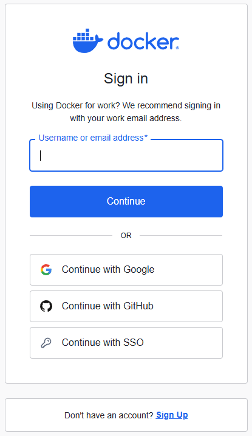  
Selecione a opção de login de sua preferência.

</Center>

3. Após o login, clique em "Start" para iniciar uma nova sessão.
<Center>

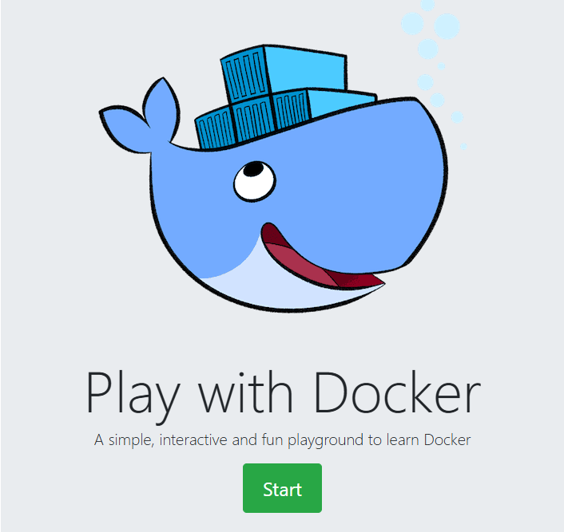  
Let's go!

</Center>

4. Essa é a tela principal do Play with Docker. Clique em "Add New Instance" para criar uma nova instância.

<Center>

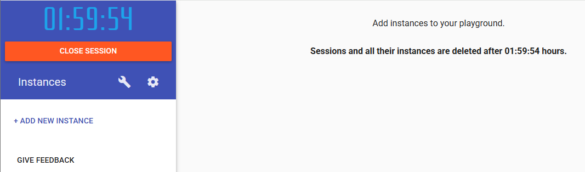

</Center>

5. Agora você tem uma instância com o Docker instalado, e pode começar a praticar os comandos do Docker.

<Center>

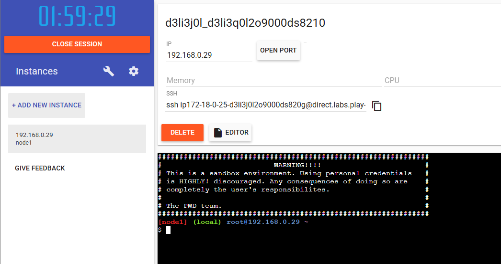

</Center>

Campos importantes na tela:

- **IP**: Endereço IP local da instância. Utilizado caso queira comunicar múltiplas instâncias no ambiente PWD.
- **Open Port**: Abre uma porta específica da instância para acesso externo. Útil para acessar remotamente. Ao clicar, um link é gerado, utilize esse link para acessar a porta aberta.
- **SSH**: O comando SSH para acessar a instância via terminal local, aí você não depende do terminal web.
- **Editor**: Abre uma interface web para navegar nos diretórios e arquivos da instância e editar arquivos, útil para quem não está acostumado com o terminal.
- **Terminal**: O terminal web da instância, onde você pode executar os comandos do Docker.

#### Dica 1 - Comandos do terminal web

- **Copiar/Colar**: Para copiar/colar no terminal web, utilize o atalho `Ctrl + Shift + V` para colar, e `Ctrl + Shift + C` para copiar. O atalho padrão `Ctrl + V` não funciona no terminal web.
- **Limpar tela**: Para limpar a tela do terminal web, utilize o comando `clear` ou o atalho `Ctrl + L`.

#### Dica 2 - Manipular arquivos

Se você não conhece bem linux e não está acostumado a utilizar o terminal, fique tranquilo, tem uma outra maneira de criar e editar arquivos no Play with Docker.

Para criar um arquivo, você pode criar o arquivo no seu computador e depois fazer o upload. Para fazer o upload, você pode **arrastar e soltar** o arquivo na área do terminal web(parte preta), dessa forma o arquivo é criado com o mesmo nome do arquivo que você está enviando.

Se você precisar editar, pode utilizar o botão **Editor**, que abre uma interface web para navegar nos diretórios e arquivos da instância e editar arquivos direto pela interface web, sem precisar utilizar o terminal.

#### Dica 3 - Manipular arquivos - Comandos linux

Para quem quer só utilizar o terminal web, segue alguns comandos linux básicos:

- `ls`: Lista os arquivos e diretórios do diretório atual.
- `cd <diretório>`: Muda para o diretório especificado.
- `cd ..`: Volta para o diretório anterior.
- `cd ~`: Vai para o diretório home do usuário.
- `cd /tmp/pasta`: Vai para o diretório especificado (Ex: /tmp/pasta).
- `pwd`: Mostra o caminho do diretório atual.
- `mkdir <diretório>`: Cria um diretório com o nome especificado.

- `cat <arquivo>`: Mostra o conteúdo do arquivo especificado.
- `nano <arquivo>`: Abre o editor de texto nano para editar o arquivo especificado. Esse editor tem alguns atalhos na barra inferior, como `Ctrl + O` para salvar, `Ctrl + X` para sair, etc.
- `touch <arquivo>`: Cria um arquivo vazio com o nome especificado.

### 1.1 - Hello World

Vamos começar com o famoso "Hello World" do Docker, que é criar e executar um container com a imagem `hello-world`.

```bash
# docker run <imagem>
docker run hello-world
```

Se tudo estiver configurado corretamente, você pode notar as seguintes mensagens:

- `Unable to find image 'hello-world:latest' locally`: O Docker não encontrou a imagem `hello-world:latest` no host.
- `latest: Pulling from library/hello-world`: O Docker está baixando a imagem `hello-world:latest` do Docker Hub, isso é feito automaticamente toda vez que você executa um container com uma imagem que não existe no host.
- `Digest: sha256:4cf9c47f86...`: O Docker baixou a imagem `hello-world:latest` do Docker Hub, e essa é a hash da imagem, pode ser que você tenha uma hash diferente, pois a imagem pode ser atualizada, mas é o identificador único da imagem.
- `Status: Downloaded newer image for hello-world:latest`: O Docker baixou a imagem `hello-world:latest` do Docker Hub com sucesso.

Todas essas mensagens são logs do Docker, que são exibidos quando você executa um container. Esses logs são úteis para entender o que o Docker está fazendo, e para debugar problemas.

Após essa mensagem, você vai ver uma mensagem de boas-vindas do Docker, que é exibida pelo container `hello-world`. Essa mensagem é exibida pelo container e não pelo Docker, então o Docker não tem controle sobre o que é exibido, ele só executa o container e exibe os logs.

<Center>

  
Log do Docker ao rodar o container `hello-world`.

</Center>

:::note O que foi visto:

- Como baixar uma imagem do Docker Hub. (Ex: `hello-world:latest`)
- Como criar e executar um container com uma imagem. (Ex: `docker run hello-world`)
- Como interpretar os logs do Docker ao rodar um container. (Ex: `Unable to find image`, `Pulling from`, `Digest`, `Status`)

:::

### 1.2 - Ubuntu

Agora vamos criar e executar um container com a imagem `ubuntu`.

```bash
docker run -it ubuntu cat /etc/lsb-release
```

Ao rodar o comando acima, ele vai fazer o mesmo que o comando do [Hello World](#11---hello-world), mas ao invés de exibir uma mensagem de boas-vindas, ele vai exibir as informações da distribuição Ubuntu, por meio do comando `cat /etc/lsb-release`. Hoje a versão `ubuntu:latest` é a versão 24.04.1 LTS, mas pode ser que você tenha uma versão diferente, pois a imagem pode ser atualizada.

<Center>

  
Log do Docker ao rodar o container `ubuntu:latest`.

</Center>

Você pode explorar outras versões dessa imagem, como `ubuntu:20.04` ou `ubuntu:18.04`, basta substituir a tag `latest` pela versão desejada.

```bash
# Ubuntu 20.04
docker run -it ubuntu:20.04 cat /etc/lsb-release
```

```bash
# Ubuntu 18.04
docker run -it ubuntu:18.04 cat /etc/lsb-release
```

<Center>

  
Log do Docker ao rodar o container `ubuntu:latest` e as outras versões do Ubuntu.

</Center>

Nesse exemplo, o comando `-it` (ou `-i -t` ou `-ti`) é utilizado para interagir com o container, ou seja, ele abre um terminal interativo no container. O comando `cat /etc/lsb-release` é utilizado para exibir as informações da distribuição Ubuntu. Então ao iniciar o terminal interativo, o comando `cat /etc/lsb-release` é executado automaticamente, e depois o container é finalizado, pois o comando foi finalizado.

:::note O que foi visto:

- Como utilizar tags para baixar versões específicas de imagens. (Ex: `ubuntu:20.04`)
- Como executar um comando em um container. (Ex: `cat /etc/lsb-release`)

:::

### 1.3 - `docker ps`

Agora vamos ver como listar os containers em execução e os containers parados.

```bash
# Lista os containers em execução
docker ps

# Lista todos os containers, incluindo os parados
docker ps -a
```

<Center>

  
Log do Docker ao rodar o container `ubuntu:latest`.

</Center>

É bem provável que você não tenha nenhum container em execução ou parado, então a lista vai estar vazia. Mas rodando o comando com o parâmetro `-a`, você vai ver todos os containers que foram executados no host, incluindo os que estão parados.

Você pode notar que o `CONTAINER ID` e o `NAMES` são identificadores únicos do container, que são gerados pelo Docker. Esses identificadores podem ser utilizados em outros comandos do Docker para referenciar o container, como `docker stop`, `docker start`, `docker restart`, `docker rm`, etc.

Além do nome, você pode ver o `IMAGE`, que é a imagem utilizada para criar o container, o `COMMAND`, que é o comando de execução do container, o `CREATED`, que é a data de criação do container, o `STATUS`, que é o status do container, o `PORTS`, que são as portas expostas pelo container.

:::note O que foi visto:

- Como listar os containers em execução. (Ex: `docker ps`)
- Como listar todos os containers, incluindo os parados. (Ex: `docker ps -a`)
- Como interpretar a lista de containers. (Ex: `CONTAINER ID`, `NAMES`, `IMAGE`, `COMMAND`, `CREATED`, `STATUS`, `PORTS`)

:::

:::tip Dica

Você não precisa passar o `CONTAINER ID` inteiro para referenciar o container, basta passar os primeiros caracteres, que sejam únicos dentre os demais containers.

:::

### 1.4 - `docker exec`

Agora vamos ver como executar um comando em um container em execução.

```bash
# Inicia um container em execução
docker run --rm -d --name "meu-container-ubuntu" ubuntu:latest sleep infinity

# Executa um comando no container em execução
docker exec meu-container-ubuntu ls -la /
```

<Center>

  
Log do Docker ao rodar o container `ubuntu:latest`.

</Center>

Nesse exemplo, o comando `docker run` é utilizado para criar e executar um container com a imagem `ubuntu:latest`, e o comando `sleep infinity` é utilizado para manter o container em execução, pois se não tiver um processo rodando, o container é encerrado. O parâmetro `--rm` é utilizado para remover o container quando ele for finalizado, o parâmetro `-d` é utilizado para executar o container em segundo plano, e o parâmetro `--name` é utilizado para dar um nome ao container. O nome é opcional, mas é uma boa prática dar um nome ao container para facilitar a referência.

Depois que o container estiver em execução, o comando `docker exec` é utilizado para executar o comando `ls -la /` no container `meu-container-ubuntu`. Esse comando vai listar todos os arquivos e diretórios do diretório raiz do container (`/`).

:::note O que foi visto:

- Como iniciar um container. (Ex: `docker run --rm -d --name "meu-container-ubuntu" ubuntu:latest sleep infinity`)
- Como atribuir um nome ao container. (Ex: `--name "meu-container-ubuntu"`)
- Como apagar o container automaticamente quando ele for finalizado. (Ex: `--rm`). Útil para não deixar containers parados ocupando espaço.
- Como executar um container em segundo plano. (Ex: `-d`). Assim seu terminal não fica preso no container e você pode continuar utilizando o terminal.
- Como executar um comando no container em execução. (Ex: `docker exec meu-container-ubuntu ls -la /`)

:::

### 1.5 - Gerenciando estados

Agora vamos ver como parar, iniciar, reiniciar e remover um container. No exemplo anterior, o container `meu-container-ubuntu` está em execução, então vamos parar ele.

```bash
# Para um container em execução
docker stop meu-container-ubuntu
```

O comando `docker stop` é utilizado para parar um container em execução. O parâmetro `meu-container-ubuntu` é o nome do container que você quer parar. Você pode utilizar o `CONTAINER ID` ou o `NAMES` para referenciar o container. Vale lembrar que na atividade [4](#14---docker-exec), o container foi iniciado com o parâmetro `--rm`, então ele vai ser removido automaticamente quando for parado. Então ele não vai aparecer na lista de containers parados. (Ex: `docker ps -a`)

Vamos então criar um novo container para ver como iniciar, reiniciar e remover um container.

```bash
docker run -d --name "container-teste" alpine sleep 10
```

O comando acima vai criar e executar um container com a imagem `alpine`, que é uma imagem leve do Linux. O comando `sleep 10` é utilizado para manter o container em execução por 10 segundos. O parâmetro `-d` é utilizado para executar o container em segundo plano, e o parâmetro `--name` é utilizado para dar um nome ao container.

Depois que passar os 10 segundos, o container vai finalizar automaticamente, você pode iniciar, reiniciar e remover o container manualmente.

```bash
# Inicia um container parado
docker start container-teste
```

```bash
# Reinicia um container em execução
docker restart container-teste
```

```bash
# Remove um container parado
docker rm container-teste
```

<Center>

  
Log do Docker ao rodar o container `alpine`.

</Center>

:::note O que foi visto:

- Como parar um container em execução. (Ex: `docker stop meu-container-ubuntu`)
- Como iniciar um container parado. (Ex: `docker start container-teste`)
- Como reiniciar um container em execução. (Ex: `docker restart container-teste`)
- Como remover um container parado. (Ex: `docker rm container-teste`). Na imagem acima, enquanto o container estava em execução, ele não podia ser removido, então foi aguardado o container finalizar para depois ser removido, mas poderia ser passado o parâmetro `-f` para forçar a remoção do container, mesmo que ele esteja em execução. (Ex: `docker rm -f container-teste`)

:::

### 1.6 - Acessando o container

Agora vamos ver como acessar um container em execução.

```bash
# Inicia um container em execução
docker run -d --name "container-nginx" nginx
```

```bash
# Acessa o terminal interativo do container em execução
docker exec -it container-nginx bash
```

O comando acima vai criar e executar um container com a imagem `nginx`, que é um servidor web. O parâmetro `-d` é utilizado para executar o container em segundo plano, e o parâmetro `--name` é utilizado para dar um nome ao container.

Depois que o container estiver em execução, o comando `docker exec` é utilizado para acessar o terminal interativo do container `container-nginx`. O parâmetro `-it` é utilizado para interagir com o container, e o comando `bash` é utilizado para abrir o terminal do container.

<Center>

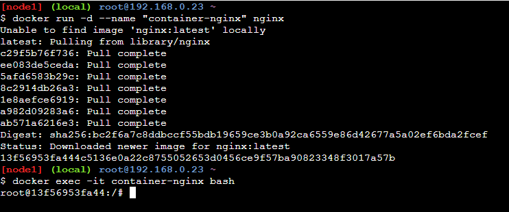  
Log do Docker ao rodar o container `nginx`.

</Center>

Dá para notar que o terminal mudou, dentro do nginx, o prompt mudou para `root@<container-id>:/#`, isso significa que você está dentro do container `container-nginx`. Você pode executar comandos no terminal do container, como `ls`, `pwd`, `cat`, `ps`, etc. Você pode explorar o container, instalar pacotes, editar arquivos, etc. Mas lembre-se que o container é efêmero, então os dados são perdidos quando o container é finalizado.

:::note O que foi visto:

- Como acessar o terminal interativo de um container em execução. (Ex: `docker exec -it container-nginx bash`)

:::

:::info Observação
No exemplo acima, o comando `bash` é utilizado para abrir o terminal do container, mas nem todas as imagens possuem o `bash` instalado. Nesse caso, você pode utilizar o `sh`, que é um shell mais simples e está presente na maioria das imagens (Ex: `docker exec -it container-nginx sh`), mas mesmo assim, pode ser que você esbarre com imagens nas quais não dê para interagir — tudo isso por motivos de segurança e otimização.
:::

## Prática 2

Se chegou até aqui, parabéns! Você já aprendeu o básico do Docker, agora vamos ver como criar uma imagem com um Dockerfile. Assim você vai entender melhor como Docker pode te ajudar no dia a dia.

### 2.1 - Dockerfile

Vamos criar um arquivo html simples e um Dockerfile para criar uma imagem com um servidor web.

<Tabs>
  <TabItem value="index" label="index.html" default>
```html title="index.html"
<!DOCTYPE html>
<html>
  <head>
    <meta charset="utf-8">
    <title>Meu Site</title>
  </head>
  <body>
    <h1>Olá Mundo!</h1>
  </body>
</html>
```
</TabItem>
<TabItem value="dockerfile" label="Dockerfile">

```Dockerfile title="Dockerfile"
# Define a imagem base
FROM nginx:latest

# Copia os arquivos do host para o container
COPY --chown=nginx:nginx index.html /usr/share/nginx/html/index.html
# --chown=nginx:nginx define o usuário e grupo do arquivo copiado no container

# Expõe a porta 80
EXPOSE 80

# Define o comando de execução quando o container for iniciado
CMD ["nginx", "-g", "daemon off;"]
```

</TabItem>
</Tabs>

:::tip info

Lembre da dica 2 da seção [manipular arquivos](#dica-2---manipular-arquivos) para criar/editar os arquivos no Play with Docker.

:::

Com os arquivos criados, vamos criar a imagem com o comando `docker build`.

```bash
docker build -t minhas_primeira_imagem .
```

O comando `docker build` é utilizado para criar uma imagem a partir de um Dockerfile. O parâmetro `-t` é utilizado para dar um nome à imagem, e o ponto (`.`) é utilizado para informar o diretório onde está o Dockerfile. Nesse caso, o Dockerfile está no diretório atual.

Depois que a imagem for criada, você pode listar as imagens no host com o comando `docker images`.

```bash
docker images
```

<Center>

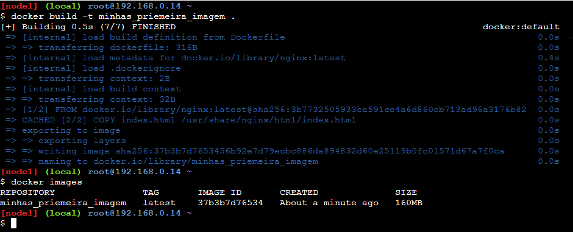  
Resultado dos comandos `docker build` e `docker images`.

</Center>

Nesse exemplo, o Dockerfile é utilizado para criar uma imagem com o servidor web Nginx. O comando `FROM` é utilizado para definir a imagem base, que é a imagem `nginx:latest`. O comando `COPY` é utilizado para copiar o arquivo `index.html` do host para o diretório `/usr/share/nginx/html/index.html` do container. O comando `EXPOSE` é utilizado para indicar a porta 80 como um porta que pode ser publicada. O comando `CMD` é utilizado para definir o comando de execução do container, que é `nginx -g 'daemon off;'`.

:::note O que foi visto:

- Como criar um Dockerfile.
- Como construir uma imagem a partir de um Dockerfile. (Ex: `docker build -t minhas_primeira_imagem .`)
- Como listar as imagens disponíveis no host. (Ex: `docker images`)

:::

### 2.2 - Executando a imagem criada

Agora que a imagem foi criada na atividade [2.1](#21---dockerfile), vamos criar e executar um container a partir dessa imagem.

```bash
docker run --rm -p 8080:80 --name meu_site minhas_primeira_imagem
```

O comando `docker run` é utilizado para criar e executar um container a partir de uma imagem. O parâmetro `--rm` é utilizado para remover o container automaticamente após a sua parada, o parâmetro `-p` é utilizado para mapear a porta 80 do container para a porta 8080 do host, o parâmetro `--name` é utilizado para dar um nome ao container, e o parâmetro `minhas_primeira_imagem` é o nome da imagem que foi criada na atividade [2.1](#21---dockerfile).

<Center>

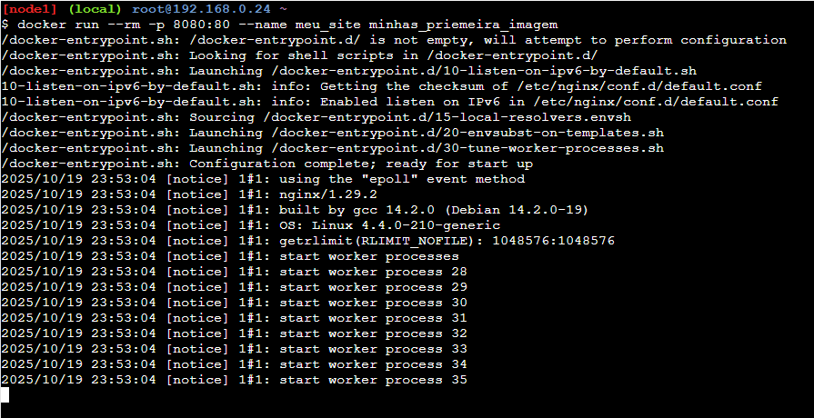  
Resultado do comando `docker run`.

</Center>

Agora vamos acessar nossa página web, no Play with Docker, clique no botão **Open Port** da instância onde o container está em execução, informe a porta `8080` e clique em **Ok**. Isso vai fazer abrir uma nova aba no navegador com a URL gerada para acessar a porta 8080 do host.

<Center>

  
Página web exibida no navegador.

</Center>

:::warning Observação

Pode ser que seu navegador bloqueie a abertura de pop-ups, então verifique se algo em seu navegador possa estar bloqueando a abertura da nova aba.

:::

Caso você esteja rodando o Docker localmente, basta acessar a URL `http://localhost:8080` no seu navegador.

<Center>

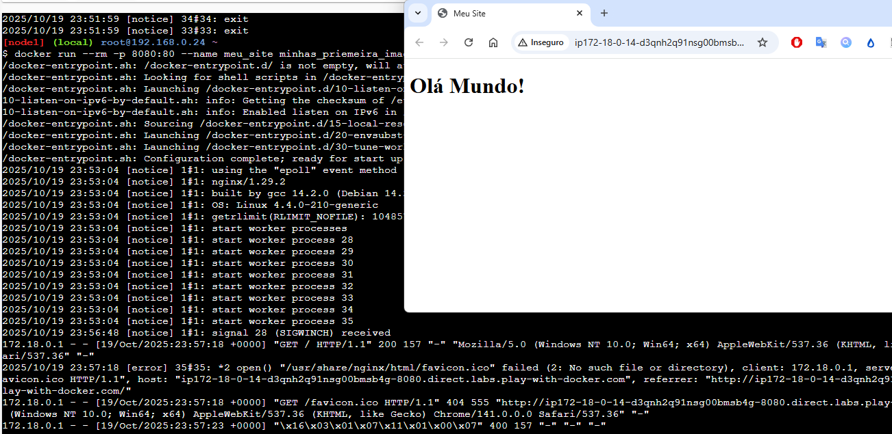  
Página web exibida no navegador.

</Center>

Por termos subido o container sem o parâmetro `-d`, o log do container é exibido no terminal, então cada solicitação feita, vai aparecer o registro do Nginx. Além disso, o terminal fica preso no container, então para parar o container, você pode utilizar o atalho `Ctrl + C`, esse comando encerra o processo em execução no terminal, que nesse caso é o container.

:::note O que foi visto:

- Como criar e executar um container a partir de uma imagem. (Ex: `docker run --rm -p 8080:80 --name meu_site minhas_primeira_imagem`)
- Como mapear portas do container para o host. (Ex: `-p 8080:80`)
- Como acessar uma aplicação web rodando em um container. (Ex: `http://localhost:8080`)

:::

### 2.3 - Mapeamento de volume

Quando colocamos no nosso Dockerfile para copiar o arquivo `index.html` para o container, esse arquivo fica "preso" dentro do container. Ou seja, se você quiser alterar o arquivo, precisa criar uma nova imagem com o Dockerfile atualizado, ou acessar o container e editar o arquivo manualmente. Mas existe uma forma mais fácil de fazer isso, que é utilizando o mapeamento de volume.

Como vimos no [início](#volume), um volume é uma forma de persistir dados ou compartilhar dados entre o host e o container. Com o mapeamento de volume, você pode mapear um arquivo ou diretório do host para o container, assim qualquer alteração feita no arquivo ou diretório do host, é refletida no container e vice-versa. Para fazer isso, você pode utilizar a opção `-v` ao executar o container.

:::note Observação

Quando criamos os arquivos `index.html` e `Dockerfile`, não configuramos as permissões deles, então antes de seguir, é importante ajustar as permissões para evitar problemas de acesso. Execute o comando abaixo para garantir que o usuário do Nginx dentro do container tenha permissão de leitura nos arquivos.

```bash
find . -type d -exec chmod 755 {} +
find . -type f -exec chmod 644 {} +
```

Os comandos acima ajustam as permissões dos diretórios para `755` (leitura, escrita e execução para o dono, e leitura e execução para grupo e outros) e dos arquivos para `644` (leitura e escrita para o dono, e leitura para grupo e outros). Isso garante que o Nginx, que roda como usuário `nginx`, possa ler os arquivos corretamente.
:::

```bash
docker run --rm -p 8080:80 -v $(pwd):/usr/share/nginx/html/ --name meu_site_com_volume minhas_primeira_imagem
```

Agora se você tentar acessar a página web novamente, você vai ver que o conteúdo é o mesmo, mas agora qualquer alteração feita no arquivo `index.html` no host, é refletida no container e vice-versa. Faça o teste, altere o `Olá Mundo!` para `Olá Docker!` no arquivo `index.html` no host, e atualize a página web no navegador, você vai ver que a alteração foi refletida na página web.

:::note O que foi visto:

- Como mapear um volume do host para o container. (Ex: `-v $(pwd):/usr/share/nginx/html/`)
- Como persistir dados entre o host e o container. (Ex: alterando o arquivo `index.html` no host e refletindo no container)

:::

### 2.4 - Limpando

Vamos fazer uma pausa para limpar os containers e imagens criados até agora.

```bash
# Parar e remover todos os containers em execução
docker rm -f $(docker ps -aq)
```

<Center>

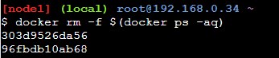  
Containers removidos.

</Center>

Cuidado com o comando acima, ele vai parar e remover todos os containers em execução no host, então certifique-se de que não tem nenhum container importante rodando antes de executar esse comando. Caso queira remover apenas containers específicos, utilize o `CONTAINER ID` ou o `NAMES` para referenciar o container.

```bash
docker rm -f <CONTAINER ID ou NAMES>
```

Caso queira remover as imagens criadas, utilize o comando abaixo.

```bash
# Remove todas as imagens
docker rmi -f $(docker images -aq)
```

Esse comando vai remover todas as imagens do host, então certifique-se de que não tem nenhuma imagem importante antes de executar esse comando. Caso queira remover apenas imagens específicas, utilize o `IMAGE ID` ou o `REPOSITORY:TAG` para referenciar a imagem.

### 2.5 Network

Vamos ver agora como fazer a comunicação entre containers utilizando redes do Docker. Mas antes, vamos ver os tipos de redes disponíveis no Docker.

- **bridge**: É a rede padrão do Docker, onde os containers podem se comunicar entre si utilizando o nome do container como hostname. Essa rede é isolada do host, ou seja, os containers não podem acessar a rede do host diretamente.
- **host**: Nessa rede, o container compartilha a rede do host, ou seja, o container pode acessar a rede do host diretamente. Essa rede não é isolada, então os containers podem acessar a rede do host e vice-versa.
- **none**: Nessa rede, o container não tem acesso à rede, ou seja, o container não pode acessar a rede do host e nem se comunicar com outros containers.

Agora vamos criar dois containers que se comunicam entre si utilizando a rede bridge padrão do Docker.

```bash
# Sube o container do banco de dados MySQL
docker run --rm --name banco_de_dados --env MYSQL_ROOT_PASSWORD=senha123 --env MYSQL_DATABASE=meu_banco --env MYSQL_USER=usuario --env MYSQL_PASSWORD=senha -d mysql:5.7
# Sube o container do phpMyAdmin
docker run --rm -d --name meu_phpmyadmin -p 8080:80 --env PMA_HOST=banco_de_dados --env PMA_USER=usuario --env PMA_PASSWORD=senha phpmyadmin/phpmyadmin
```

Ao rodar os comandos acima, dois containers são criados: um container com o banco de dados MySQL e outro container com o phpMyAdmin. O container do phpMyAdmin se conecta ao container do banco de dados utilizando o nome do container (`banco_de_dados`) como hostname. Entretanto, eles não estão na mesma rede, então precisamos criar uma rede personalizada para que eles possam se comunicar entre si.

Remova os containers criados acima, seguindo a dica da seção [limpando](#24---limpando).

Agora vamos fazer com que os containers conversem entre si, vamos colocar eles na mesma rede.

```bash
# Cria uma rede personalizada
docker network create minha_rede_personalizada

# Sobe o container do banco de dados MySQL na rede personalizada
docker run --rm --name banco_de_dados --env MYSQL_ROOT_PASSWORD=senha123 --env MYSQL_DATABASE=meu_banco --env MYSQL_USER=usuario --env MYSQL_PASSWORD=senha --network minha_rede_personalizada -d mysql:5.7

# Sube o container do phpMyAdmin na rede personalizada
docker run --rm -d --name meu_phpmyadmin -p 8080:80 --env PMA_HOST=banco_de_dados --env PMA_USER=usuario --env PMA_PASSWORD=senha --network minha_rede_personalizada phpmyadmin/phpmyadmin
```

O `phpMyAdmin` está rodando na porta `8080`, então repita os passos da seção [2.2 - Executando a imagem criada](#22---executando-a-imagem-criada) para acessar o `phpMyAdmin` no navegador ou acesse a URL `http://localhost:8080` caso esteja rodando o Docker localmente.

<Center>

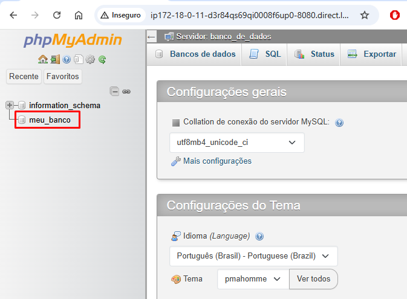  
phpMyAdmin conectado ao banco de dados MySQL.

</Center>

:::note O que foi visto:

- Como criar uma rede personalizada. (Ex: `docker network create minha_rede_personalizada`)
- Como conectar containers a uma rede personalizada. (Ex: `--network minha_rede_personalizada`)
- Como fazer a comunicação entre containers utilizando o nome do container como hostname. (Ex: `PMA_HOST=banco_de_dados`)
- Como utilizar variáveis de ambiente para configurar containers. (Ex: `--env MYSQL_ROOT_PASSWORD=senha123`)

:::

## Pratica 3 - Docker Compose

:::info Observação
🚧 Em construção 🚧
:::

## Conclusão

Parabéns por chegar até aqui! Você já aprendeu o básico do Docker e do Docker Compose, e viu como criar imagens, containers, volumes e como utilizar o Docker no dia a dia.

Espero que esse tutorial tenha te ajudado a entender melhor como Docker funciona e que comece a utilizar o Docker no seu dia a dia. Lembre-se que o Docker é uma ferramenta poderosa e versátil, e que existem muitos outros recursos e funcionalidades que você pode explorar. Continue praticando e explorando o Docker, e você vai ver como ele pode facilitar sua vida como desenvolvedor.

<Center>

  
Parabéns por chegar até aqui! 🎉

</Center>
