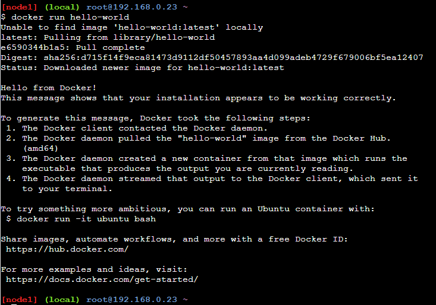
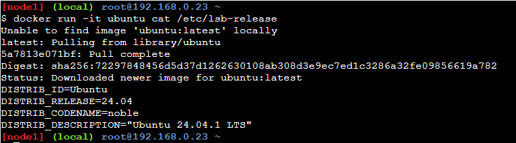
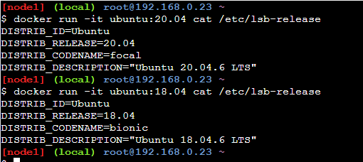
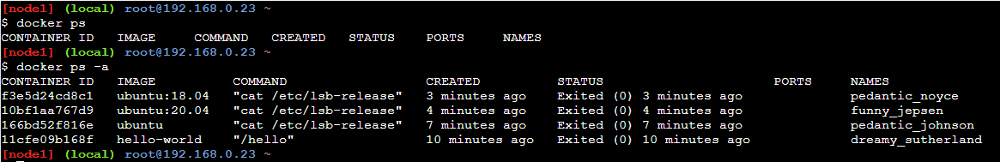
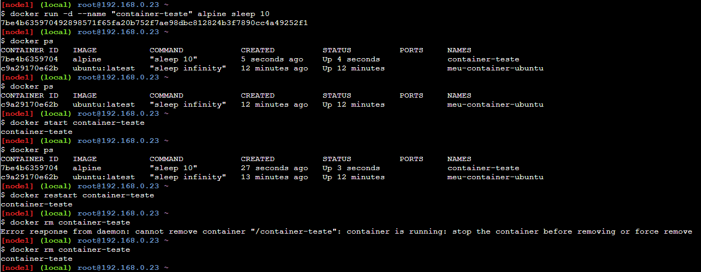
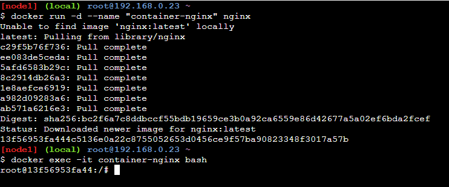

import Center from "@site/src/components/Center";

:::info Observação
🚧 Em construção 🚧
:::

Fala pessoal, tudo bem? Hoje quero falar um pouco sobre Docker, na minha opinião uma das ferramentas mais importantes para um desenvolvedor, logo após [Git](/tutorial/git/), pois permite que você crie ambientes isolados para suas aplicações, facilitando o desenvolvimento, teste e deploy de suas aplicações, padronizando ambientes e evitando o famoso "na minha máquina funciona".

<Center>

  
Docker + Container = ❤️

</Center>

## O que é Docker?

Na [documentação oficial](https://docs.docker.com/get-started/docker-overview/) do Docker, temos a seguinte definição:

> Docker is an open platform for developing, shipping, and running applications. Docker enables you to separate your applications from your infrastructure so you can deliver software quickly. With Docker, you can manage your infrastructure in the same ways you manage your applications. By taking advantage of Docker's methodologies for shipping, testing, and deploying code, you can significantly reduce the delay between writing code and running it in production.

Que em uma tradução livre seria:

> Docker é uma plataforma aberta para desenvolver, enviar e executar aplicações. Docker permite que você separe suas aplicações da sua infraestrutura para que você possa entregar software rapidamente. Com Docker, você pode gerenciar sua infraestrutura da mesma forma que gerencia suas aplicações. Ao aproveitar as metodologias do Docker para enviar, testar e implantar código, você pode reduzir significativamente o atraso entre escrever o código e executá-lo em produção.

## História e evolução do Docker

O Docker utiliza tecnologias existentes no Linux, como **namespaces** e **cgroups**, para criar, executar e gerenciar containers. O Docker foi criado em 2013 por Solomon Hykes, como um projeto interno da dotCloud, uma empresa de PaaS (Platform as a Service). Em 2013, o Docker foi lançado como um projeto open-source, e em 2014, a dotCloud mudou o nome para Docker Inc., para focar no desenvolvimento e suporte do Docker.

O conceito de **Linux Containers (LXC)** já existia antes do Docker, mas o Docker adicionou uma camada de abstração para facilitar a criação, execução e gerenciamento de containers, além de adicionar funcionalidades como Dockerfile, Docker Compose e Docker Hub.

:::info Observação

Existem outras tecnologias de containers, como **rkt (Rocket)**, **Podman**, **LXD**, **containerd**, **CRI-O**, **Kubernetes**, etc. Mas o Docker é o mais conhecido e utilizado, e é o que vamos focar nesse tutorial.

:::

## Vantagens do uso de containers

- **Leveza**: Containers compartilham o mesmo kernel do host, então eles são mais leves que máquinas virtuais.
- **Rápido**: Containers são mais rápidos para iniciar e parar que máquinas virtuais.
- **Portabilidade**: Containers podem ser executados em qualquer lugar, desde o seu laptop até o ambiente de produção.
- **Padronização**: Com Docker, você pode padronizar os ambientes de desenvolvimento, teste e produção.
- **Isolamento**: Containers são isolados do host e de outros containers, então você pode executar várias aplicações no mesmo host sem interferência.
- **Escalabilidade**: Com Docker, você pode escalar sua aplicação facilmente, adicionando ou removendo containers.
- **Reprodutibilidade**: Com Docker, você pode reproduzir o ambiente de desenvolvimento, teste e produção facilmente.
- **Segurança**: Containers são isolados do host e de outros containers, então você pode executar aplicações de terceiros com segurança.

## Docker vs Máquina Virtual

Antes de continuarmos, é importante entender a diferença entre Docker e Máquina Virtual.

<Center>

  
Fonte: https://www.sdxcentral.com/cloud/containers/definitions/containers-vs-vms/

</Center>

### Máquina Virtual

- Utiliza um Hypervisor para virtualizar o hardware.
- Cada máquina virtual possui seu próprio sistema operacional.
- Cada máquina virtual possui seu próprio kernel.
- Cada máquina virtual possui seu próprio sistema de arquivos.
- Cada máquina virtual possui seu próprio consumo de memória e CPU.
- Cada máquina virtual é isolada da outra.

Em resumo, a Máquina Virtual é uma máquina dentro de outra máquina, e isso consome mais recursos computacionais, visto que cada máquina virtual possui seu próprio sistema operacional, kernel, sistema de arquivos.

### Docker

- Utiliza o Docker Engine para gerenciar containers e a comunicação com o host.
- Todos os containers compartilham o mesmo sistema operacional.
- Todos os containers compartilham o mesmo kernel.
- Todos os containers compartilham o mesmo sistema de arquivos.
- Todos os containers compartilham o mesmo consumo de memória e CPU do host. Mas cada container pode ter limites de memória e CPU individuais.
- Cada container é isolado do outro.

Em resumo, o Docker compartilha o sistema operacional e kernel do host, e isso consome menos recursos computacionais, somente a aplicação e suas dependências são isoladas do host e dos outros containers.

## Conceitos básicos

Vamos passar por alguns conceitos básicos do Docker antes de vermos como isso funciona na prática. Assim quando chegarmos na parte prática, você vai entender melhor como Docker pode te ajudar no dia a dia.

### Imagem (Image)

Uma imagem é um pacote que contém tudo o que é necessário para executar uma aplicação, incluindo o código, as bibliotecas, as dependências, as variáveis de ambiente e as configurações. **Uma imagem é somente leitura e é usada para criar containers.**

### Container

Um container Docker é uma instância de uma imagem em execução. Diferente da imagem que é somente leitura, **um container é efêmero, ou seja, ele é destruído quando é finalizado e com isso, os dados são perdidos.** Mas você pode persistir os dados do container utilizando volumes. O container é isolado do host e de outros containers, e possui seu próprio sistema de arquivos, processos, rede e variáveis de ambiente. Então você pode executar várias aplicações em containers separados no mesmo host sem interferência.

### Tag

Uma tag é uma referência a uma imagem. **Uma imagem pode ter várias tags, e cada tag pode ser usada para identificar uma versão da imagem.** Por padrão, uma imagem sem tag é considerada a tag `latest`. Então você pode utilizar tags para identificar versões específicas da imagem, como `latest`, `1.0`, `1.1`, `1.2`, etc.

Exemplo:

- `ubuntu`: Última versão da imagem Ubuntu. O mesmo que `ubuntu:latest`.
- `ubuntu:latest`: Última versão da imagem Ubuntu. O mesmo que `ubuntu`.
- `ubuntu:24.04`: Versão 24.04 da imagem Ubuntu.
- `ubuntu:18.04`: Versão 18.04 da imagem Ubuntu.

### Docker Hub

Docker Hub é um serviço na nuvem que permite que você compartilhe imagens Docker publicamente ou privadamente. **Docker Hub é o repositório oficial de imagens Docker, é o que conhecemos como _Docker Registry_.** No Docker Hub, você pode encontrar imagens oficiais de várias tecnologias, como Ubuntu, MySQL, PostgreSQL, Nginx, Apache, etc. Você também pode criar seu próprio repositório no Docker Hub e compartilhar suas imagens com outras pessoas.

Existem outros _registries_ de imagens Docker, mas o Docker Hub é o mais conhecido e utilizado.

### Dockerfile

Um Dockerfile é um arquivo de texto que contém uma lista de instruções para criar uma imagem. **Um Dockerfile é usado para automatizar a criação de imagens.** Com um Dockerfile, você pode definir o ambiente de execução da sua aplicação, como a imagem base, as dependências, as variáveis de ambiente, os comandos de instalação, os comandos de execução, etc. Com um Dockerfile, você pode padronizar o ambiente de desenvolvimento, teste e produção da sua aplicação.

O Dockerfile é composto por várias instruções, como `FROM`, `RUN`, `COPY`, `CMD`, `ENTRYPOINT`, `EXPOSE`, `ENV`, `WORKDIR`, `VOLUME`, `USER`, `HEALTHCHECK`, etc.

Exemplo de um Dockerfile para criar uma imagem com Node.js:

```Dockerfile title="Dockerfile"
# Define a imagem base
# Geralmente é o primeiro comando no Dockerfile, e é obrigatório
# Imagem oficial do Node.js
# https://hub.docker.com/layers/library/node/23.6.0/images/sha256-39a107554b5037a135efb3853517dcc66cf653a144ff3f16533edd65c36b4abf
FROM node:23.6.0

# Define o diretório de trabalho
# É opcional, mas é uma boa prática definir o diretório de trabalho
WORKDIR /app

# Copia os arquivos do host para o container
COPY . .
# O comando COPY copia os arquivos do host para o container.
# .(ponto) é o diretório atual do host, e .(ponto) é o diretório atual do container, que por causa do WORKDIR é /app
# Então ele copiará todos os arquivos do diretório atual do host para o diretório /app do container

# Instala as dependências
RUN npm install

# Variáveis de ambiente para produção
ENV NODE_ENV=production

# Expõe a porta 3000
# É opcional, mas é uma boa prática expor a porta que a aplicação utiliza
EXPOSE 3000

# Define o comando de execução quando o container for iniciado
# Forma 1: CMD ["node", "index.js"]
# Forma 2: CMD node index.js
CMD ["node", "index.js"]
```

Esse é um exemplo simples de um Dockerfile para criar uma imagem com Node.js. Com esse Dockerfile, você pode criar uma imagem com Node.js, instalar as dependências, expor a porta 3000 e definir o comando de execução. Com essa imagem, você pode criar e executar containers com Node.js facilmente.

Depois da imagem criada, você não precisa mais se preocupar com a instalação do Node.js, das dependências, das variáveis de ambiente, da porta, etc. Sempre que for executado um container a partir dessa imagem, ele terá tudo o que precisa para executar a aplicação, sempre da mesma forma.

Depois vamos criar mais exemplos para entender melhor como isso funciona na prática.

### Docker Compose

Docker Compose é uma ferramenta que permite que você defina e execute aplicações Docker multi-container. **Com Docker Compose, você pode usar um arquivo YAML (compose.yaml) para configurar os serviços da sua aplicação, e depois, com um único comando, você cria e inicia todos os serviços.** Cada serviço é executado em um container separado. Com Docker Compose, você pode definir o ambiente de desenvolvimento, teste e produção da sua aplicação, e compartilhar esse ambiente com outras pessoas.

Seguindo o exemplo anterior, da para criar um arquivo `compose.yaml` com a aplicação e o banco de dados, e com um único comando, você cria e inicia os containers da aplicação e do banco de dados.

```yaml title="compose.yaml"
services:
  app:
    build:
      context: .
      dockerfile: Dockerfile # Caminho do Dockerfile criado anteriormente
    ports:
      - "3000:3000"
    depends_on:
      - db

  db:
    image: mysql:5.7
    environment:
      MYSQL_ROOT_PASSWORD: root
      MYSQL_DATABASE: app
```

O exemplo acima iria criar dois containers, um com a aplicação Node.js e outro com o banco de dados MySQL. O container da aplicação Node.js iria depender do container do banco de dados MySQL, então o Docker Compose iria criar e iniciar o container do banco de dados MySQL primeiro, e depois o container da aplicação Node.js. Com isso, você pode definir e executar aplicações Docker multi-container facilmente.

### Camadas (Layers)

Uma imagem Docker é composta por várias camadas, onde cada camada é uma modificação da camada anterior. **Quando você cria uma imagem, o Docker cria uma camada para cada instrução no Dockerfile.** Isso permite que o Docker reutilize camadas existentes quando você cria uma nova imagem, economizando tempo e espaço em disco. Com camadas, o Docker pode armazenar e compartilhar camadas comuns entre imagens, então se você criar duas imagens com a mesma base, o Docker vai reutilizar as camadas comuns entre as imagens, economizando espaço em disco.

De início você não precisa se preocupar com as camadas, mas quando tiver mais experiência com Docker, é importante entender como as camadas funcionam para otimizar o tamanho das imagens e o tempo de construção. Assim você pode criar imagens menores e mais rápidas, economizando espaço em disco e tempo de execução.

### Volume

Um container Docker é efêmero, ou seja, ele é destruído quando é finalizado e com isso, os dados são perdidos. **Para persistir os dados do container, você pode utilizar volumes, que são diretórios ou arquivos que são montados no container.** Com volumes, você pode persistir os dados do container mesmo que ele seja destruído. Com volumes, você pode compartilhar dados entre containers, persistir dados em um diretório específico, fazer backup dos dados, etc.

## Instalação

Não vou entrar em detalhes sobre a instalação do Docker, pois a própria [documentação oficial](https://docs.docker.com/get-docker/) é bem completa e fácil de seguir. Então, siga os passos de acordo com seu sistema operacional ou pesquisa no Google/YouTube que você vai encontrar vários tutoriais sobre a instalação do Docker para seu sistema operacional.

Um ponto importante é que existe dois tipos de inslação do Docker:

- Docker Desktop: É uma aplicação com interface gráfica que facilita a utilização do Docker, que faz a instalação do Docker Engine, Docker CLI e Docker Compose em um único pacote.
- Docker Engine: É a aplicação que faz a instalação do Docker Engine e Docker CLI, sem interface gráfica.

Você pode escolher qual instalar de acordo com sua preferência, num primeiro momento é recomendado utilizar o Docker Desktop, mas depois de aprender os principais comandos do Docker, é recomendado utilizar o Docker CLI para se acostumar com a linha de comando. Até porque a maioria dos tutoriais e documentações utilizam o Docker CLI, além de que em empresas, Docker Desktop não é permitido, por questões de licença.

<Center>

  
Não precisa ter medo do terminal, ele é seu amigo!

</Center>

## Principais comandos

### Docker

Você no dia a dia vai utilizar vários comandos do Docker, mas vou listar os principais comandos para você começar a utilizar o Docker.

- `docker version`: Mostra a versão do Docker instalada no host.
- `docker info`: Mostra informações sobre o Docker instalado no host.
- `docker run`: Cria e executa um container a partir de uma imagem.
- `docker ps`: Lista os containers em execução.
- `docker ps -a`: Lista todos os containers, incluindo os que estão parados.
- `docker images`: Lista as imagens no host.
- `docker image ls`: Lista as imagens no host. (Mesmo que `docker images`)
- `docker build`: Cria uma imagem a partir de um Dockerfile.
- `docker pull`: Baixa uma imagem do Docker Hub.
- `docker push`: Envia uma imagem para o Docker Hub.
- `docker exec`: Executa um comando em um container em execução.
- `docker stop`: Para um container em execução.
- `docker start`: Inicia um container parado.
- `docker restart`: Reinicia um container em execução.
- `docker rm`: Remove um container.
- `docker rmi`: Remove uma imagem.
- `docker volume ls`: Lista os volumes no host.
- `docker volume create`: Cria um volume.
- `docker volume rm`: Remove um volume.

A lista completa de comandos do Docker está disponível na [documentação oficial](https://docs.docker.com/reference/cli/docker/).

### Docker Compose

O Docker Compose tem seus próprios comandos, mas os principais são:

- `docker compose version`: Mostra a versão do Docker Compose instalada no host.
- `docker compose up`: Cria e inicia os containers definidos no arquivo `compose.yaml`.
- `docker compose down`: Para e remove os containers definidos no arquivo `compose.yaml`.
- `docker compose restart`: Reinicia os containers definidos no arquivo `compose.yaml`.
- `docker compose stop`: Para os containers definidos no arquivo `compose.yaml`.

A lista completa de comandos do Docker Compose está disponível na [documentação oficial](https://docs.docker.com/compose/reference/).

## Prática 1

<Center>

  
Respira fundo, que agora vamos para a prática!

</Center>

Agora que vimos alguns conceitos do Docker, vamos ver como isso funciona na prática. Assim você vai entender melhor como Docker pode te ajudar no dia a dia.

Caso você não tenha o Docker instalado, você pode utilizar o [Play with Docker](https://labs.play-with-docker.com/), que é um ambiente Docker online gratuito, onde você pode criar e executar containers sem precisar instalar o Docker no seu computador. O ambiente é temporário, então você pode utilizar para testar o Docker sem se preocupar em instalar nada, e depois que terminar, você pode fechar o ambiente.

Cada atividade vai ser um exemplo, incrementando o conhecimento anterior, então siga o passo a passo para entender melhor como Docker funciona.

### 1 - Hello World

Vamos começar com o famoso "Hello World" do Docker, que é criar e executar um container com a imagem `hello-world`.

```bash
# docker run <imagem>
docker run hello-world
```

Se tudo estiver configurado corretamenta, você pode notar as seguintes mensagens:

- `Unable to find image 'hello-world:latest' locally`: O Docker não encontrou a imagem `hello-world:latest` no host.
- `latest: Pulling from library/hello-world`: O Docker está baixando a imagem `hello-world:latest` do Docker Hub, isso é feito automaticamente toda vez que você executa um container com uma imagem que não existe no host.
- `Digest: sha256:4cf9c47f86...`: O Docker baixou a imagem `hello-world:latest` do Docker Hub, e essa é a hash da imagem, pode ser que você tenha uma hash diferente, pois a imagem pode ser atualizada, mas é o identificador único da imagem.
- `Status: Downloaded newer image for hello-world:latest`: O Docker baixou a imagem `hello-world:latest` do Docker Hub com sucesso.

Todas essas mensagens são logs do Docker, que são exibidos quando você executa um container. Esses logs são úteis para entender o que o Docker está fazendo, e para debugar problemas.

Após essa mensagem, você vai ver uma mensagem de boas-vindas do Docker, que é exibida pelo container `hello-world`. Essa mensagem é exibida pelo container e não pelo Docker, então o Docker não tem controle sobre o que é exibido, ele só executa o container e exibe os logs.

<Center>

  
Log do Docker ao rodar o container `hello-world`.

</Center>

:::note O que foi visto:

- Como baixar uma imagem do Docker Hub. (Ex: `hello-world:latest`)
- Como criar e executar um container com uma imagem. (Ex: `docker run hello-world`)
- Como interpretar os logs do Docker ao rodar um container. (Ex: `Unable to find image`, `Pulling from`, `Digest`, `Status`)

:::

### 2 - Ubuntu

Agora vamos criar e executar um container com a imagem `ubuntu`.

```bash
docker run -it ubuntu cat /etc/lsb-release
```

Ao rodar o comando acima, ele vai fazer o mesmo que o comando do [Hello World](#1---hello-world), mas ao invés de exibir uma mensagem de boas-vindas, ele vai exibir as informações da distribuição Ubuntu, por meio do comando `cat /etc/lsb-release`. Hoje a versão `ubuntu:latest` é a versão 24.04.1 LTS, mas pode ser que você tenha uma versão diferente, pois a imagem pode ser atualizada.

<Center>

  
Log do Docker ao rodar o container `ubuntu:latest`.

</Center>

Você pode explorar outras versões dessa imagem, como `ubuntu:20.04` ou `ubuntu:18.04`, basta substituir a tag `latest` pela versão desejada.

- `docker run -it ubuntu:20.04 cat /etc/lsb-release`
- `docker run -it ubuntu:18.04 cat /etc/lsb-release`

<Center>

  
Log do Docker ao rodar o container `ubuntu:latest`.

</Center>

Nesse exemplo, o comando `-it` (ou `-i -t` ou `-ti`) é utilizado para interagir com o container, ou seja, ele abre um terminal interativo no container. O comando `cat /etc/lsb-release` é utilizado para exibir as informações da distribuição Ubuntu.

:::note O que foi visto:

- Como utilizar tags para baixar versões específicas de imagens. (Ex: `ubuntu:20.04`)
- Como executar um comando em um container. (Ex: `cat /etc/lsb-release`)

:::

### 3 - `docker ps`

Agora vamos ver como listar os containers em execução e os containers parados.

```bash
# Lista os containers em execução
docker ps

# Lista todos os containers, incluindo os parados
docker ps -a
```

<Center>

  
Log do Docker ao rodar o container `ubuntu:latest`.

</Center>

Bem provável que você não tenha nenhum container em execução ou parado, então a lista vai estar vazia. Mas rodando o comando com o parâmetro `-a`, você vai ver todos os containers que foram executados no host, incluindo os que estão parados.

Você pode notar que o `CONTAINER ID` e o `NAMES` são identificadores únicos do container, que são gerados pelo Docker. Esses identificadores podem ser utilizados em outros comandos do Docker para referenciar o container, como `docker stop`, `docker start`, `docker restart`, `docker rm`, etc.

Além do nome, você pode ver o `IMAGE`, que é a imagem utilizada para criar o container, o `COMMAND`, que é o comando de execução do container, o `CREATED`, que é a data de criação do container, o `STATUS`, que é o status do container, o `PORTS`, que são as portas expostas pelo container.

:::note O que foi visto:

- Como listar os containers em execução. (Ex: `docker ps`)
- Como listar todos os containers, incluindo os parados. (Ex: `docker ps -a`)
- Como interpretar a lista de containers. (Ex: `CONTAINER ID`, `NAMES`, `IMAGE`, `COMMAND`, `CREATED`, `STATUS`, `PORTS`)

:::

:::tip Dica

Você não precisa passar o `CONTAINER ID` inteiro para referenciar o container, basta passar os primeiros caracteres, que sejam únicos dentre os demais containers.

:::

### 4 - `docker exec`

Agora vamos ver como executar um comando em um container em execução.

```bash
# Inicia um container em execução
docker run --rm -d --name "meu-container-ubuntu" ubuntu:latest sleep infinity

# Executa um comando no container em execução
docker exec meu-container-ubuntu ls -la /
```

<Center>

  
Log do Docker ao rodar o container `ubuntu:latest`.

</Center>

Nesse exemplo, o comando `docker run` é utilizado para criar e executar um container com a imagem `ubuntu:latest`, e o comando `sleep infinity` é utilizado para manter o container em execução. O parâmetro `--rm` é utilizado para remover o container quando ele for finalizado, o parâmetro `-d` é utilizado para executar o container em segundo plano, e o parâmetro `--name` é utilizado para dar um nome ao container. O nome é opcional, mas é uma boa prática dar um nome ao container para facilitar a referência.

Depois que o container estiver em execução, o comando `docker exec` é utilizado para executar o comando `ls -la /` no container `meu-container-ubuntu`. Esse comando vai listar todos os arquivos e diretórios do diretório raiz do container (`/`).

:::note O que foi visto:

- Como iniciar um container em execução. (Ex: `docker run --rm -d --name "meu-container-ubuntu" ubuntu:latest sleep infinity`)
- Como executar um comando no container em execução. (Ex: `docker exec meu-container-ubuntu ls -la /`)

:::

### 5 - Gerenciando estados

Agora vamos ver como parar, iniciar, reiniciar e remover um container.

```bash
# Para um container em execução
docker stop meu-container-ubuntu
```

O comando `docker stop` é utilizado para parar um container em execução. O parâmetro `meu-container-ubuntu` é o nome do container que você quer parar. Você pode utilizar o `CONTAINER ID` ou o `NAMES` para referenciar o container. Vale lembrar que na atividade [4](#4---docker-exec), o container foi iniciado com o parâmetro `--rm`, então ele vai ser removido automaticamente quando for parado. Então ele não vai aparecer na lista de containers parados. (Ex: `docker ps -a`)

Vamos então criar um novo container para ver como iniciar, reiniciar e remover um container.

```bash
docker run -d --name "container-teste" alpine sleep 10
```

O comando acima vai criar e executar um container com a imagem `alpine`, que é uma imagem leve do Linux. O comando `sleep 10` é utilizado para manter o container em execução por 10 segundos. O parâmetro `-d` é utilizado para executar o container em segundo plano, e o parâmetro `--name` é utilizado para dar um nome ao container.

Depois que passar os 10 segundos, o container vai finalizar automaticamente, você pode iniciar, reiniciar e remover o container manualmente.

```bash
# Inicia um container parado
docker start container-teste

# Reinicia um container em execução
docker restart container-teste

# Remove um container parado
docker rm container-teste
```

<Center>

  
Log do Docker ao rodar o container `alpine`.

</Center>

:::note O que foi visto:

- Como parar um container em execução. (Ex: `docker stop meu-container-ubuntu`)
- Como iniciar um container parado. (Ex: `docker start container-teste`)
- Como reiniciar um container em execução. (Ex: `docker restart container-teste`)
- Como remover um container parado. (Ex: `docker rm container-teste`)

:::

### 6 - Acessando o container

Agora vamos ver como acessar um container em execução.

```bash
# Inicia um container em execução
docker run -d --name "container-nginx" nginx

# Acessa o terminal interativo do container em execução
docker exec -it container-nginx bash
```

O comando acima vai criar e executar um container com a imagem `nginx`, que é um servidor web. O parâmetro `-d` é utilizado para executar o container em segundo plano, e o parâmetro `--name` é utilizado para dar um nome ao container. Depois que o container estiver em execução, o comando `docker exec` é utilizado para acessar o terminal interativo do container `container-nginx`. O parâmetro `-it` é utilizado para interagir com o container, e o comando `bash` é utilizado para abrir o terminal do container.

<Center>

  
Log do Docker ao rodar o container `nginx`.

</Center>

Da para notar que o terminal mudou, isso significa que você está dentro do container `container-nginx`. Você pode executar comandos no terminal do container, como `ls`, `pwd`, `cat`, `ps`, etc. Você pode explorar o container, instalar pacotes, editar arquivos, etc. Mas lembre-se que o container é efêmero, então os dados são perdidos quando o container é finalizado.

:::note O que foi visto:

- Como acessar o terminal interativo de um container em execução. (Ex: `docker exec -it container-nginx bash`)

:::

## Prática 2

Se chegou até aqui, parabéns! Você já aprendeu o básico do Docker, agora vamos ver como criar uma imagem com um Dockerfile. Assim você vai entender melhor como Docker pode te ajudar no dia a dia. 

### 1 - Dockerfile

Vamos criar um arquivo html simples e um Dockerfile para criar uma imagem com um servidor web.

```html title="index.html"
<!DOCTYPE html>
<html>
<head>
  <title>Meu Site</title>
</head>
<body>
  <h1>Olá Mundo!</h1>
</body>
</html>
```

```Dockerfile title="Dockerfile"
# Define a imagem base
FROM nginx:latest

# Copia os arquivos do host para o container
COPY index.html /usr/share/nginx/html/index.html

# Expõe a porta 80
EXPOSE 80

# Define o comando de execução quando o container for iniciado
CMD ["nginx", "-g", "daemon off;"]
```

Nesse exemplo, o Dockerfile é utilizado para criar uma imagem com o servidor web Nginx. O comando `FROM` é utilizado para definir a imagem base, que é a imagem `nginx:latest`. O comando `COPY` é utilizado para copiar o arquivo `index.html` do host para o diretório `/usr/share/nginx/html/index.html` do container. O comando `EXPOSE` é utilizado para expor a porta 80 do container. O comando `CMD` é utilizado para definir o comando de execução do container, que é `nginx -g 'daemon off;'`.


