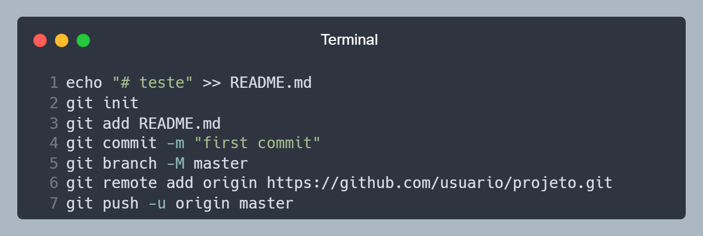

## Introdução

Em conversas com outros desenvolvedores, percebi um padrão de dúvidas sobre o **Git**. A maioria delas são como utilizar Git no dia a dia, como enviar alterações para o repositório remoto, como atualizar o repositório local com as alterações feitas remotamente, etc.

Então esse guia tem como objetivo ser um guia rápido de utilização do Git, para você **deixar salvo nos favoritos** e consultar quando precisar.

:::warning Aviso
Não é um tutorial completo, apenas um guia de utilização rápida. Para entender melhor o Git, recomendo o [tutorial do Git](/tutorial/git) aqui do site.
:::

## Conceitos

Não é necessário entender todos os conceitos do Git para utilizar ele no dia a dia, mas é importante entender alguns conceitos para não se perder no meio do caminho.

### Sequência de comandos

O Git funciona com diversos comandos, que são executados em sequência. Entretanto, não é todo comando que precisa de uma sequência, alguns comandos podem ser executados quando necessário.

Um exemplo é quando criamos nosso repositório no GitHub. O GitHub nos dá uma sequência de comandos para executar no terminal. Mas você não precisa seguir exatamente essa sequência, pois alguns comandos podem ser executados de forma independente.

<div style={{textAlign: 'center', fontSize: '15px', color: '#999' }}>

  
Exemplo de sequência sugerida pelo GitHub.

<!-- https://carbon.now.sh/?bg=rgba%28171%2C+184%2C+195%2C+1%29&t=nord&wt=none&l=application%2Fx-sh&width=650&ds=false&dsyoff=20px&dsblur=68px&wc=true&wa=false&pv=16px&ph=16px&ln=true&fl=1&fm=Hack&fs=14px&lh=133%25&si=false&es=2x&wm=false&code=echo%2520%2522%2523%2520teste%2522%2520%253E%253E%2520README.md%250Agit%2520init%250Agit%2520add%2520README.md%250Agit%2520commit%2520-m%2520%2522first%2520commit%2522%250Agit%2520branch%2520-M%2520master%250Agit%2520remote%2520add%2520origin%2520https%253A%252F%252Fgithub.com%252Fusuario%252Fprojeto.git%250Agit%2520push%2520-u%2520origin%2520master&tb=Terminal -->

</div>

Quando observamos a sequência, podemos separar em 4 partes:

1. Criar o repositório local.
    - `git init`
2. Vincular o repositório local com o repositório remoto.
    - `git branch -M master`
    - `git remote add origin https://github.com/usuario/projeto.git`
3. Adicionar os arquivos do projeto no repositório local.
    - `git add README.md`
    - `git commit -m "first commit"`
4. Enviar as alterações para o repositório remoto.
    - `git push -u origin master`

Nesse exemplo, você obrigatoriamente precisa que o **bloco 1** sejá o primeiro e o **bloco 4** seja o último. Mas os **blocos 2 e 3** podem ser alternados sem problemas.
Vale notar que os comandos do **bloco 2** podem ser executados em qualquer momento (após bloco 1 e antes do bloco 4) e podem ser separados. Porém, os comandos do **bloco 3** precisam ser executados em sequência e não podem ser separados.

Então não se prenda em aprender a sequência de comandos, mas sim o que cada comando faz, isso vai te ajudar a entender melhor o Git e como ele pode te ajudar no dia a dia.

### Termos
- **Repositório:** É um local onde ficam armazenados os arquivos do seu projeto.
    - **Repositório local:** É o repositório que fica no seu computador.
    - **Repositório remoto:** É o repositório que fica em um servidor, como o GitHub, GitLab, etc.
- **Branch:** É uma ramificação do seu repositório. É uma forma de organizar o seu projeto em diferentes versões. Por padrão, o Git cria uma branch chamada `main` (ou `master`).
- **Commit:** É uma alteração feita no seu repositório. É uma forma de organizar as alterações feitas no seu projeto.
- **Push:** É o envio de alterações do seu repositório local para o repositório remoto.
- **Pull:** É a atualização do seu repositório local com as alterações do repositório remoto.
- **Clone:** É a cópia de um repositório remoto para o seu repositório local.

## Principais ações

- [Primeiro commit](#primeiro-commit)
- [Criar um repositório local](#criar-um-repositório-local)
- [Vincular um repositório remoto](#vincular-um-repositório-remoto)
- [Clonar um repositório remoto existente](#clonar-um-repositório-remoto-existente)
- [Enviar alterações para o repositório remoto](#enviar-alterações-para-o-repositório-remoto)
- [Atualizar repositório local com repositório remoto](#atualizar-repositório-local-com-repositório-remoto)

### Primeiro commit

:::caution Atenção
Só utilize essa explicação se você estiver criando um repositório do zero e deseja enviar as alterações para o repositório remoto recém criado.
:::

Você criou um repositório local e deseja enviar as alterações para o repositório remoto recém criado.

**Pré-requisitos:**
- Você já deve ter criado um repositório remoto no GitHub (ou similar).

**Passos:**
1. Acesse a pasta raiz do seu projeto.
2. Abra o terminal na pasta e execute o comando abaixo para criar um repositório local.

```bash
git init
```

3. Execute o comando abaixo para adicionar as alterações.

```bash
git add .
```

4. Execute o comando abaixo para commitar as alterações.

```bash
git commit -m "MENSAGEM_DE_COMMIT"
```

5. Execute o comando abaixo para criar uma branch.

```bash
git branch -M BRANCH
```

Se o nome da sua branch for `main`, o comando ficará assim:

```bash
git branch -M main
```

6. Execute o comando abaixo para vincular o repositório remoto ao repositório local.

```bash
git remote add origin URL_DO_PROJETO
```

Se o link do seu repositório remoto for `https://github.com/usuario/projeto.git`, o comando ficará assim:

```bash
git remote add origin https://github.com/usuario/projeto.git
```

7. Execute o comando abaixo para enviar as alterações para o repositório remoto.

```bash
git push -u origin BRANCH
```

Se o nome da sua branch for `main`, o comando ficará assim:

```bash
git push -u origin main
```

**Explicação:**
- O comando `git init` cria um repositório local na pasta atual, adicionando uma pasta oculta `.git` na pasta onde o comando foi executado.
- O comando `git add .` adiciona todas as alterações feitas no repositório local.
- O comando `git commit -m "MENSAGEM_DE_COMMIT"` commita as alterações feitas no repositório local.
- O comando `git branch -M BRANCH` cria uma branch com o nome `BRANCH` e o `-M` indica que vai renomear a branch atual para o nome `BRANCH`.	
- O comando `git remote add origin https://github.com/usuario/projeto.git` vincula o repositório remoto ao repositório local.
- O comando `git push -u origin BRANCH` envia as alterações do repositório local para o repositório remoto. O `-u` indica que a branch `BRANCH` será a branch padrão para o repositório remoto.

### Criar um repositório local

Você tem seu código localmente e deseja criar um repositório Git para ele, para posteriormente enviar para um repositório remoto.

**Pré-requisitos:**
- Nenhum.

**Passos:**
1. Acesse a pasta raiz do seu projeto.
2. Abra o terminal na pasta e execute o comando abaixo para iniciar o repositório local.

```bash
git init
```

**Explicação:**
- O comando `git init` cria um repositório local na pasta atual, adicionando uma pasta oculta `.git` na pasta onde o comando foi executado.

### Vincular um repositório remoto

Você tem um repositório remoto e deseja vincular ele ao seu repositório local.

**Pré-requisitos:**
- Você já deve ter criado um repositório local.
- Você já deve ter criado um repositório remoto no GitHub (ou similar).

**Passos:**
1. Acesse a pasta raiz do seu projeto.
2. Abra o terminal na pasta e execute o comando abaixo para vincular o repositório remoto.

```bash
git remote add origin URL_DO_PROJETO
```

Se o link do seu repositório remoto for `https://github.com/usuario/projeto.git`, o comando ficará assim:

```bash
git remote add origin https://github.com/usuario/projeto.git
```

**Explicação:**
- O comando `git remote add origin` vincula o repositório remoto ao repositório local. O nome `origin` é um apelido para o repositório remoto, você pode escolher qualquer nome para ele, mas por padrão é utilizado `origin`.

### Clonar um repositório remoto existente

Você quer clonar um repositório remoto existente para o seu computador.

**Pré-requisitos:**
- Você já deve ter criado um repositório remoto no GitHub (ou similar).

**Passos:**
1. Acesse a pasta onde deseja clonar o repositório. Ao clonar uma nova pasta será criada com o nome do repositório.
2. Abra o terminal na pasta e execute o comando abaixo para clonar o repositório.

```bash
git clone URL_DO_PROJETO
```

Se o link do seu repositório remoto for `https://github.com/usuario/projeto.git`, o comando ficará assim:

```bash
git clone https://github.com/usuario/projeto.git
```

**Explicação:**
- O comando `git clone` clona o repositório remoto para o repositório local (sua maquina).

### Enviar alterações para o repositório remoto

Você fez alterações no seu repositório local e deseja enviar essas alterações para o repositório remoto.

**Pré-requisitos:**
- Você já deve ter criado um repositório local.
- Você já deve ter criado um repositório remoto no GitHub (ou similar).

**Passos:**
1. Acesse a pasta raiz do seu projeto.
2. Abra o terminal na pasta e execute o comando abaixo para adicionar as alterações.

```bash
git add .
```

3. Execute o comando abaixo para commitar as alterações.

```bash
git commit -m "MENSAGEM_DE_COMMIT"
```

4. Execute o comando abaixo para enviar as alterações para o repositório remoto.

```bash
git push origin BRANCH
```

Se o nome da sua branch for `main`, o comando ficará assim:

```bash
git push origin main
```

**Explicação:**
- O comando `git add .` adiciona todas as alterações feitas no repositório local.
- O comando `git commit -m "MENSAGEM_DE_COMMIT"` commita as alterações feitas no repositório local. A mensagem deve ser uma explicação do que foi alterado.
- O comando `git push origin BRANCH` envia as alterações do repositório local para o repositório remoto. 

### Atualizar repositório local com repositório remoto

Você fez alterações no repositório remoto e deseja atualizar o repositório local com essas alterações.

**Pré-requisitos:**
- Você já deve ter criado um repositório local.
- Você já deve ter criado um repositório remoto no GitHub (ou similar).

**Passos:**
1. Acesse a pasta raiz do seu projeto.
2. Abra o terminal na pasta e execute o comando abaixo para atualizar o repositório local.

```bash
git pull origin BRANCH
```

Se o nome da sua branch for `main`, o comando ficará assim:

```bash
git pull origin main
```

**Explicação:**
- O comando `git pull origin BRANCH` atualiza o repositório local com as alterações do repositório remoto.

## Resumo dos comandos

Se você já conhece o Git e só precisa de uma referência rápida dos comandos, aqui está uma lista com os comandos mais utilizados e menos utilizados.

### Mais utilizados

| Comando | Descrição |
| --- | --- |
| `git checkout -b BRANCH` | Cria uma branch com o nome `BRANCH` e muda para ela. |
| `git checkout BRANCH` | Muda para a branch `BRANCH`. |
| `git add .` | Adiciona todas as alterações feitas no repositório local. |
| `git commit -m "MENSAGEM_DE_COMMIT"` | Commita as alterações feitas no repositório local. |
| `git push origin BRANCH` | Envia as alterações do repositório local para o repositório remoto. |
| `git pull origin BRANCH` | Atualiza o repositório local com as alterações do repositório remoto. |

### Menos utilizados

| Comando | Descrição |
| --- | --- |
| `git init` | Inicia um repositório local. |
| `git clone URL_DO_PROJETO` | Clona o repositório remoto para o repositório local (sua maquina). |
| `git remote add origin URL` | Vincula o repositório remoto ao repositório local. |
| `git branch -M BRANCH` | Cria uma branch com o nome `BRANCH` e o `-M` indica que vai renomear a branch atual para o nome `BRANCH`. |
| `git push -u origin BRANCH` | Envia as alterações do repositório local para o repositório remoto. O `-u` indica que a branch `BRANCH` será a branch padrão para o repositório remoto. |