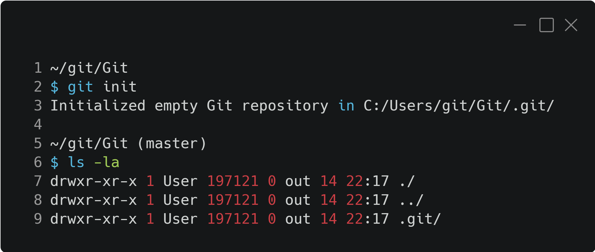

:::tip LINK
**LINK:** [https://git-scm.com/](https://git-scm.com/)
:::

# Introdução

**Git**, para alguns um sonho, para outros um pesadelo, por que isso? Vamos entender o que é **Git**, para que usamos, como configurar, quais são os principais comandos, tudo que você precisa para começar a utilizar essa ferramenta incrível.  

Na minha opinião, o **Git** é a ferramenta mais importante que você deve aprender, pois em muitas vagas de emprego é visto como um dos requisitos mínimos para um desenvolvedor e/ou profissional da área de TI. Não consigo imaginar uma empresa de software que não utiliza **Git** hoje em dia.

:::note Aviso
Futuramente em outro tópico vai ser abordado a fundo o que são os sites como Github, GitLab, Bitbucket entre outros. Pórem a grande diferença é que esses sites são servições que armazenam projetos que utilizam o versionamento que o **Git** realiza, pois o **Git** é uma ferramenta que roda em seu computador.
:::
<div style={{textAlign: 'center'}}>


<div style={{fontSize: '15px', color: '#999'}}>

Logo do Git

</div>

</div>

## O que é Git?

No site oficial do **Git** tem a seguinte descrição:
> Git is a free and open source distributed version control system designed to handle everything from small to very large projects with speed and efficiency.  

Em uma tradução livre seria algo como:

> Git é um sistema de controle de versão distribuído gratuitamente e de código aberto projetado para lidar com tudo, desde projetos pequenos a muito grandes com velocidade e eficiência.

Vamos entender o que está escrito, analisando algumas palavras chaves, começando com o que é um **sistema de controle de versão?** 

Para responder esta pergunta, vamos entender em que categoria de programa o **Git** se encaixa e qual seu propósito.
O **Git** é um ****SCM**** **S**ource **C**ode **M**anagement (Sistema de Controle de Código Fonte). Um dos seus principais recursos é o de versionamento de código, salvando quem, quando e o que foi alterado conforme seu software for evoluindo.

**Distribuído** representa que ele funciona independente, não necessitando estar conectado a internet ou servidor.

**Gratuito e de código aberto**, segundo seu criador, "Está é a única maneira certa de se fazer software".

**Projetos pequenos e muito grandes**, é uma afirmação que não importa que projeto você tem, o **Git** vai conseguir lidar com ele.

Além de tudo que foi dito acima, temos **com velocidade e eficiência**, todas essas palavras chaves são requisitos mínimos impostos quando o projeto do **Git** foi feito, e é seguido isto até hoje.

## História resumida

Seu criador é nada menos que Linus Torvalds, criador do Kernel Linux, do qual utilizava um outro programa de SCM, o *BitKeeper*. Pórem a empresa que criava o *BitKeeper* decidiu mudar a licença desse programa, que era gratuito e passou a ser um programa pago. Linus se negou a ter que pagar por um programa, e foi em busca de um substituto para o SCM que utilizava. Em sua procura, todas as opções de programas não atendiam aos seguintes requisitos:

* Gratuito
* Distribuído
* Performance
* Garantir que o que for salvo, possa ser baixado igual a forma que foi salvo.

Todos esses pontos podem ser visto no video abaixo aos [10:23](https://youtu.be/4XpnKHJAok8?t=623).

Essa busca resultou em nenhum programa. Nas palavras do Linus *`"O resultado final foi que eu decidi que posso escrever algo melhor do que qualquer coisa lá fora em duas semanas, e eu estava certo"`* essa frase foi dita durante uma palestra dentro do Google, do video abaixo, aos [12:15](https://youtu.be/4XpnKHJAok8?t=735).

Eu falei que era resumido, mas basicamente o **Git** utiliza uma ferramenta do linux, o *diff*, está ferramenta gera a diferença entre dois arquivos, como isso ele já tinha pronto no Linux, bastava criar uma forma de salvar essas diferenças e organizar isso em uma árvore com a referência dos arquivos.

<div style={{textAlign: 'center'}}>

<iframe 
    width="100%"
    height="315"
    src="https://www.youtube-nocookie.com/embed/4XpnKHJAok8"
    frameborder="0"
    allow="accelerometer; autoplay; clipboard-write; encrypted-media; gyroscope; picture-in-picture"
    allowfullscreen
></iframe>

</div>

Caso tenha interesse em ver a palestra do Linus no Google, segue o vídeo, ative as legendas caso necessário.

## Fluxo

Antes de ver na prática, é importante ver um pouco de teoria e como funciona o **Git**. Normalmente você não utiliza o **Git** sozinho, geralmente tem um servidor do qual você e seus colega baixam o código e enviam alterações, damos o nome de ****Remoto**** ou ****Repositório remoto****.

Temos que saber que nosso código tem um ciclo de vida, o coração dele podemos dizer que é o ****Remoto****, mas em nossa máquina, ele tem outra vida, mas como assim?

Separamos o código entre dois ambientes, **local** e **remoto**. Quando vamos começar a trabalhar com um projeto, realizamos um clone do remoto, e passamos a ter uma cópia local, e assim não precisamos estar conectados sempre com o ambiente remoto. Dentro do ambiente local, temos as seguintes separações:

* **Diretório local**: Pasta na qual você utiliza para programar, onde seu projeto está. 
* **Stage (INDEX)**: Arquivos modificados que foram indexados pelo **git**.
* **Repositório Local (HEAD)**: Cópia do repositório remoto em seu dispositivo.

Entender essa separação é fundamental, segue uma imagem com a representação do lado local e remoto.

<div style={{textAlign: 'center'}}>


</div>

### *Branches*

Antes de seguirmos para os demais comandos, temos que entender como o **Git** separa os arquivos em seu computador. Um projeto pode ter vários *branches*, geralmente o *branch* principal vai ser o ****master****, mas por causa do movimento BLM, pode ser que veja algum projeto com o *branch* principal sendo o ****main****, independente do nome, o que é isso, *branch*, por que ele é importante?

***Branches*** são ramificações que você pode fazer em seu projeto, sempre em um projeto tem um *branch* que é o principal, e a partir dele, você pode criar outro *branch* que vai conter melhorias, correções, novas funções, etc. Dessa forma, você consegue desenvolver sem afetar o código que está correto (*branch* principal), basta criar um novo e fazer suas alterações.

## CLI

O termo **CLI** significa **C**ommand-**L**ine **I**nterface (Interface de Linha de Comandos). Acho que esta parte assusta um pouco as pessoas, pois o **Git** não tem uma interface gráfica, então todas as suas ações tem que rodar por linha de comando. Existe no mercado alguns programas que funcionam com **Git** e disponibilizam uma interface gráfica, mas não é necessário, pode parecer complicado no início mas não é.

:::info Dica
Se você nunca teve experiência com Terminal (Linux/MacOS) ou CMD/Powershell (Windows), não tenha medo, é mais fácil do que parece.
:::

### Instalação

*** Vai ficar para depois, estou com preguiça de montar uma máquina virtual e tirar as prints, fica para depois. ***

### Configuração

Após instalar o **Git**, é preciso configurar um nome e um e-mail, dados que são anexados no commit, para identificar o autor. Para isso, rode os comandos abaixo:

```bash
git config --global user.name "Nome Sobrenome"
git config --global user.email "exemplo@seuemail.com.br"
```

Um gosto meu particular é utilizar uma configuração que a solicitação de senha seja feita dentro do terminal.

```bash
git config --global core.askPass ""
```

:::note Dica
Você pode configurar seu **Git** para não pedir nem usuário e nem senha.
:::

### Primeiros passos

Não precisa decorar todos os comandos agora, basta saber o que dá para fazer com **Git**, eu mesmo tive por muito tempo um arquivo **.txt** com os comandos e a sequência que eu deveria utilizar eles, faça o mesmo, uma hora você vai perceber que tudo vai fluir naturalmente. 😀

### `git init`

O comando `git init` é onde tudo começa, você precisa rodar esse comando em um diretório para fazer com que o **Git** comece a gerenciar os arquivos, pastas e subpastas.

Após rodar o comando `git init`, vai ser criada uma pasta chamada **.git**, dependendo da configuração do seu sistema operacional, você não vai ver esta pasta, mas basta rodar `ls -la`, que é o comando para listar arquivos ocultos.

<div style={{textAlign: 'center'}}>



</div>

* **Linha 2** - Comando `git init` rodado para iniciar o diretório para ser rastreado pelo **Git**.
* **Linha 6** - Comando `ls -la` para listar os arquivos, a **linha 7 e 8** são padrão do sistema e **linha 9** é a pasta **.git** criada.

:::caution Cuidado

No geral, não mexa na pasta `.git`, dependendo do que mexer dentro desta pasta, você pode corromper a estrutura.

:::

### `git status`

Agora que temos um diretório **.git**. Podemos rodar os outros comandos do **Git**. Usamos o `git status` para saber como está a situação dos arquivos em nosso diretório local, se tem algo alterado, novo, deletado, etc.

Eu gosto de utilizar `git status -s` que traz de uma forma resumida, na minha visão é mais prático para identificar as alterações.

Quando rodar esse comando, ele trará algumas informações sobre os arquivos:
* **Untracked** ou **U**: Arquivos novos que não estão indexados, o git ainda não tem conhecimento deles.
* **New** ou **A**: Arquivo foi indexado, git passa a gerenciar suas alterações.
* **Modified** ou **M**: Arquivo que já era indexado pelo git e foi modificado.
* **Deleted** ou **D**: Arquivo que já era indexado pelo git e foi deletado.
* **Renamed** ou **R**: Arquivo que já era indexado pelo git e foi renomeado.

### `git add`

Este comando tem o propósito de adicionar o arquivo ou pasta para o **stage**, isso significa que você quer salvar no **git** as alterações que foram feitas neste arquivo.

Esta ação sozinha não faz nada, mas sem ela, você não pode fazer um *commit*, então, após realizar as alterações que deseja no seu projeto (criar arquivos, renomear, alterar o conteúdo do arquivo), utilize `git add .` para adicionar todos os arquivos, ou `git add menu.txt` para adicionar o arquivo **menu.txt** no *stage*.

### `git commit`

No passo anterior vimos como adicionar um arquivo no *stage*, agora veremos como fazer com que essas alterações sejam enviadas para nosso repositório local. Para isso utilizamos `git commit`, a forma que gosto de explicar é *`"Pegar as alterações e adiciona numa caixinha(commit) que depois vai ser enviada para o remoto"`* .

O commit tem a relação de quais arquivos tem que ser enviados, o que mudou entre a versão anterior e a atual, o autor das alterações, data, etc. Utilize `git commit -m "Primeiro Commit"`, O parâmetro **-m** é a mensagem que vai ser anexado ao commit. É uma boa prática adicionar uma descrição do que foi alterado. 

### `git push`

Seguindo o que fizemos até agora, nós adicionamos uma alteração, criamos um commit, então falta enviar essa alteração para o repositório remoto, para isso utilizamos `git push`.

Para o comando funcionar corretamente, temos que falar qual repositório remoto vamos utilizar e para qual *branch* enviaremos.

```bash
git push origin master
```

O comando acima envia todos os commits do *branch* atual que estão em seu repositório local para o repositório remoto, nesse caso, o nome do repositório remoto é **origin**, e o *branch* é o **master**.

### `git fetch`

Utilize esse comando para puxar as alterações remotas para seu repositório local. Você deve obrigatoriamente informar qual é o repositório remoto do qual deseja pegar as alterações.

```bash
# puxar todas as alterações do repositório remoto
git fetch origin
# ou pode especificar um único branch e buscar só as alterações dele
git fetch origin master
```

O comando acima puxa todos os commits do repositório remoto **origin**, e no segundo caso filtra somente alterações do *branch*.

### `git merge`

O comando `git fetch` busca as alterações remotas, mas para aplicá-las em seu diretório local, você tem que fazer o *merge* delas, para isso, utilize `git merge`. Você pode sincronizar alterações do *branch* atual que está ou outro *branch*.

```bash
git merge origin/master
# ou fazer o merge de um branch local
git merge master
```

Parece que os dois comandos são iguais, mas quando utilizamos **origin/master**, você está especificando que quer o *branch* **master** do repositório ****remoto****, que você fez o **fetch** anteriormente. Quando utilizamos **master**, você está especificando que quer o *branch* **master** do repositório ****local****.

### `git pull`

Esse carinha aqui podemos fazer que é a combinação de dois outros métodos que vimos anteriormente, o `git fetch` e o `git merge`. Basicamente o `git pull` ele faz os dois comando em um só, puxa as alterações e faz o merge no diretório local

```bash
git pull origin master
```

### `git reset`

Até o momento vimos o caminho perfeito, mas se fizer 💩, o que o **git** pode fazer por nós, meros mortais? Para isso, temos o `git reset`, que desfaz as alterações.

Vamos com calma nessa parte, pois dependendo dos parâmetros que utilizar com `git reset` você pode perder alterações em seu código, então vamos ver elas e entender melhor.

Um dos parâmetros que temos é o **--soft**, ele vai voltar somente os commits do seu diretório local, mas vai manter as alterações nos arquivos.
```bash
git reset --soft origin/master
# ou
git reset origin/master
```

Mas se o que você quer é apagar tudo que fez, até mesmo os commits, utilize **--hard**, ele afeta seu diretório local e repositório local. 
```bash
git reset --hard origin/master
```

### `git checkout`

Muito utilizado no dia a dia, utilizamos `git checkout` para mudar o conteúdo do nosso diretório local. Imaginamos que eu tenho os seguintes *branches*: *master*, *dev* e *test*. Se eu quero mudar meu ambiente para fazer uma nova funcionalidade, e não quero afetar meu código no master, utilizar `git checkout dev` para mudar para um *branch* que já existe.

Caso eu queira criar um novo branch, posso utilizar `git checkout -b fix1` para criar um branch novo chamado **fix1**.

## Comandos utilizados com menos frequência

### `git clone`

Você tende a utilizar isso uma vez e pronto, você informa um repositório remoto e copia ele para sua máquina. Se for um repositório privado, vai ser solicitado usuário e senha, caso contrário, o clone acontece normalmente.

```bash
git clone https://github.com/microsoft/vscode.git
# comando para clonar o projeto do VS Code, disponível no GitHub.
```

Eu gosto de utilizar o parâmetro **-o** para atribuir um nome específico para meu repositório remoto, nesse caso, o nome que for colocado substitui o **origin**. É raro trabalhar em um projeto com mais de um repositório remoto, mas é possível.

> Exemplo: Uma empresa hipotética separou o ambiente de desenvolvimento em dois repositórios, **oficial** e **teste**. Além disso, ela não aceita que um programador envie suas alterações para o repositório **oficial**. Para ajudar no entendimento dos repositórios, você pode utilizar o parâmetro **-o** para atribuir um nome no momento do clone, como **-o oficial** e **-o teste**, então assim você pode fazer `git fetch oficial` e `git push teste master`.

```bash
# Realizar a copia do repositório do VSCode e renomear ele como remoto
git clone https://github.com/microsoft/vscode.git -o remoto
# Caso eu queria depois puxar novas alterações, utilizo assim
git fetch remoto
# Caso for enviar alterações
git push remoto master
```

### `git remote`

Ações relacionadas ao seu repositório remoto.

Para listar os repositórios que seu projeto tem. `git remote -v`, ele vai listar o repositório utilizado para **fetch** e para **push**.

Para adicionar um novo repositório remoto, passe o nome e o url do repositório.
```
git remote add origin1 https://github.com/microsoft/vscode.git
```

Se quiser remover o repositório, passe o nome do repositório remoto.
```
git remote remove origin1
```

### `git branch`

O mais importante desse comando, poderia dizer que é `git branch`, esse comando lista os repositórios locais que você tem, e marca com um **\*** o repositório atual.

Para listar todos os repositórios que o projeto tem, utilize `git branch -a`, ou se quiser só os repositórios remotos, `git branch -r`.

### `git clean`

Deleta todos os arquivos que não estão indexados pelo git. Mesmo quando você dá um `git reset --hard`, arquivos que não tão indexados ficam. Utilize `git clean` para limpar esses arquivos.

Eu gosto de utilizar os parâmetros **-d** e **-f**, que força apagar os arquivos e diretórios.
```bash
git clean -df
```

### `git log`

Verifique os commits do seu repositórios local, só rodar `git log`.

### `git reflog`

Esse é um comando mais avançado, se algum dia você perder parte do código que você fez um `git reset --hard`, talvez exista a possibilidade de recuperar utilizando `git reflog`. No caso `git reflog` vai mostrar uma sequência de **hash**, e daí você pode utilizar esse **hash** para fazer um `git reset hash`.

## Cuidados

Às vezes pode ser que seu objetivo seja forçar o envio de uma alteração, mas esse comando pode causar a perda de código permanentemente. Geralmente quando vemos um parâmetro **-f** temos que tomar cuidado, pois existe uma grande chance de ser **F** de Forçar, no caso, forçar uma alteração.
```bash
git push -f origin master
```

Um outro ponto para notar é que para deletarmos um branch local, utilizamos `git branch -d master`, entretanto, não dá para fazer push disso, então para deletar um branch remoto, basta colocar um **:** antes do seu nome, o que pode até acontecer por acidente na hora de digitar.
```bash
git push origin :master
```

## Extra

Alguns links que achei interessante, se tiver um tempo, dê uma olhada.

* [Git - Guia prático](http://rogerdudler.github.io/git-guide/index.pt_BR.html)
* [Git Flow](https://danielkummer.github.io/git-flow-cheatsheet/index.pt_BR.html)
* [Visualização interativa dos comandos](https://ndpsoftware.com/git-cheatsheet.html)

Achei interessante a imagem, tem uma representação do fluxo de acordo com cada comando.  

<div style={{textAlign: 'center', fontSize: '15px', color: '#999'}}>

<br />
Fonte: https://greenido.wordpress.com/2014/08/03/git-101-part-2-a-bit-more-advance-commands/

</div>