import Center from '@site/src/components/Center';

:::tip LINK
**LINK:** [https://git-scm.com/](https://git-scm.com/)
:::

## Primeiramente

Antes de começar a falar sobre **Git**, gostaria de dizer que este material foi criado com o intuito de ajudar as pessoas que estão começando a utilizar o **Git**, e não tem conhecimento nenhum sobre a ferramenta. Este material tem uma sequência de passos, para que você possa entender o que é o **Git**, como funciona, e como utilizar seus comandos com exemplos práticos, evoluindo comando em comando.

<Center>

  
Bora estudar!

</Center>

## Introdução

**Git**, para alguns um sonho, para outros um pesadelo, por que isso? Vamos entender o que é **Git**, para que é usado, como configurar, além de ver quais são os principais comandos e tudo o que você precisa para começar a utilizar essa ferramenta incrível.

Na minha opinião, o **Git** é a ferramenta mais importante que você deve aprender como um desenvolvedor/profissional da área de TI, pois em muitas vagas de emprego é visto como um dos requisitos mínimos. Não consigo imaginar uma empresa de software que não utiliza **Git** hoje em dia.

Hoje (2023) o **Git** é a ferramenta mais utilizada para versionamento de código, mas não é a única, existem outras ferramentas como: **SVN**, **Mercurial**, **CVS**.

<Center>

  
Logo do Git

</Center>

:::info Nota
Futuramente em outro tópico será abordado a fundo o que são os sites como GitHub, GitLab, Bitbucket entre outros. Porém, o principal ponto que temos que ter em mente é que esses sites são serviços que armazenam o código do projetos que utiliza o **Git** como versionamento, mas nada impede que você utilize o **Git** sem utilizar esses sites.
:::

## O que é Git?

No site oficial do **Git** tem a seguinte definição:

> Git is a free and open source distributed version control system designed to handle everything from small to very large projects with speed and efficiency.

Em uma tradução livre seria algo como:

> Git é um sistema de controle de versão distribuído gratuitamente e de código aberto projetado para lidar com tudo, desde projetos pequenos a muito grandes com velocidade e eficiência.

<!-- Adicionar um gif de pessoa confusa -->

<Center>


</Center>

Vamos entender o que está escrito, analisando algumas palavras-chave da frase:

- **Sistema de controle de versão**: O **Git** é um **SCM**, **S**ource **C**ode **M**anagement (Sistema de Controle de Código Fonte). Um dos seus principais recursos é o versionamento de código, salvando quem, quando e o que foi alterado conforme seu software for evoluindo.
- **Distribuído**: Representa que ele funciona de forma independente, não necessita conexão com a internet, e nem que precisa de um servidor central para funcionar, cada máquina que tem o **Git** instalado, pode enviar alterações para as outras máquinas.
- **Gratuito e de código aberto**: Segundo seu criador, _"Esta é a única maneira certa de se fazer software"_, um software que todos podem ver e contribuir com o projeto através do código fonte aberto, e o melhor, de graça.
- **Projetos pequenos e muito grandes com velocidade e eficiência**: Diz respeito a performance do **Git**, pois ele foi criado para ser rápido, e aguentar aplicações com milhares de linhas de código, como o **Kernel do Linux**.

Todas essas palavras-chave foram requisitos mínimos impostos quando o projeto do **Git** foi criado, e é seguido isto até hoje. Mas não se preocupe, você não precisa saber tudo isso para começar a utilizar o **Git**, são só informações complementares.

## História resumida

:::info Nota
Caso queira pular está parte histórica, pode ir direto para a [instalação](#instalação).
:::

Seu criador é nada menos que [Linus Torvalds](https://pt.wikipedia.org/wiki/Linus_Torvalds), criador do Kernel Linux, do qual utilizava um outro programa de SCM, antes de existir o **Git**, o _BitKeeper_. Pórem a empresa que criava o _BitKeeper_ decidiu mudar a licença desse programa, que era gratuito e passou a ser um programa pago. Linus se negou a ter que pagar por um programa, e foi em busca de um substituto. Em sua procura, todas as opções de programas não atendiam aos seguintes requisitos:

- Gratuito
- Distribuído
- Performático
- Garantir que o que for salvo, possa ser baixado igual a forma que foi salvo.

Todos esses pontos podem ser visto no video abaixo aos [10:23](https://youtu.be/4XpnKHJAok8?t=623).

Essa busca resultou em nenhum programa. Nas palavras do Linus _`"O resultado final foi que eu decidi que posso escrever algo melhor do que qualquer coisa lá fora em duas semanas, e eu estava certo"`_ essa frase foi dita durante uma palestra dentro do Google, que pode ser vista no video abaixo, aos [12:15](https://youtu.be/4XpnKHJAok8?t=735).

Eu falei que era resumido, mas basicamente o **Git** utiliza uma ferramenta do linux, o _diff_, está ferramenta gera a diferença entre dois arquivos, como isso ele já tinha pronto no Linux, bastava criar uma forma de salvar essas diferenças e organizar isso em uma árvore com a referência dos arquivos.

<Center>

<iframe 
    width="100%"
    height="315"
    src="https://www.youtube-nocookie.com/embed/4XpnKHJAok8"
    frameborder="0"
    allow="accelerometer; autoplay; clipboard-write; encrypted-media; gyroscope; picture-in-picture"
    allowfullscreen
></iframe>

</Center>

Caso tenha interesse em ver a palestra do Linus no Google, ela esta em inglês, mas você pode ativar as legendas caso necessário.

## Instalação

Vamos começar a utilizar o **Git**, para isso, instale-o e sua máquina, acesse o site oficial do [Git](https://git-scm.com/), e baixe a versão para o seu sistema operacional. Não vou entrar em detalhes de como instalar, pois é bem simples, basta seguir o instalador. Caso tenha dúvidas, dê uma pesquisada no Google ou Youtube, que vai terão vários tutoriais.

Para verificar se foi instalado corretamente, abra o terminal, e digite o seguinte comando:

```bash
git --version
```

Caso apareça a versão do **Git**, significa que foi instalado corretamente.

<Center>

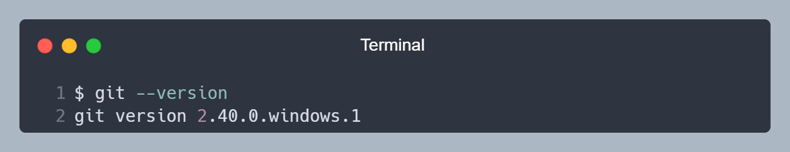  
Exemplo de saída do comando `git --version` da versão para Windows

<!-- https://carbon.now.sh/?bg=rgba%28171%2C+184%2C+195%2C+1%29&t=nord&wt=none&l=application%2Fx-sh&width=650&ds=false&dsyoff=20px&dsblur=68px&wc=true&wa=false&pv=16px&ph=16px&ln=true&fl=1&fm=Hack&fs=14px&lh=133%25&si=false&es=2x&wm=false&code=%2524%2520git%2520--version%250Agit%2520version%25202.40.0.windows.1&tb=Terminal -->

</Center>

Caso não apareça a versão ou apresente erro ao rodar o comando, pode ser que o **Git** não foi instalado corretamente ou não foi adicionado ao PATH do sistema. Tente reinstalar o **Git**, e caso não funcione, tente pesquisar no Google ou YouTube, é bem provável que alguém já tenha passado por isso.

<Center>

  
Erros acontecem, não desista!

</Center>

## Pontos importantes

Agora que temos o **Git** instalado, tem alguns itens que considero importantes entender antes de começarmos a sair rodando comandos, são eles:

### Configuração inicial (.gitconfig)

Alguns comandos do **Git** precisam de algumas informações, como por exemplo, o seu nome e e-mail, para identificar quem fez as alterações no código. Para isso, vamos utilizar o seguinte comando:

```bash
git config --global user.name "Seu nome"
git config --global user.email "seu_email@email.com"
```

<Center>

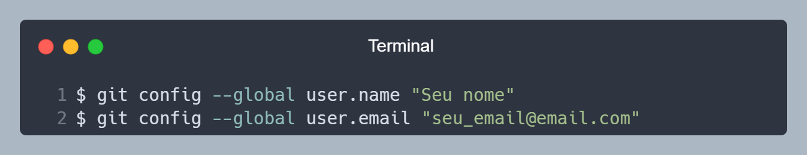  
Exemplo de saída dos comandos `git config user.name` e `git config user.email`

<!-- https://carbon.now.sh/?bg=rgba%28171%2C+184%2C+195%2C+1%29&t=nord&wt=none&l=application%2Fx-sh&width=650&ds=false&dsyoff=20px&dsblur=68px&wc=true&wa=false&pv=16px&ph=16px&ln=true&fl=1&fm=Hack&fs=14px&lh=133%25&si=false&es=2x&wm=false&code=%2524%2520git%2520config%2520--global%2520user.name%2520%2522Seu%2520nome%2522%250A%2524%2520git%2520config%2520--global%2520user.email%2520%2522seu_email%2540email.com%2522&tb=Terminal -->

</Center>

:::note Nota
A opção `--global` serve para informar que essa configuração é global, ou seja, ela vale para todos os projetos que você utilizar o **Git**. É a opção mais utilizada. O Nome não precisa ser o seu nome completo, pode ser um apelido, ou até mesmo um nome de usuário, o importante é que você se identifique. O e-mail deve ser o mesmo que você utiliza para se cadastrar em sites, pois é com ele que o **Git** vai identificar quem fez as alterações.
:::

Ao rodar esses comandos, um arquivo chamado `.gitconfig` é criado na pasta do usuário, que é onde o **Git** salva as configurações globais. Você pode editar esse arquivo manualmente, mas tenha cuidado.

<Center>

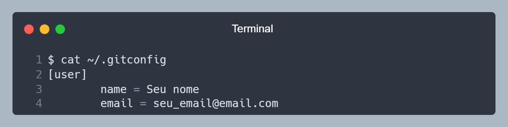  
Arquivo `.gitconfig` gerado após rodar os comandos de configuração

<!-- https://carbon.now.sh/?bg=rgba%28171%2C+184%2C+195%2C+1%29&t=nord&wt=none&l=application%2Fx-sh&width=650&ds=false&dsyoff=20px&dsblur=68px&wc=true&wa=false&pv=16px&ph=16px&ln=true&fl=1&fm=Hack&fs=14px&lh=133%25&si=false&es=2x&wm=false&code=%2524%2520cat%2520%7E%252F.gitconfig%250A%255Buser%255D%250A%2509%2509name%2520%253D%2520Seu%2520nome%250A%2520%2520%2520%2520%2520%2520%2520%2520email%2520%253D%2520seu_email%2540email.com&tb=Terminal -->

</Center>

Se rodarmos o comando que utilizamos para configurar o nome e e-mail, mas sem passar nenhum parâmetro, ele vai mostrar o que está configurado no momento. Que tem que bater com o arquivo `.gitconfig`.

```bash
git config user.name
git config user.email
```

### Pasta _.git_

Toda vez que utilizamos o **Git** em um projeto, ele cria uma pasta oculta chamada `.git`, que é onde ele salva todas as informações do projeto, como as alterações feitas, histórico de ajustes, quem alterou o que, etc. Essa pasta **não deve ser modificada manualmente**, pois pode corromper o funcionamento do **Git**, a menos que você saiba o que está fazendo.

Caso esteja começando a utilizar o **Git** em um projeto, e não tenha essa pasta, basta utilizar o comando `git init`, que ele irá criar essa pasta.

Se você clonar um projeto que já utiliza o **Git**, essa pasta já estará criada, e você **não** precisa utilizar o comando `git init`.

<Center>

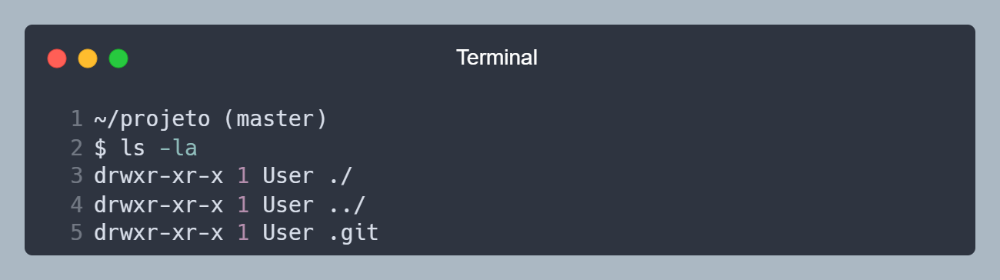  
Pasta oculta `.git` criada após utilizar o comando `git init`

<!-- https://carbon.now.sh/?bg=rgba%28171%2C+184%2C+195%2C+1%29&t=nord&wt=none&l=application%2Fx-sh&width=650&ds=false&dsyoff=20px&dsblur=68px&wc=true&wa=false&pv=16px&ph=16px&ln=true&fl=1&fm=Hack&fs=14px&lh=133%25&si=false&es=2x&wm=false&code=%7E%252Fprojeto%2520%28master%29%250A%2524%2520ls%2520-la%250Adrwxr-xr-x%25201%2520User%2520.%252F%250Adrwxr-xr-x%25201%2520User%2520..%252F%250Adrwxr-xr-x%25201%2520User%2520.git&tb=Terminal -->

</Center>

### Arquivo _.gitignore_

O arquivo `.gitignore` é um arquivo que serve para ignorar arquivos e pastas que não devem ser monitorados pelo **Git**, como por exemplo, arquivos de configuração, arquivos de log, arquivos de cache, etc.

Alguns _frameworks_ e linguagens já possuem um arquivo `.gitignore` padrão, que você pode utilizar, mas caso não tenha, você pode criar um arquivo `.gitignore` na raiz do projeto, e adicionar os arquivos e pastas que você quer ignorar.

Não é obrigatório ter um arquivo `.gitignore`, mas é recomendado, pois assim você não vai ficar enviando arquivos desnecessários para o repositório remoto. Torna o projeto mais limpo e organizado.

Não vamos entrar em detalhes sobre esse arquivo aqui, mas você pode ler mais sobre ele nessa [página](/docs/ferramentas_online/gitignore_io/).

### Ciclo de vida do Git

Os arquivos tem um ciclo de vida dentro do **Git**, pode parecer confuso no começo, mas é bem simples. Agora vamos só ver quais são as etapas que um arquivo pode estar, e mais a frente vamos ver que comando faz cada etapa.

Os arquivos podem estar em "quatro" etapas, sendo elas:

- **Untracked** (Não rastreado): Arquivos que o **Git** não sabe que existe. De certa forma, essa etapa não é um status do **Git**, pois ele não sabe que esse arquivo existe, mas é importante saber que existe essa etapa.
- **Unmodified** (Não modificado): Arquivos que o **Git** sabe que existe, mas não foi modificado. No dia a dia, a maioria dos arquivos vão estar nessa etapa.
- **Modified** (Modificado): Arquivos que o **Git** sabe que existe e que foi modificado, mas ele não está controlando as alterações feitas.
- **Staged** (Preparado): Arquivos que o **Git** sabe que existe, que foi modificado e que está preparado para o **Git** controlar as alterações feitas.

<Center>

  
Representação do ciclo de vida dos arquivos  
Fonte: [Git](https://git-scm.com/book/en/v2/Git-Basics-Recording-Changes-to-the-Repository)

</Center>

:::warning IMPORTANTE
O **Git** não rastreia as alterações de todos os arquivos de forma automática, você tem que informar para ele quais arquivos ele deve monitorar. Mais a frente vamos ver como fazer isso.
:::

<!-- Acho que é cedo demais para falar sobre Branchs -->
<!-- ### _Branches_

Esse é um conceito que pode ser um pouco confuso no começo, mas é muito importante para entendermos algo que é muito utilizado no **Git**. Por padrão, quando iniciamos um projeto, o **Git** cria um _branch_ principal, que geralmente é chamado de **master** ou **main**.

Mas o que é um _branch_? Um _branch_ é uma ramificação, ou seja, é uma cópia do _branch_ principal (ou outra branch), e a partir dele, você pode fazer alterações, sem afetar o _branch_ de origem. É como se fosse uma cópia do projeto, mas de uma forma mais inteligente e eficiente.

Isso é o que precisamos entender sobre _branches_ por enquanto, mas vamos ver mais sobre isso mais a frente. -->

<Center>

  
Anotado!

</Center>

<!-- Numeros Romandos: https://www.htmlsymbols.xyz/roman-symbols/roman-numerals -->

## Exemplo prático Ⅰ

Agora vamos fazer um exemplo prático, para entendermos melhor como funciona o **Git**. Vamos rodar alguns comandos, e ver o que acontece com cada comando. Se quiser, pode fazer esse exemplo na sua máquina e acompanhar o que acontece.

Em uma pasta vazia, abra o terminal e siga os passos abaixo.

:::tip Dica
Você pode utilizar o comando `git status` a qualquer momento para saber em que status do ciclo de vida seu projeto está, este comando é informativo e não modifica nada, então pode rodar a vontade.
:::

### 1. Inicializando o Git

Iniciamos o **Git** no projeto, utilizando o comando `git init`. Abra o terminal na pasta do projeto, e rode o comando.

<Center>

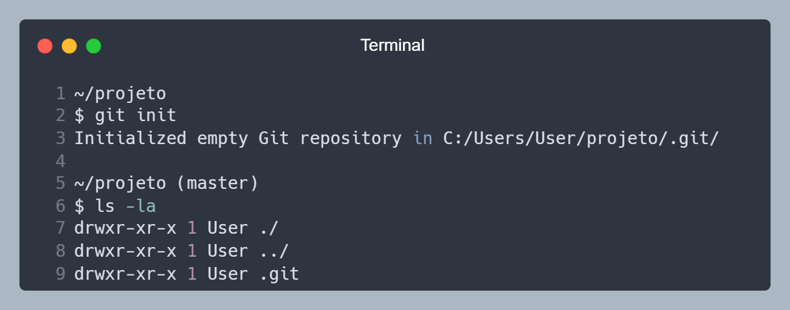  
Pasta oculta `.git` criada após utilizar o comando `git init`

<!-- https://carbon.now.sh/?bg=rgba%28171%2C+184%2C+195%2C+1%29&t=nord&wt=none&l=application%2Fx-sh&width=650&ds=false&dsyoff=20px&dsblur=68px&wc=true&wa=false&pv=16px&ph=16px&ln=true&fl=1&fm=Hack&fs=14px&lh=133%25&si=false&es=2x&wm=false&code=%7E%252Fprojeto%250A%2524%2520git%2520init%250AInitialized%2520empty%2520Git%2520repository%2520in%2520C%253A%252FUsers%252FUser%252Fprojeto%252F.git%252F%250A%250A%7E%252Fprojeto%2520%28master%29%250A%2524%2520ls%2520-la%250Adrwxr-xr-x%25201%2520User%2520.%252F%250Adrwxr-xr-x%25201%2520User%2520..%252F%250Adrwxr-xr-x%25201%2520User%2520.git&tb=Terminal -->

</Center>

### 2. Criando um arquivo

Vamos criar um arquivo chamado `index.html`, deixe ele vazio por enquanto, podemos criar rodando no terminal o comando `touch index.html`. Para o **Git**, esse arquivo está na etapa **Untracked**, pois ele não sabe que esse arquivo existe. Podemos confirmar isso rodando o comando `git status`.

<Center>

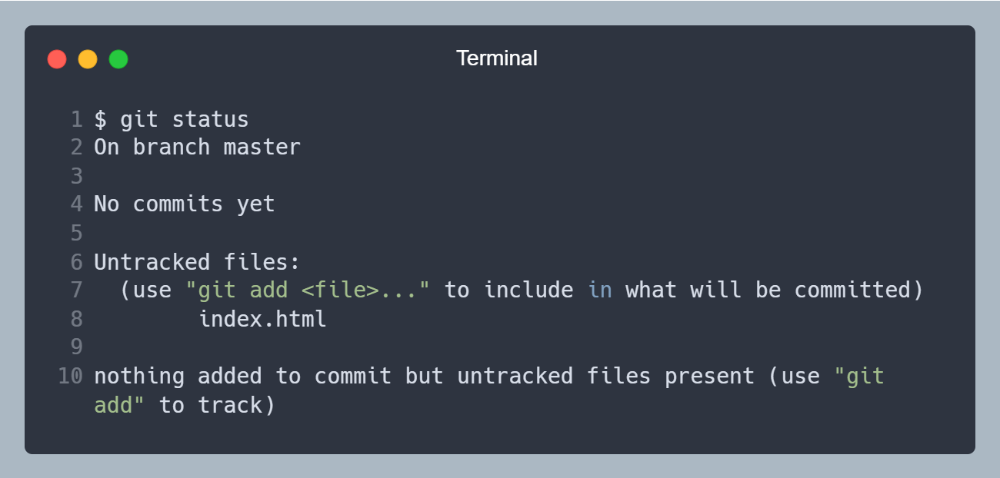  
Arquivo `index.html`, na linha 8, listado como **Untracked** (Não rastreado)

<!-- https://carbon.now.sh/?bg=rgba%28171%2C+184%2C+195%2C+1%29&t=nord&wt=none&l=application%2Fx-sh&width=650&ds=false&dsyoff=20px&dsblur=68px&wc=true&wa=false&pv=16px&ph=16px&ln=true&fl=1&fm=Hack&fs=14px&lh=133%25&si=false&es=2x&wm=false&code=%2524%2520git%2520status%250AOn%2520branch%2520master%250A%250ANo%2520commits%2520yet%250A%250AUntracked%2520files%253A%250A%2520%2520%28use%2520%2522git%2520add%2520%253Cfile%253E...%2522%2520to%2520include%2520in%2520what%2520will%2520be%2520committed%29%250A%2520%2520%2520%2520%2520%2520%2520%2520index.html%250A%250Anothing%2520added%2520to%2520commit%2520but%2520untracked%2520files%2520present%2520%28use%2520%2522git%2520add%2522%2520to%2520track%29&tb=Terminal -->

</Center>

### 3. Adicionando o arquivo para ser monitorado

Adicionamos o arquivo `index.html` para ser monitorado pelo **Git**, utilizando o comando `git add index.html`, isso vai fazer o arquivo ir para **Staged** (Preparado). Agora o **Git** está preparado para controlando as alterações do arquivo `index.html`. Podemos confirmar isso rodando o comando `git status`.

Quando o arquivo está **Staged**, o **Git** tira uma foto 📸 do arquivo e compara com a versão anterior, e salva essa "foto" 🖼️ em um local seguro, dentro da pasta `.git`.

<Center>

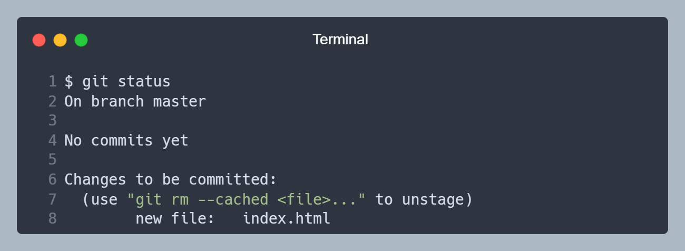  
Arquivo `index.html`, na linha 8, na etapa **Staged**

<!-- https://carbon.now.sh/?bg=rgba%28171%2C+184%2C+195%2C+1%29&t=nord&wt=none&l=application%2Fx-sh&width=650&ds=false&dsyoff=20px&dsblur=68px&wc=true&wa=false&pv=16px&ph=16px&ln=true&fl=1&fm=Hack&fs=14px&lh=133%25&si=false&es=2x&wm=false&code=%2524%2520git%2520status%250AOn%2520branch%2520master%250A%250ANo%2520commits%2520yet%250A%250AChanges%2520to%2520be%2520committed%253A%250A%2520%2520%28use%2520%2522git%2520rm%2520--cached%2520%253Cfile%253E...%2522%2520to%2520unstage%29%250A%2520%2520%2520%2520%2520%2520%2520%2520new%2520file%253A%2520%2520%2520index.html&tb=Terminal -->

</Center>

### 4. Realizando o commit

Vamos salvar as alterações do arquivo `index.html`, utilizando o comando `git commit -m "Atividade prática - 1"`.

O comando `git commit` pega a foto 🖼️ (que foi tirada quando o arquivo estava **Staged**) e salva em um local seguro, dentro da pasta `.git`. O _commit_ tem informações de identificação das alterações, como os arquivos alterados, data, hora, autor e cria um _hash_ para identificar esse _commit_ de forma única.

<Center>

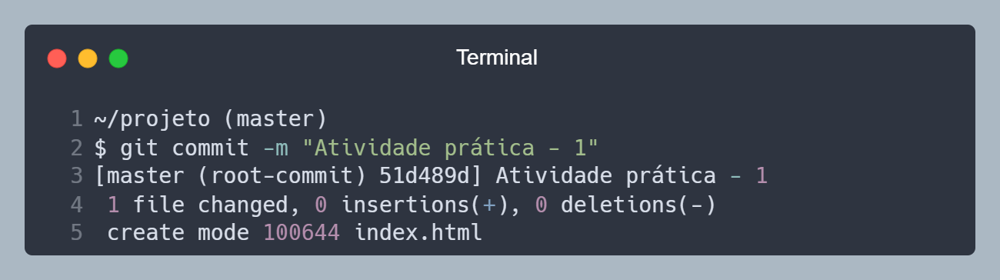  
Commit de _hash_ "51d489d" criado.

<!-- https://carbon.now.sh/?bg=rgba%28171%2C+184%2C+195%2C+1%29&t=nord&wt=none&l=application%2Fx-sh&width=650&ds=false&dsyoff=20px&dsblur=68px&wc=true&wa=false&pv=16px&ph=16px&ln=true&fl=1&fm=Hack&fs=14px&lh=133%25&si=false&es=2x&wm=false&code=%7E%252Fprojeto%2520%28master%29%250A%2524%2520git%2520commit%2520-m%2520%2522Atividade%2520pr%25C3%25A1tica%2520-%25201%2522%250A%255Bmaster%2520%28root-commit%29%252051d489d%255D%2520Atividade%2520pr%25C3%25A1tica%2520-%25201%250A%25201%2520file%2520changed%252C%25200%2520insertions%28%252B%29%252C%25200%2520deletions%28-%29%250A%2520create%2520mode%2520100644%2520index.html&tb=Terminal -->

</Center>

### 5. Verificando o status

Passamos por todas as etapas do ciclo de vida do **Git**. Se rodarmos o comando `git status`, ele vai mostrar que não tem mais nada para ser comitado, pois o arquivo `index.html` está na etapa **Unmodified** (Não modificado).

<Center>

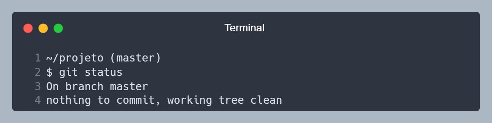  
Nada para ser comitado, arquivo `index.html` na etapa **Unmodified**

<!-- https://carbon.now.sh/?bg=rgba%28171%2C+184%2C+195%2C+1%29&t=nord&wt=none&l=application%2Fx-sh&width=650&ds=false&dsyoff=20px&dsblur=68px&wc=true&wa=false&pv=16px&ph=16px&ln=true&fl=1&fm=Hack&fs=14px&lh=133%25&si=false&es=2x&wm=false&code=%7E%252Fprojeto%2520%28master%29%250A%2524%2520git%2520status%250AOn%2520branch%2520master%250Anothing%2520to%2520commit%252C%2520working%2520tree%2520clean&tb=Terminal -->

</Center>

### Revisão

Nesse exemplo, no item **1** fizemos a inicialização do **Git** na pasta. No item **2** criamos o arquivo `index.html`, que no inicio era um arquivo que o **Git** não sabia que existia, então ele estava na etapa **Untracked**. No item **3** adicionamos o arquivo `index.html` para ser monitorado pelo **Git**, então ele foi para a etapa **Staged**. No item **4** realizamos o _commit_ do arquivo `index.html`, então ele foi para a etapa **Unmodified**. Assim passamos por todas as etapas do ciclo de vida do **Git**.

<Center>

  
Parabéns, você passou por todas as etapas do ciclo de vida do Git!

</Center>

## Exemplo prático Ⅱ

Vamos seguir com o mesmo exemplo, mas agora vamos fazer algumas alterações no arquivo `index.html`, e ver como o **Git** se comporta.

### 6. Alterando o arquivo

Vamos adicionar um conteúdo no arquivo `index.html`, pode ser qualquer coisa, mas vamos adicionar o seguinte conteúdo:

```html
<h1>Olá mundo</h1>
```

### 7. Verificando o status

Agora vamos rodar o comando `git status`, para ver em que etapa o arquivo `index.html` está. Ele vai mostrar que o arquivo está na etapa **Modified** (Modificado), pois o **Git** sabe que o arquivo existe, mas não está monitorando as alterações.

<Center>

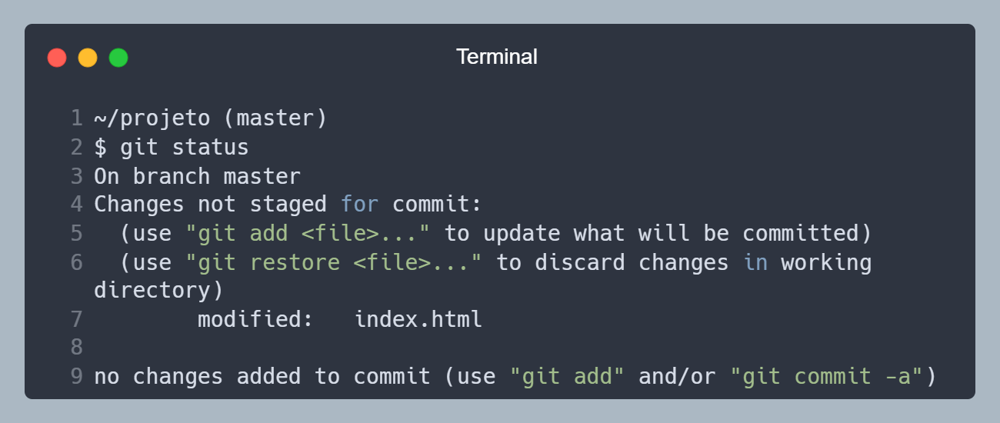  
Arquivo `index.html`, na linha 7, na etapa **Modified**

<!-- https://carbon.now.sh/?bg=rgba%28171%2C+184%2C+195%2C+1%29&t=nord&wt=none&l=application%2Fx-sh&width=650&ds=false&dsyoff=20px&dsblur=68px&wc=true&wa=false&pv=16px&ph=16px&ln=true&fl=1&fm=Hack&fs=14px&lh=133%25&si=false&es=2x&wm=false&code=%7E%252Fprojeto%2520%28master%29%250A%2524%2520git%2520status%250AOn%2520branch%2520master%250AChanges%2520not%2520staged%2520for%2520commit%253A%250A%2520%2520%28use%2520%2522git%2520add%2520%253Cfile%253E...%2522%2520to%2520update%2520what%2520will%2520be%2520committed%29%250A%2520%2520%28use%2520%2522git%2520restore%2520%253Cfile%253E...%2522%2520to%2520discard%2520changes%2520in%2520working%2520directory%29%250A%2520%2520%2520%2520%2520%2520%2520%2520modified%253A%2520%2520%2520index.html%250A%250Ano%2520changes%2520added%2520to%2520commit%2520%28use%2520%2522git%2520add%2522%2520and%252For%2520%2522git%2520commit%2520-a%2522%29&tb=Terminal -->

</Center>

### 8. Adicionando o arquivo para ser controlado

Vimos na etapa [**3**](#3-adicionando-o-arquivo-para-ser-monitorado) que falamos para o **Git** começar a monitorar o arquivo `index.html`, e ele foi para a etapa **Staged**. Agora vamos rodar o comando `git add index.html` novamente, para o **Git** tirar uma nova foto 📸 do arquivo, preparando ele para ser salvo as alterações.

<Center>

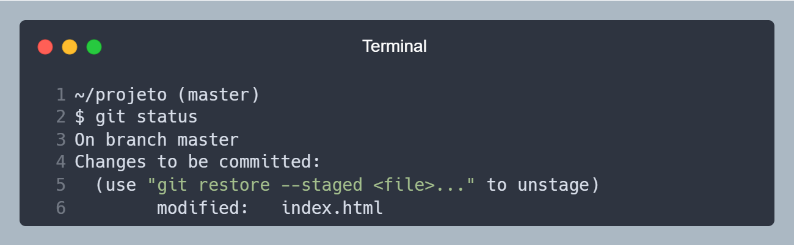  
Agora a mensagem fala que tem um arquivo modificado, e que está pronto para ser comitado.

<!-- https://carbon.now.sh/?bg=rgba%28171%2C+184%2C+195%2C+1%29&t=nord&wt=none&l=application%2Fx-sh&width=650&ds=false&dsyoff=20px&dsblur=68px&wc=true&wa=false&pv=16px&ph=16px&ln=true&fl=1&fm=Hack&fs=14px&lh=133%25&si=false&es=2x&wm=false&code=%7E%252Fprojeto%2520%28master%29%250A%2524%2520git%2520status%250AOn%2520branch%2520master%250AChanges%2520to%2520be%2520committed%253A%250A%2520%2520%28use%2520%2522git%2520restore%2520--staged%2520%253Cfile%253E...%2522%2520to%2520unstage%29%250A%2520%2520%2520%2520%2520%2520%2520%2520modified%253A%2520%2520%2520index.html&tb=Terminal -->

</Center>

### 9. Realizando o commit

Agora vamos salvar as alterações do arquivo `index.html`, utilizando o comando `git commit -m "Adicionando o conteúdo Olá mundo"`. O **Git** vai tirar uma nova foto 🖼️ do arquivo, e salvar em um local seguro, dentro da pasta `.git`.

<Center>

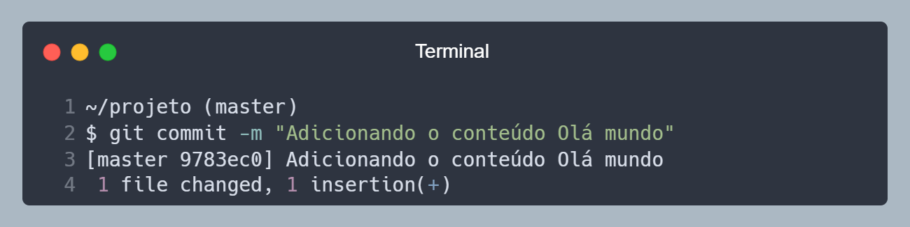  
Commit de _hash_ "9783ec0" criado.

<!-- https://carbon.now.sh/?bg=rgba%28171%2C+184%2C+195%2C+1%29&t=nord&wt=none&l=application%2Fx-sh&width=650&ds=false&dsyoff=20px&dsblur=68px&wc=true&wa=false&pv=16px&ph=16px&ln=true&fl=1&fm=Hack&fs=14px&lh=133%25&si=false&es=2x&wm=false&code=%7E%252Fprojeto%2520%28master%29%250A%2524%2520git%2520commit%2520-m%2520%2522Adicionando%2520o%2520conte%25C3%25BAdo%2520Ol%25C3%25A1%2520mundo%2522%250A%255Bmaster%25209783ec0%255D%2520Adicionando%2520o%2520conte%25C3%25BAdo%2520Ol%25C3%25A1%2520mundo%250A%25201%2520file%2520changed%252C%25201%2520insertion%28%252B%29&tb=Terminal -->

</Center>

### 10. Verificando o status

Agora vamos rodar o comando `git log`, para ver o histórico de _commits_ que fizemos. Ele vai mostrar o _hash_ do _commit_, a mensagem que foi passada, o autor, a data e hora, e o arquivo que foi alterado.

<Center>

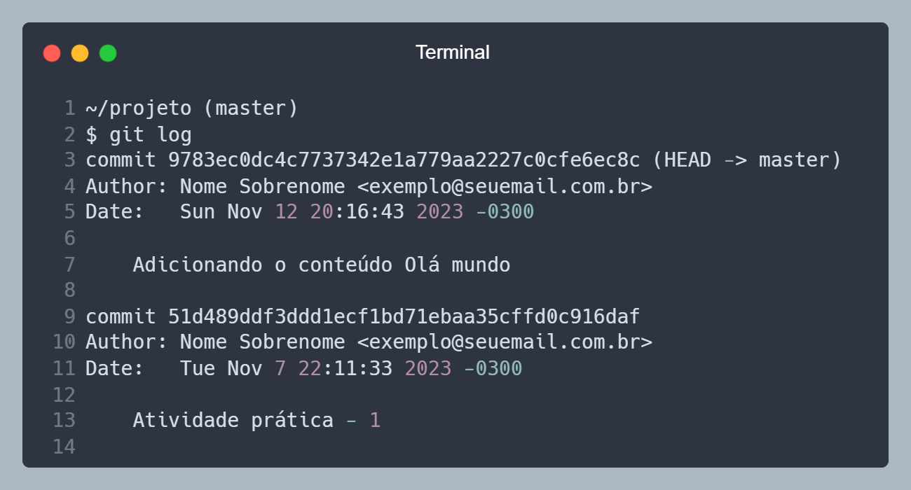  
Histórico de _commits_.

<!-- https://carbon.now.sh/?bg=rgba%28171%2C+184%2C+195%2C+1%29&t=nord&wt=none&l=application%2Fx-sh&width=650&ds=false&dsyoff=20px&dsblur=68px&wc=true&wa=false&pv=16px&ph=16px&ln=true&fl=1&fm=Hack&fs=14px&lh=133%25&si=false&es=2x&wm=false&code=%7E%252Fprojeto%2520%28master%29%250A%2524%2520git%2520log%250Acommit%25209783ec0dc4c7737342e1a779aa2227c0cfe6ec8c%2520%28HEAD%2520-%253E%2520master%29%250AAuthor%253A%2520Nome%2520Sobrenome%2520%253Cexemplo%2540seuemail.com.br%253E%250ADate%253A%2520%2520%2520Sun%2520Nov%252012%252020%253A16%253A43%25202023%2520-0300%250A%250A%2520%2520%2520%2520Adicionando%2520o%2520conte%25C3%25BAdo%2520Ol%25C3%25A1%2520mundo%250A%250Acommit%252051d489ddf3ddd1ecf1bd71ebaa35cffd0c916daf%250AAuthor%253A%2520Nome%2520Sobrenome%2520%253Cexemplo%2540seuemail.com.br%253E%250ADate%253A%2520%2520%2520Tue%2520Nov%25207%252022%253A11%253A33%25202023%2520-0300%250A%250A%2520%2520%2520%2520Atividade%2520pr%25C3%25A1tica%2520-%25201%250A&tb=Terminal -->

</Center>

### Revisão

Nesse exemplo, no item **6** alteramos o arquivo `index.html`, que estava na etapa **Unmodified**, então ele foi para a etapa **Modified**. No item **7** adicionamos o arquivo `index.html` para ele ficar preparado para o **Git** controlar as alterações, então ele foi para a etapa **Staged**. No item **8** realizamos o _commit_ do arquivo `index.html`, então ele foi para a etapa **Unmodified**. Assim passamos por todas as etapas do ciclo de vida do **Git** novamente.

### Conclusão

Os exemplos foram bem simples, mas representam bem o dia a dia de um desenvolvedor, que é alterar arquivos, e salvar as alterações. O **Git** é uma ferramenta muito poderosa, e que pode ser utilizada de diversas formas, mas o básico é isso, e com isso você já consegue utilizar o **Git** no seu dia a dia.

## Repositório remoto

Agora que já sabemos como funciona o **Git** localmente, vamos ver como funciona o **Git** em um servidor remoto. O servidor remoto é onde o projeto fica hospedado, e onde você e seus colegas vão baixar o projeto, e enviar as alterações.

Os principais servidores remotos são o [GitHub](https://github.com), [GitLab](https://gitlab.com) e [Bitbucket](https://bitbucket.org). Não vamos entrar em detalhes sobre cada um deles. Não importa qual você vai utilizar, o **Git** funciona da mesma forma em todos eles.

### Configurando o repositório remoto

Para configurar o repositório remoto, vamos utilizar o comando `git remote add origin <URL>`, onde `<URL>` é a URL do repositório remoto. Por exemplo, o projeto que estamos utilizando nesse guia, está hospedado no GitHub, então a URL do repositório é `https://github.com/lucasbaccan/code.git` ou a versão com SSH `git@github.com:lucasbaccan/code.git`.

<Center>

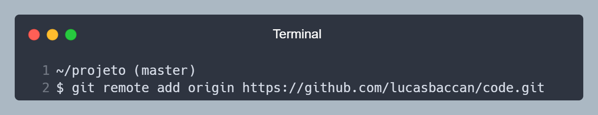  
Configurando o repositório remoto.

<!-- https://carbon.now.sh/?bg=rgba%28171%2C+184%2C+195%2C+1%29&t=nord&wt=none&l=application%2Fx-sh&width=650&ds=false&dsyoff=20px&dsblur=68px&wc=true&wa=false&pv=16px&ph=16px&ln=true&fl=1&fm=Hack&fs=14px&lh=133%25&si=false&es=2x&wm=false&code=%7E%252Fprojeto%2520%28master%29%250A%2524%2520git%2520remote%2520add%2520origin%2520https%253A%252F%252Fgithub.com%252Flucasbaccan%252Fcode.git&tb=Terminal -->

</Center>

No exemplo acima, o nome do repositório remoto é `origin`, mas você pode dar o nome que quiser, mas o nome `origin` é o padrão, e é o mais utilizado.

:::info Observação
Você pode configurar mais de um repositório remoto, não é algo muito comum, mas é possível. Para isso, basta utilizar o comando `git remote add <NOME> <URL>`, onde `<NOME>` é o nome do repositório remoto, e `<URL>` é a URL do repositório remoto.
:::

### Enviando as alterações para o repositório remoto

Agora que já configuramos o repositório remoto, vamos enviar as alterações que fizemos localmente para o repositório remoto. Para isso, vamos utilizar o comando `git push <NOME> <BRANCH>`, onde `<NOME>` é o nome do repositório remoto, e `<BRANCH>` é o nome da _branch_ que queremos enviar as alterações.

<Center>

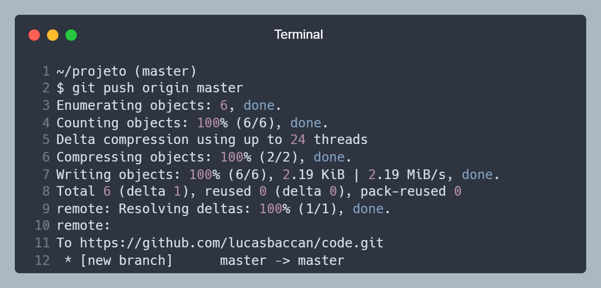  
Enviando as alterações para o repositório remoto.

<!-- https://carbon.now.sh/?bg=rgba%28171%2C+184%2C+195%2C+1%29&t=nord&wt=none&l=application%2Fx-sh&width=650&ds=false&dsyoff=20px&dsblur=68px&wc=true&wa=false&pv=16px&ph=16px&ln=true&fl=1&fm=Hack&fs=14px&lh=133%25&si=false&es=2x&wm=false&code=%7E%252Fprojeto%2520%28master%29%250A%2524%2520git%2520push%2520origin%2520master%250AEnumerating%2520objects%253A%25206%252C%2520done.%250ACounting%2520objects%253A%2520100%2525%2520%286%252F6%29%252C%2520done.%250ADelta%2520compression%2520using%2520up%2520to%252024%2520threads%250ACompressing%2520objects%253A%2520100%2525%2520%282%252F2%29%252C%2520done.%250AWriting%2520objects%253A%2520100%2525%2520%286%252F6%29%252C%25202.19%2520KiB%2520%257C%25202.19%2520MiB%252Fs%252C%2520done.%250ATotal%25206%2520%28delta%25201%29%252C%2520reused%25200%2520%28delta%25200%29%252C%2520pack-reused%25200%250Aremote%253A%2520Resolving%2520deltas%253A%2520100%2525%2520%281%252F1%29%252C%2520done.%250Aremote%253A%250ATo%2520https%253A%252F%252Fgithub.com%252Flucasbaccan%252Fcode.git%250A%2520*%2520%255Bnew%2520branch%255D%2520%2520%2520%2520%2520%2520master%2520-%253E%2520master&tb=Terminal -->

</Center>

### Baixando as alterações do repositório remoto

Agora vamos baixar as alterações que foram feitas no repositório remoto, para isso, vamos utilizar o comando `git pull <NOME> <BRANCH>`, onde `<NOME>` é o nome do repositório remoto, e `<BRANCH>` é o nome da _branch_ que queremos baixar as alterações.

<Center>

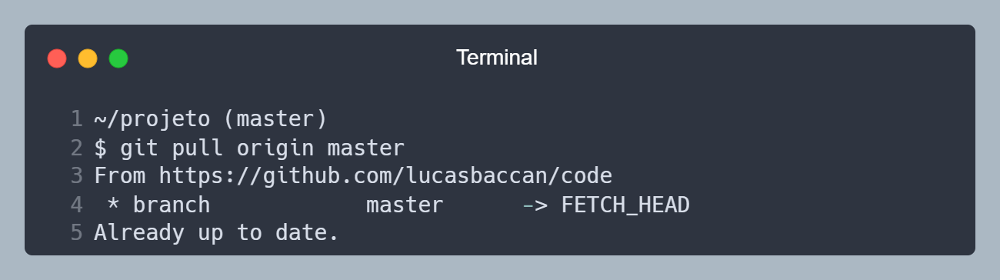  
Baixando as alterações do repositório remoto.

<!-- https://carbon.now.sh/?bg=rgba%28171%2C+184%2C+195%2C+1%29&t=nord&wt=none&l=application%2Fx-sh&width=650&ds=false&dsyoff=20px&dsblur=68px&wc=true&wa=false&pv=16px&ph=16px&ln=true&fl=1&fm=Hack&fs=14px&lh=133%25&si=false&es=2x&wm=false&code=%7E%252Fprojeto%2520%28master%29%250A%2524%2520git%2520pull%2520origin%2520master%250AFrom%2520https%253A%252F%252Fgithub.com%252Flucasbaccan%252Fcode%250A%2520*%2520branch%2520%2520%2520%2520%2520%2520%2520%2520%2520%2520%2520%2520master%2520%2520%2520%2520%2520%2520-%253E%2520FETCH_HEAD%250AAlready%2520up%2520to%2520date.&tb=Terminal -->

</Center>

No exemplo acima, o comando `git pull origin master` baixou as alterações da _branch_ `master` do repositório remoto `origin` e colocou na _branch_ `master` local.

:::caution Atenção
O comando `git pull` é uma junção dos comandos `git fetch` e `git merge`, então ele baixa as alterações do repositório remoto, e faz o _merge_ com a _branch_ local.
Você pode utilizar os comandos `git fetch` e `git merge` separadamente sem problemas, mas o `git pull` é mais prático.
:::

<Center>

  
Parabéns, você aprendeu como trabalhar com o **Git** localmente e com um repositório remoto!

</Center>

## Branches(_Ramificações_)

Uma das funcionalidades mais importantes do **Git** é a possibilidade de criar _branches_ (ramificações). As _branches_ são ramificações do projeto, que podem ser utilizadas para diversas finalidades, como por exemplo, criar uma nova funcionalidade, corrigir um bug, testar uma nova versão, etc.

Com isso você pode trabalhar em uma nova funcionalidade, sem afetar o projeto principal, e quando estiver tudo pronto, você pode juntar as alterações da _branch_ com o projeto principal, sem afetar o que já foi feito.

### Criando uma nova branch

Para criar uma nova _branch_, vamos utilizar o comando `git checkout -b <NOME>`, onde `<NOME>` é o nome da _branch_ que queremos criar. Por exemplo, vamos criar uma _branch_ chamada `feature/nova-funcionalidade`, então vamos rodar o comando `git checkout -b feature/nova-funcionalidade`.

<Center>

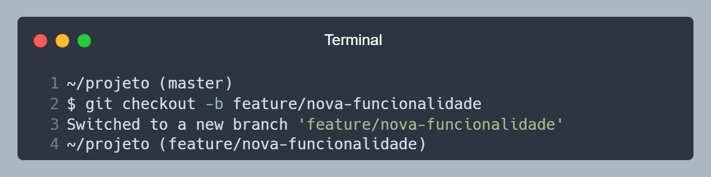  
Criando uma nova _branch_ chamada `feature/nova-funcionalidade`.

<!-- https://carbon.now.sh/?bg=rgba%28171%2C+184%2C+195%2C+1%29&t=nord&wt=none&l=application%2Fx-sh&width=650&ds=false&dsyoff=20px&dsblur=68px&wc=true&wa=false&pv=16px&ph=16px&ln=true&fl=1&fm=Hack&fs=14px&lh=133%25&si=false&es=2x&wm=false&code=%7E%252Fprojeto%2520%28master%29%250A%2524%2520git%2520checkout%2520-b%2520feature%252Fnova-funcionalidade%250ASwitched%2520to%2520a%2520new%2520branch%2520%27feature%252Fnova-funcionalidade%27%250A%7E%252Fprojeto%2520%28feature%252Fnova-funcionalidade%29&tb=Terminal -->

</Center>

### Trocando de branch

Para trocar de _branch_, vamos utilizar o comando `git switch  <NOME>`, onde `<NOME>` é o nome da _branch_ que queremos trocar. Por exemplo, vamos trocar para a _branch_ `master`, então vamos rodar o comando `git switch  master`.

:::info Observação
O comando `git switch` foi adicionado na versão 2.23 do **Git**, então se você estiver utilizando uma versão anterior, utilize o comando `git checkout <NOME>`.
Eu ainda utilizo o padrão antigo, ambos funcionam da mesma forma, mas o `git switch` é mais intuitivo.
:::

<Center>

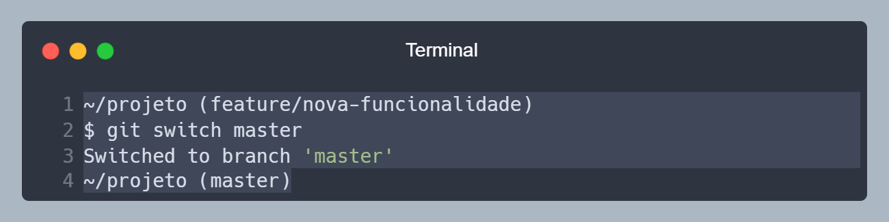  
Trocando para a _branch_ `master`.

<!-- https://carbon.now.sh/?bg=rgba%28171%2C+184%2C+195%2C+1%29&t=nord&wt=none&l=application%2Fx-sh&width=650&ds=false&dsyoff=20px&dsblur=68px&wc=true&wa=false&pv=16px&ph=16px&ln=true&fl=1&fm=Hack&fs=14px&lh=133%25&si=false&es=2x&wm=false&code=%7E%252Fprojeto%2520%28feature%252Fnova-funcionalidade%29%250A%2524%2520git%2520switch%2520master%250ASwitched%2520to%2520branch%2520%27master%27%250A%7E%252Fprojeto%2520%28master%29&tb=Terminal -->

</Center>

Se você fez alguma alteração na _branch_ `feature/nova-funcionalidade`, e tentar trocar para a _branch_ `master`, o **Git** vai mostrar uma mensagem de erro, pois você tem alterações que não foram salvas. Então você tem duas opções, salvar as alterações, ou descartar as alterações.

Se você for salvar as alterações, basta rodar o comando `git commit -m "Mensagem do commit"`, e depois rodar o comando `git switch master` novamente. Assim as alterações serão salvas na _branch_ `feature/nova-funcionalidade`, e você vai conseguir trocar para a _branch_ `master`.

A branch `master` **NÃO** vai ter as alterações que você fez na _branch_ `feature/nova-funcionalidade`, pois as _branches_ são independentes.

### Juntando as alterações de uma branch com outra

Agora que já sabemos criar e trocar de _branches_, vamos ver como juntar as alterações de uma _branch_ com outra. Para isso, vamos utilizar o comando `git merge <NOME>`, onde `<NOME>` é o nome da _branch_ que queremos juntar. Por exemplo, vamos juntar as alterações da _branch_ `feature/nova-funcionalidade` com a _branch_ `master`, então vamos rodar o comando `git merge feature/nova-funcionalidade`.

<Center>

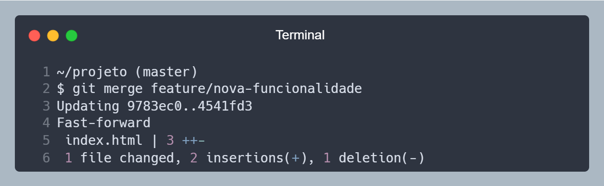  
Juntando as alterações da _branch_ `feature/nova-funcionalidade` com a _branch_ `master`.

<!-- https://carbon.now.sh/?bg=rgba%28171%2C+184%2C+195%2C+1%29&t=nord&wt=none&l=application%2Fx-sh&width=650&ds=false&dsyoff=20px&dsblur=68px&wc=true&wa=false&pv=16px&ph=16px&ln=true&fl=1&fm=Hack&fs=14px&lh=133%25&si=false&es=2x&wm=false&code=%7E%252Fprojeto%2520%28master%29%250A%2524%2520git%2520merge%2520feature%252Fnova-funcionalidade%250AUpdating%25209783ec0..4541fd3%250AFast-forward%250A%2520index.html%2520%257C%25203%2520%252B%252B-%250A%25201%2520file%2520changed%252C%25202%2520insertions%28%252B%29%252C%25201%2520deletion%28-%29&tb=Terminal -->

</Center>

Com isso, as alterações da _branch_ `feature/nova-funcionalidade` foram juntadas com a _branch_ `master`, e agora a _branch_ `master` tem as alterações da _branch_ `feature/nova-funcionalidade`.

Caso você deseja fazer o _merge_ de uma _branch_ remota com uma _branch_ local, basta utilizar o comando `git merge <NOME>`, onde `<NOME>` é o nome da _branch_ remota que queremos juntar. Por exemplo, vamos juntar as alterações da _branch_ `origin/feature/nova-funcionalidade` com a _branch_ `master`, então vamos rodar o comando `git merge origin/feature/nova-funcionalidade`.

### Resumo

O que vimos até agora foi:

- Criar uma nova _branch_ com o comando `git checkout -b <NOME>`.
- Trocar de _branch_ com o comando `git switch <NOME>`.
- Juntar as alterações de uma _branch_ com outra com o comando `git merge <NOME>`.

No exemplo sobre _merge_, utilizamos o nome `origin` antes do nome da _branch_, pois a _branch_ `feature/nova-funcionalidade` é uma _branch_ remota, e não uma _branch_ local. Lembre-se que no git temos _branches_ locais e _branches_ remotas que são independentes.

<Center>

  
Fluxo de trabalho com _branches_ locais e remotas.

</Center>

- **Diretório local**: Pasta na qual você utiliza para programar, onde seu projeto está.
- **Stage (INDEX)**: Arquivos modificados que foram indexados pelo **git**.
- **Repositório Local (HEAD)**: Cópia do repositório remoto em seu dispositivo.
- **Repositório Remoto**: Servidor onde o projeto está hospedado.

## CLI

O termo **CLI** significa **C**ommand-**L**ine **I**nterface (Interface de Linha de Comandos). Acho que esta parte assusta um pouco as pessoas, pois o **Git** não tem uma interface gráfica, então todas as suas ações tem que rodar por linha de comando. Existe no mercado alguns programas que funcionam com **Git** e disponibilizam uma interface gráfica, mas não é necessário, pode parecer complicado no início mas não é.

:::info Dica
Se você nunca teve experiência com Terminal (Linux/MacOS) ou CMD/Powershell (Windows), não tenha medo, é mais fácil do que parece.
:::

<Center>


</Center>

### `git init`

O comando `git init` é onde tudo começa, você precisa rodar esse comando em um diretório para fazer com que o **Git** comece a gerenciar os arquivos, pastas e subpastas.

Após rodar o comando `git init`, vai ser criada uma pasta chamada **.git**, dependendo da configuração do seu sistema operacional, você não vai ver esta pasta, mas basta rodar `ls -la`, que é o comando para listar arquivos ocultos.

<Center>


</Center>

- **Linha 2** - Comando `git init` rodado para iniciar o diretório para ser rastreado pelo **Git**.
- **Linha 6** - Comando `ls -la` para listar os arquivos, a **linha 7 e 8** são padrão do sistema e **linha 9** é a pasta **.git** criada.

:::caution Cuidado
No geral, não mexa na pasta `.git`, dependendo do que mexer dentro desta pasta, você pode corromper a estrutura.
:::

### `git status`

Agora que temos um diretório **.git**. Podemos rodar os outros comandos do **Git**. Usamos o `git status` para saber como está a situação dos arquivos em nosso diretório local, se tem algo alterado, novo, deletado, etc.

Eu gosto de utilizar `git status -s` que traz de uma forma resumida, na minha visão é mais prático para identificar as alterações.

Quando rodar esse comando, ele trará algumas informações sobre os arquivos:

- **Untracked** ou **U**: Arquivos novos que não estão indexados, o git ainda não tem conhecimento deles.
- **New** ou **A**: Arquivo foi indexado, git passa a gerenciar suas alterações.
- **Modified** ou **M**: Arquivo que já era indexado pelo git e foi modificado.
- **Deleted** ou **D**: Arquivo que já era indexado pelo git e foi deletado.
- **Renamed** ou **R**: Arquivo que já era indexado pelo git e foi renomeado.

### `git add`

Este comando tem o propósito de adicionar o arquivo ou pasta para o **stage**, isso significa que você quer salvar no **git** as alterações que foram feitas neste arquivo.

Esta ação sozinha não faz nada, mas sem ela, você não pode fazer um _commit_, então, após realizar as alterações que deseja no seu projeto (criar arquivos, renomear, alterar o conteúdo do arquivo), utilize `git add .` para adicionar todos os arquivos, ou `git add menu.txt` para adicionar o arquivo **menu.txt** no _stage_.

### `git commit`

No passo anterior vimos como adicionar um arquivo no _stage_, agora veremos como fazer com que essas alterações sejam enviadas para nosso repositório local. Para isso utilizamos `git commit`, a forma que gosto de explicar é _`"Pegar as alterações e adiciona numa caixinha(commit) que depois vai ser enviada para o remoto"`_ .

O commit tem a relação de quais arquivos tem que ser enviados, o que mudou entre a versão anterior e a atual, o autor das alterações, data, etc. Utilize `git commit -m "Primeiro Commit"`, O parâmetro **-m** é a mensagem que vai ser anexado ao commit. É uma boa prática adicionar uma descrição do que foi alterado.

### `git push`

Seguindo o que fizemos até agora, nós adicionamos uma alteração, criamos um commit, então falta enviar essa alteração para o repositório remoto, para isso utilizamos `git push`.

Para o comando funcionar corretamente, temos que falar qual repositório remoto vamos utilizar e para qual _branch_ enviaremos.

```bash
git push origin master
```

O comando acima envia todos os commits do _branch_ atual que estão em seu repositório local para o repositório remoto, nesse caso, o nome do repositório remoto é **origin**, e o _branch_ é o **master**.

### `git fetch`

Utilize esse comando para puxar as alterações remotas para seu repositório local. Você deve obrigatoriamente informar qual é o repositório remoto do qual deseja pegar as alterações.

```bash
# puxar todas as alterações do repositório remoto
git fetch origin
# ou pode especificar um único branch e buscar só as alterações dele
git fetch origin master
```

O comando acima puxa todos os commits do repositório remoto **origin**, e no segundo caso filtra somente alterações do _branch_.

### `git merge`

O comando `git fetch` busca as alterações remotas, mas para aplicá-las em seu diretório local, você tem que fazer o _merge_ delas, para isso, utilize `git merge`. Você pode sincronizar alterações do _branch_ atual que está ou outro _branch_.

```bash
git merge origin/master
# ou fazer o merge de um branch local
git merge master
```

Parece que os dois comandos são iguais, mas quando utilizamos **origin/master**, você está especificando que quer o _branch_ **master** do repositório **remoto**, que você fez o **fetch** anteriormente. Quando utilizamos **master**, você está especificando que quer o _branch_ **master** do repositório **local**.

### `git pull`

Esse carinha aqui podemos fazer que é a combinação de dois outros métodos que vimos anteriormente, o `git fetch` e o `git merge`. Basicamente o `git pull` ele faz os dois comando em um só, puxa as alterações e faz o merge no diretório local

```bash
git pull origin master
```

### `git reset`

Até o momento vimos o caminho perfeito, mas se fizer 💩, o que o **git** pode fazer por nós, meros mortais? Para isso, temos o `git reset`, que desfaz as alterações.

Vamos com calma nessa parte, pois dependendo dos parâmetros que utilizar com `git reset` você pode perder alterações em seu código, então vamos ver elas e entender melhor.

Um dos parâmetros que temos é o **--soft**, ele vai voltar somente os commits do seu diretório local, mas vai manter as alterações nos arquivos.

```bash
git reset --soft origin/master
# ou
git reset origin/master
```

Mas se o que você quer é apagar tudo que fez, até mesmo os commits, utilize **--hard**, ele afeta seu diretório local e repositório local.

```bash
git reset --hard origin/master
```

### `git checkout`

Muito utilizado no dia a dia, utilizamos `git checkout` para mudar o conteúdo do nosso diretório local. Imaginamos que eu tenho os seguintes _branches_: _master_, _dev_ e _test_. Se eu quero mudar meu ambiente para fazer uma nova funcionalidade, e não quero afetar meu código no master, utilizar `git checkout dev` para mudar para um _branch_ que já existe.

Caso eu queira criar um novo branch, posso utilizar `git checkout -b fix1` para criar um branch novo chamado **fix1**.

### `git switch`

Esse comando é bem parecido com o `git checkout`, mas ele é mais intuitivo, e foi adicionado na versão 2.23 do **Git**. Então se você estiver utilizando uma versão anterior, utilize o comando `git checkout <NOME>`.

```bash
git switch dev
# ou
git switch -c fix1 # cria um novo branch chamado fix1
```

### `git rebase`

O comando `git rebase` é um pouco mais avançado, mas é muito útil, ele serve para reescrever o histórico de commits, ou seja, você pode alterar a ordem dos commits, juntar commits, deletar commits, etc.

```bash
git rebase -i HEAD~3
```

O comando acima vai abrir um editor de texto, e vai mostrar os últimos 3 commits, e você pode fazer as alterações que desejar.

### `git tag`

O comando `git tag` é utilizado para marcar um ponto específico do histórico do projeto, geralmente é utilizado para marcar uma versão do projeto.

```bash
git tag -a v1.0.0 -m "Versão 1.0.0"
```

O comando acima vai criar uma tag chamada **v1.0.0** e vai adicionar uma mensagem **Versão 1.0.0**.

## Comandos utilizados com menos frequência

### `git clone`

Você tende a utilizar isso uma vez e pronto, você informa um repositório remoto e copia ele para sua máquina. Se for um repositório privado, vai ser solicitado usuário e senha, caso contrário, o clone acontece normalmente.

```bash
git clone https://github.com/microsoft/vscode.git
# comando para clonar o projeto do VS Code, disponível no GitHub.
```

Eu gosto de utilizar o parâmetro **-o** para atribuir um nome específico para meu repositório remoto, nesse caso, o nome que for colocado substitui o **origin**. É raro trabalhar em um projeto com mais de um repositório remoto, mas é possível.

> Exemplo: Uma empresa hipotética separou o ambiente de desenvolvimento em dois repositórios, **oficial** e **teste**. Além disso, ela não aceita que um programador envie suas alterações para o repositório **oficial**. Para ajudar no entendimento dos repositórios, você pode utilizar o parâmetro **-o** para atribuir um nome no momento do clone, como **-o oficial** e **-o teste**, então assim você pode fazer `git fetch oficial` e `git push teste master`.

```bash
# Realizar a copia do repositório do VSCode e renomear ele como remoto
git clone https://github.com/microsoft/vscode.git -o remoto
# Caso eu queria depois puxar novas alterações, utilizo assim
git fetch remoto
# Caso for enviar alterações
git push remoto master
```

### `git remote`

Ações relacionadas ao seu repositório remoto.

Para listar os repositórios que seu projeto tem. `git remote -v`, ele vai listar o repositório utilizado para **fetch** e para **push**.

Para adicionar um novo repositório remoto, passe o nome e o url do repositório.

```bash
git remote add origin1 https://github.com/microsoft/vscode.git
```

Se quiser remover o repositório, passe o nome do repositório remoto.

```bash
git remote remove origin1
```

### `git branch`

O mais importante desse comando, poderia dizer que é `git branch`, esse comando lista os repositórios locais que você tem, e marca com um **\*** o repositório atual.

Para listar todos os repositórios que o projeto tem, utilize `git branch -a`, ou se quiser só os repositórios remotos, `git branch -r`.

### `git clean`

Deleta todos os arquivos que não estão indexados pelo git. Mesmo quando você dá um `git reset --hard`, arquivos que não tão indexados ficam. Utilize `git clean` para limpar esses arquivos.

Eu gosto de utilizar os parâmetros **-d** e **-f**, que força apagar os arquivos e diretórios.

```bash
git clean -df
```

### `git log`

Verifique os commits do seu repositórios local, só rodar `git log`.

### `git reflog`

Esse é um comando mais avançado, se algum dia você perder parte do código que você fez um `git reset --hard`, talvez exista a possibilidade de recuperar utilizando `git reflog`. No caso `git reflog` vai mostrar uma sequência de **hash**, e daí você pode utilizar esse **hash** para fazer um `git reset hash`.

## Cuidados

Às vezes pode ser que seu objetivo seja forçar o envio de uma alteração, mas esse comando pode causar a perda de código permanentemente. Geralmente quando vemos um parâmetro **-f** temos que tomar cuidado, pois existe uma grande chance de ser **F** de Forçar, no caso, forçar uma alteração.

```bash
git push -f origin master
```

Um outro ponto para notar é que para deletarmos um branch local, utilizamos `git branch -d master`, entretanto, não dá para fazer push disso, então para deletar um branch remoto, basta colocar um **:** antes do seu nome, o que pode até acontecer por acidente na hora de digitar.

```bash
git push origin :master
```

## Extra

Alguns links que achei interessante, se tiver um tempo, dê uma olhada.

- [Git - Guia prático](http://rogerdudler.github.io/git-guide/index.pt_BR.html)
- [Git Flow](https://danielkummer.github.io/git-flow-cheatsheet/index.pt_BR.html)
- [Visualização interativa dos comandos](https://ndpsoftware.com/git-cheatsheet.html)

Achei interessante a imagem, tem uma representação do fluxo de acordo com cada comando.

<Center >

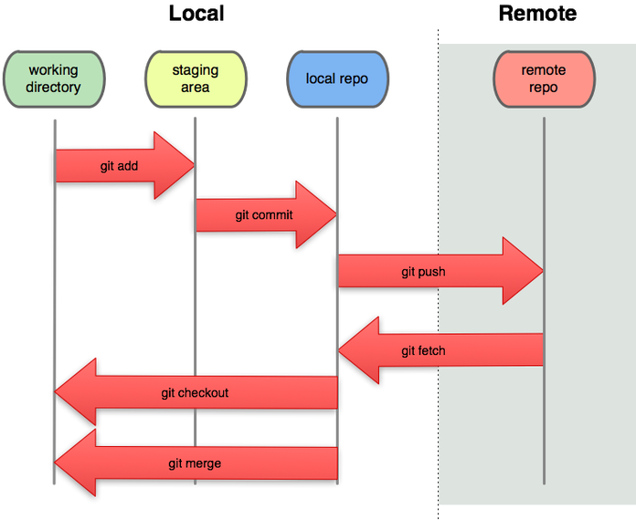<br />
Fonte: https://greenido.wordpress.com/2014/08/03/git-101-part-2-a-bit-more-advance-commands/

</Center>

## Parabéns

Você chegou até aqui, espero que tenha gostado do conteúdo, e que tenha aprendido algo novo. Trabalhar com **Git** é muito legal, e é uma ferramenta muito poderosa, que pode ser utilizada de diversas formas, e que pode te ajudar muito no seu dia a dia. Quanto mais você utilizar o **Git**, mais você vai aprender, e mais você vai gostar dele.

<Center>

  
Parabéns, você aprendeu como trabalhar com o **Git**!

</Center>
