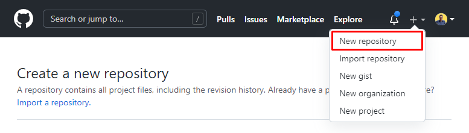
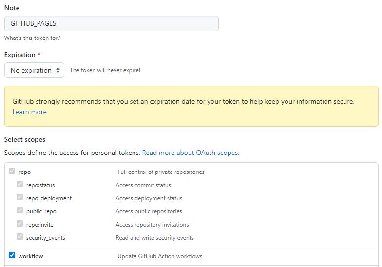

## Requisitos

Para publicar o site, você precisa ter uma conta no [GitHub](https://github.com) e ter o [Git](https://git-scm.com) instalado na sua máquina.

## Configurando o GitHub Actions

Para publicar o site, você precisa fazer o **build** do projeto e depois fazer o **deploy** para o GitHub Pages, para isso, você pode fazer manualmente, mas eu vou mostrar como fazer isso de forma automática com o [GitHub Actions](https://docs.github.com/pt/actions).

Antes de começar, abra a pasta do projeto com um editor de texto, como o [Visual Studio Code](https://code.visualstudio.com). Depois crie uma pasta chamada `.github` e dentro dela crie outra pasta chamada `workflows`, dentro dessa pasta crie um arquivo chamado `main.yml` e cole o seguinte código:

```yml title=".github/workflows/main.yml"
name: Build and Deploy

on:
  push:
    branches:
      - main
      - master

jobs:
  build-and-deploy:
    runs-on: ubuntu-latest
    steps:
      - uses: actions/checkout@v2
      - uses: actions/setup-node@v2
        with:
          node-version: "16"
      - run: npm clean-install
      - run: npm run build
      - uses: peaceiris/actions-gh-pages@v3
        with:
          github_token: ${{ secrets.GITHUB_TOKEN }}
          publish_dir: ./build
          branch: gh-pages
```

:::warning Atenção
Você precisa criar a pasta `.github` e dentro dela a pasta `workflows` para que o GitHub Actions funcione. A pasta `.github` é uma pasta oculta e você precisa habilitar a opção de mostrar pastas ocultas para que ela apareça no seu sistema operacional
:::

O código acima faz o seguinte:

- Quando você fizer um `push` para a branch `main` ou `master`, o GitHub Actions vai executar o código.
- Ele vai instalar o Node.js na versão 16 e depois vai instalar as dependências do projeto.
- Depois ele vai fazer o build do projeto e depois vai fazer o deploy para o GitHub Pages na branch `gh-pages`.

## Criando o repositório

Primeiro, você precisa criar um repositório no GitHub, para isso, acesse o [GitHub](https://github.com) e crie um repositório com o nome que desejar, e deixe ele público.

- [Link para criar um repositório](https://github.com/new)



Depois de criar o repositório, você vai ver uma página com instruções de como fazer o upload do seu projeto para o repositório, então vamos seguir essas instruções.

## Fazendo o upload do projeto

Vamos abrir o terminal na pasta onde você criou o projeto com o Docusaurus e executar os seguintes comandos:

```bash
# Inicializa o repositório Git
git init

# Adiciona todos os arquivos para o repositório
git add .

# Faz o commit dos arquivos
git commit -m "Primeiro commit"

# Adiciona o repositório remoto
git remote add origin <URL>
# git remote add origin https://github.com/lucasbaccan/Teste.git

# Faz o push para o repositório remoto
git push -u origin main
```

:::note Observação
O comando `git remote add origin <URL>` deve ser executado com a URL do repositório que você criou no GitHub.
:::

Todos esses comandos vão fazer o upload do seu projeto para o repositório que você criou no GitHub.

## Configurando o GitHub Pages

Agora que o projeto já está no GitHub, você precisa configurar o GitHub Pages para que ele possa publicar o site.

Vamos primeiro criar um token de acesso para o GitHub Pages, para isso, acesse o [GitHub](https://github.com) e vá até a página de [configurações do seu perfil](https://github.com/settings/profile), depois vá até a aba `Developer settings` e depois clique em `Personal access tokens`.

- [Link para criar um novo token de acesso diretamente](https://github.com/settings/tokens/new)

Lembre de marcar a opção `repo` e `workflow` depois clique em `Generate token`.



Copie o token gerado e salve em algum lugar, pois vamos precisar dele depois.

Depois de criar o token, vamos voltar para a página do repositório que você criou, e vamos clicar em `Settings` e depois em `Secrets` e `Actions` e depois em `New repository secret`.

Insira o nome `GITHUB_TOKEN` e cole o token que você copiou no campo `Value` e depois clique em `Add secret`.

Fizemos tudo isso para dar permissão para o GitHub Actions fazer o deploy do site em nosso nome, sem precisarmos fazer isso manualmente.

Agora vamos voltar para a página do repositório e vamos clicar em `Settings` e depois em `Pages` e depois em `Source` e selecione a opção `Deploy from a branch` e selecione a branch `gh-pages` e depois clique em `Save`.

Se tudo deu certo, você vai ver uma mensagem dizendo que o site foi publicado com sucesso. Agora você pode acessar o site pelo link que aparece na página.

Vamos agora fazer um teste, vamos fazer uma alteração no projeto e fazer um novo `push` para o repositório, para isso, vamos abrir o arquivo `docusaurus.config.js` e vamos alterar o título do site para `Teste` e vamos salvar o arquivo.

Depois vamos abrir o terminal na pasta do projeto e vamos executar os seguintes comandos:

```bash
# Adiciona todos os arquivos para o repositório
git add .

# Faz o commit dos arquivos
git commit -m "Alterando o título do site"

# Faz o push para o repositório remoto
git push
```

Depois de fazer o `push` do projeto, você vai ver que o GitHub Actions vai executar o código e vai fazer o deploy do site novamente, e você pode acessar o site pelo link que aparece na página do repositório.

:::info Informação
O GitHub Pages pode demorar alguns minutos para atualizar o site, então se você não conseguir acessar o site, tente novamente depois de alguns minutos.
:::

## Conclusão

Nesse tutorial, você aprendeu como criar um site com o Docusaurus e como fazer o deploy do site para o GitHub Pages.
