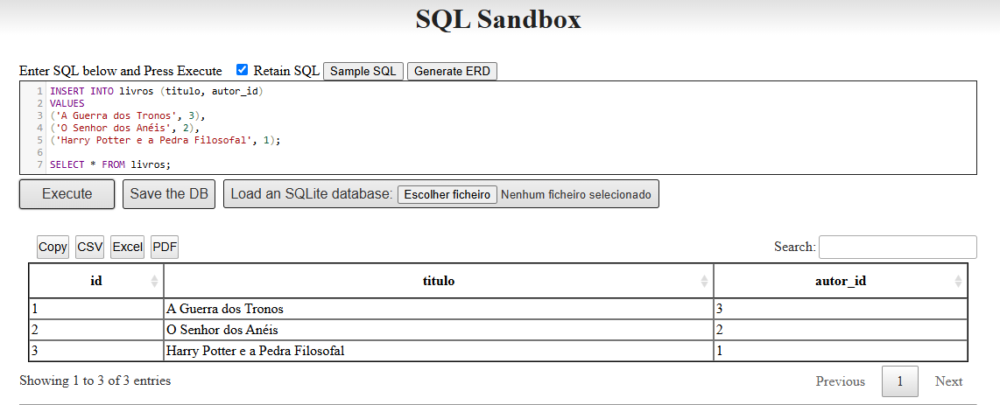
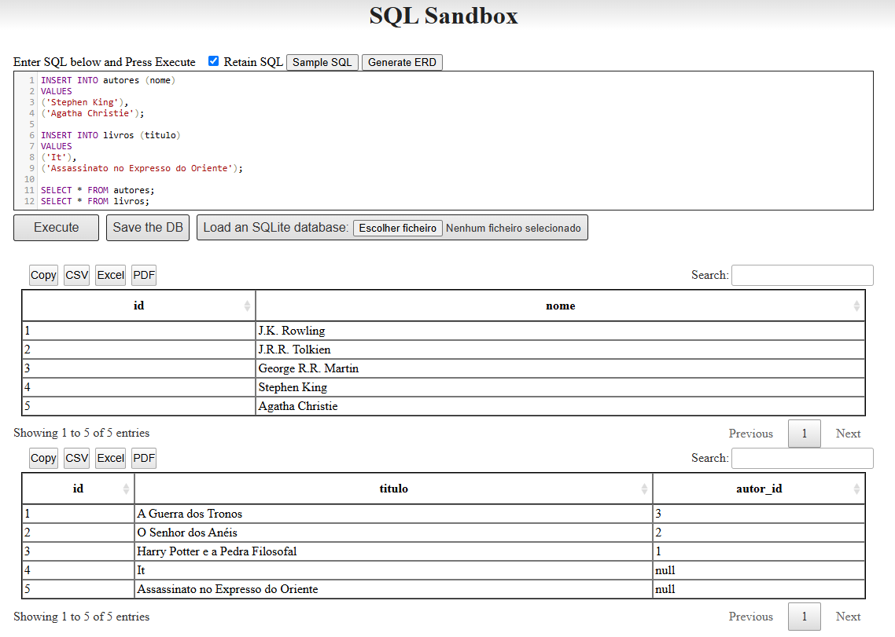
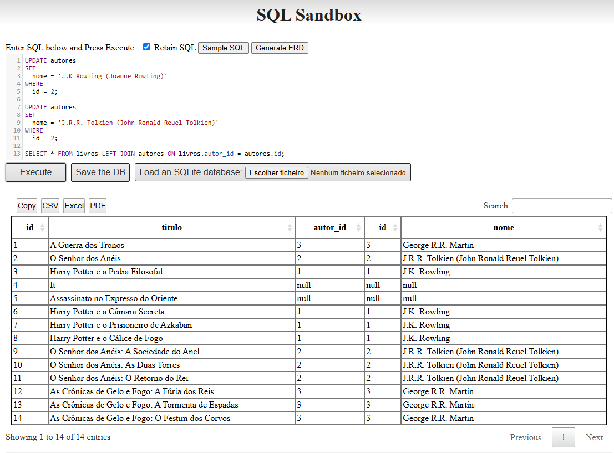

import Center from '@site/src/components/Center';

<!-- import SQL from '@site/src/components/SQL'; -->
<!-- <SQL></SQL> -->

## Introdução

Seja bem vindo ao tutorial de SQL. Aqui você aprenderá os conceitos básicos de SQL, as principais instruções e como utilizá-las para manipular e consultar dados em um banco de dados.

<Center>

  
Boa sorte e bons estudos!

</Center>

## Requisitos

Esse tutorial pode ser feito em qualquer lugar, desde que você tenha acesso a um navegador e uma conexão com a internet. Vamos utilizar um site para praticar SQL, então você não precisa instalar nada em sua máquina.

De preferencia, utilize um computador para fazer o tutorial, pois é mais fácil de praticar SQL em um computador do que em um celular. Mas se você só tiver um celular, não tem problema, você ainda pode aprender SQL.

## Metodologia

Existem vários bancos de dados, e cada banco de dados tem implementações levemente diferentes de SQL. Neste tutorial, vamos utilizar o [SQLite](https://www.sqlite.org/index.html), um banco de dados relacional super leve e fácil de usar, você consegue utilizá-lo sem precisar instalar nada em sua máquina, basta acessar o site [SQLite Online](https://www.convertcsv.com/sqlite-online.htm) e começar a praticar SQL.

<Center>

  
Site utilizado para praticar SQL online

</Center>

:::info Observação
Caso você queira instalar um banco de dados ou se já tiver um banco de dados instalado em sua máquina, você pode utilizar o banco de dados que preferir para praticar SQL. Mas para este tutorial, vamos utilizar o [SQLite Online](https://www.convertcsv.com/sqlite-online.htm) por questão de praticidade.
:::

## O que é SQL?

**SQL** (**S**tructured **Q**uery **L**anguage ou Linguagem de Consulta Estruturada) é utilizada para manipular e consultar bancos de dados relacionais. SQL é uma linguagem padrão para bancos de dados relacionais, e é utilizada para realizar operações como inserir, atualizar, deletar e consultar dados.

## O que é um banco de dados relacional?

Um banco de dados relacional é um banco de dados que armazena dados em tabelas. Cada tabela é composta por linhas e colunas, onde cada linha representa um registro e cada coluna representa um atributo do registro.

Em um banco de dados relacional, as tabelas são relacionadas entre si através de chaves estrangeiras. Isso permite que os dados sejam consultados e manipulados de forma eficiente. Pode parecer complicado, mas com a prática você verá que é bem simples.

## O que é um banco não relacional?

Não é o foco deste tutorial, mas existem outros tipos de bancos de dados, como os bancos de dados não relacionais, que armazenam dados de forma diferente dos bancos de dados relacionais. Bancos de dados não relacionais são utilizados para armazenar dados não estruturados ou semi-estruturados, e são utilizados em aplicações que requerem alta escalabilidade e flexibilidade.

:::info Observação
Se você está vendo bancos de dados pela primeira vez, não se preocupe qual tipo de banco de dados é melhor. Um banco de dados relacional é uma ótima escolha para a maioria dos casos, ele é uma ótima forma de começar sua jornada em bancos de dados. Com a prática, você vai entender melhor as diferenças entre os tipos de bancos de dados e quando utilizar cada um.
:::

## Onde podemos utilizar SQL?

Toda aplicação que precisa armazenar e consultar dados pode utilizar SQL. Se você está em uma aplicação web, pode ser que não precise escrever SQL diretamente, mas no backend da aplicação, o banco de dados estará lá, e SQL será utilizado para consultar e manipular os dados.

Então toda aplicação que precisa armazenar e consultar dados, como um site de notícias, um sistema de gerenciamento de vendas, um aplicativo de delivery, entre outros, pode utilizar SQL em algum momento.

## Recursos

Como já mencionamos, existem tabelas, linhas e colunas em um banco de dados relacional. Vamos ver alguns conceitos básicos de SQL para começar a praticar.

### Tabelas

Uma tabela é uma coleção de registros, onde cada registro é composto por um conjunto de atributos. Cada tabela é composta por colunas e linhas, onde cada coluna representa um atributo do registro e cada linha representa um registro.

### Linhas

Uma linha é um registro na tabela, e é composta por um conjunto de valores que representam os atributos do registro.

### Colunas

Uma coluna é um atributo do registro, e representa um campo de dados na tabela. Esses campos de dados podem ser de diferentes tipos, como texto, número, data, entre outros.

### Exemplo

Vamos ver um exemplo de uma tabela de usuários:

| id  | nome  | email           | idade |
| --- | ----- | --------------- | ----- |
| 1   | João  | joao@email.com  | 25    |
| 2   | Maria | maria@email.com | 30    |
| 3   | Pedro | pedro@email.com | 35    |

- A **tabela** é o conjunto de todos os registros, mesmo que a tabela esteja vazia, ela ainda é uma tabela.
- Cada **linha** é um registro na tabela, e representa um usuário, que contem dados.
- Cada **coluna** é um dado do registro, e representa um campo de dados na tabela.

### Chave primária

A chave primária é um campo ou um conjunto de campos que identifica unicamente um registro em uma tabela. A chave primária é utilizada para garantir que cada registro seja único na tabela.

No exemplo da tabela de usuários, a coluna `id` é a chave primária, e garante que cada usuário seja único na tabela. A chave primária é utilizada para identificar um registro de forma única, e é utilizada para relacionar tabelas entre si.

### Chave estrangeira

A chave estrangeira é um campo ou um conjunto de campos que estabelece uma relação entre duas tabelas. A chave estrangeira é utilizada para garantir a integridade referencial entre as tabelas.

Mais para frente vamos ver como utilizar chaves estrangeiras para relacionar tabelas entre si. Por enquanto, vamos focar nos conceitos básicos de SQL.

## Próximos passos

Quando utilizamos um banco de dados relacional, precisamos ter uma preocupação com as colunas que vamos criar e seus tipos, para que os dados sejam armazenados corretamente. Os bancos de dados validam os dados antes de inseri-los, então se você tentar salvar um texto em uma coluna de número, o banco de dados irá retornar um erro. Fique atento a isso quando estiver criando suas tabelas.

Vamos então começar a ver como criar um banco de dados e quais comandos SQL podemos utilizar para manipular e consultar os dados.

## Formatação

SQL é uma linguagem sem diferenciação de maiúsculas e minúsculas, então você pode escrever os comandos em maiúsculas ou minúsculas, como preferir. Por exemplo, `SELECT`, `select`, `Select`, `SeLeCt` são equivalentes. O mesmo vale para os espaçamentos, você pode escrever tudo em uma linha ou separar os comandos em várias linhas, como preferir.

```sql showLineNumbers
select * From tabela;
```

é equivalente a

```sql showLineNumbers
SELECT
  *
FROM
  tabela;
```

Para fins de legibilidade, vamos utilizar a formatação com letras maiúsculas e comandos em várias linhas, mas você pode utilizar a formatação que preferir. O importante é que os comandos estejam corretos e sejam compreensíveis.

### Ponto e vírgula

Alguns bancos de dados requerem que os comandos SQL terminem com um ponto e vírgula `;`. Isso indica ao banco de dados que o comando terminou. Alguns bancos de dados não requerem o ponto e vírgula ao final da instrução.

Se você tiver mais de um comando SQL em sequência, você precisa separar os comandos com um ponto e vírgula `;`. Isso indica ao banco de dados que um comando terminou e outro começou.

```sql showLineNumbers
SELECT * FROM tabela1;
SELECT * FROM tabela2;
```

### Comentários

Assim como em outras linguagens de programação, você pode adicionar comentários no código. Comentários são ignorados pelo banco de dados, e são utilizados para explicar o código e torná-lo mais compreensível.

Em SQL, você pode adicionar comentários de uma linha utilizando `--` ou comentários de múltiplas linhas utilizando `/*` e `*/` no início e no final do comentário, respectivamente.

Utilize sempre que achar necessário adicionar comentários ao seu código, para que outras pessoas possam entender o que você está fazendo ou para o seu eu do futuro.

```sql showLineNumbers
-- Este é um comentário de uma linha
SELECT
  *
FROM
  tabela;
/*
Este é um comentário
de múltiplas linhas
*/
```

## Comandos SQL

Agora que já sabemos o que é SQL e onde podemos utilizá-lo, vamos ver os comandos básicos de SQL que vamos utilizar para manipular e consultar os dados. Depois de aprender esses comandos, vamos ter uma area de prática para você testar seus conhecimentos, então de uma lida em cada item, mas se não memorizar tudo, não tem problema, quando chegar na prática e não lembrar de algo, você pode voltar aqui e consultar.

<Center>

  
Anotado

</Center>

### CREATE

O comando `CREATE` é utilizado para criar um banco de dados, uma tabela, ou um índice. Ele sozinho não faz nada, mas é utilizado em conjunto com outras palavras-chave para criar objetos no banco de dados.

### CREATE DATABASE

O comando `CREATE DATABASE` é utilizado para criar um novo banco de dados. Você precisa especificar o nome do banco de dados que deseja criar.

```sql showLineNumbers
CREATE DATABASE nome_do_banco_de_dados;
```

Uma vez que você criou um banco de dados, você pode começar a criar tabelas e inserir dados nele.

Vale notar que você pode ter vários bancos de dados em um servidor de banco de dados, e cada banco de dados pode ter várias tabelas. Cada banco de dados é isolado dos outros, então você pode ter diferentes bancos de dados para diferentes aplicações.

### CREATE TABLE

O comando `CREATE TABLE` é utilizado para criar uma nova tabela no banco de dados. Você precisa especificar o nome da tabela e as colunas que a tabela vai ter.

```sql showLineNumbers
CREATE TABLE nome_da_tabela (
  coluna1 tipo_da_coluna,
  coluna2 tipo_da_coluna,
  ...
);
```

Os tipos de dados variam de acordo com os bancos de dados, mas nessa documentação, vamos utilizar os tipos de dados do [SQLite](https://www.sqlite.org/datatype3.html), que são os seguintes:

- `INTEGER` para números inteiros positivos e negativos.
- `REAL` para números reais (números com casas decimais).
- `TEXT` para texto.
- `BLOB` para dados binários.
- `NULL` para valores nulos.

Mas sempre verifique a documentação do seu banco de dados para ver todos os tipos de dados disponíveis.

```sql showLineNumbers
CREATE TABLE usuarios (
  id INTEGER PRIMARY KEY,
  nome TEXT,
  email TEXT,
  idade INTEGER
);
```

### ALTER TABLE

O comando `ALTER TABLE` é utilizado para adicionar, modificar ou deletar colunas de uma tabela.

```sql showLineNumbers
-- Adiciona uma nova coluna à tabela
ALTER TABLE nome_da_tabela
ADD coluna tipo_da_coluna;

-- Modifica o tipo de uma coluna
ALTER TABLE nome_da_tabela
ALTER COLUMN coluna tipo_da_coluna;

-- Deleta uma coluna da tabela
ALTER TABLE nome_da_tabela
DROP COLUMN coluna;
```

Então você não precisa se preocupar se esqueceu de adicionar uma coluna à tabela, você pode adicionar, modificar ou deletar colunas a qualquer momento. Mas lembre-se de que isso pode afetar os dados que já estão na tabela, então tome cuidado ao modificar a estrutura da tabela.

### DROP

O comando `DROP` é utilizado para deletar um banco de dados, uma tabela, ou um índice. O comando `DROP` é irreversível, então tome cuidado ao utilizá-lo.

### DROP DATABASE

O comando `DROP DATABASE` é utilizado para deletar um banco de dados. Você precisa especificar o nome do banco de dados que deseja deletar.

```sql showLineNumbers
DROP DATABASE nome_do_banco_de_dados;
```

### DROP TABLE

O comando `DROP TABLE` é utilizado para deletar uma tabela. Você precisa especificar o nome da tabela que deseja deletar.

```sql showLineNumbers
DROP TABLE nome_da_tabela;
```

### INSERT

O comando `INSERT` é utilizado para inserir dados em uma tabela. Você precisa especificar o nome da tabela e os valores que deseja inserir.

```sql showLineNumbers
INSERT INTO nome_da_tabela (coluna1, coluna2, ...)
VALUES
(valor1, valor2, ...),
(valor3, valor4, ...);
```

### SELECT

O comando `SELECT` é utilizado para consultar dados de uma tabela. Com o comando `SELECT`, você pode selecionar todas as colunas de uma tabela, ou selecionar colunas específicas, ou até mesmo fazer cálculos com os dados.

```sql showLineNumbers
-- Seleciona todas as colunas da tabela
SELECT
  *
FROM
  tabela;

-- Seleciona colunas específicas da tabela
SELECT
  coluna1,
  coluna2
FROM
  tabela;
```

### UPDATE

O comando `UPDATE` é utilizado para atualizar dados em uma tabela. Você precisa especificar o nome da tabela, as colunas que deseja atualizar e os valores que deseja atualizar.

```sql showLineNumbers
UPDATE nome_da_tabela
SET
  coluna1 = valor1,
  coluna2 = valor2
WHERE
  condição;
```

:::info Observação
Não se preocupe com as cláusulas no momento (WHERE). Elas serão vistas mais [adiante](#cláusulas).
:::

### DELETE

O comando `DELETE` é utilizado para deletar dados de uma tabela. Você precisa especificar o nome da tabela e a condição que deseja deletar.

```sql showLineNumbers
DELETE FROM nome_da_tabela
WHERE
  condição;
```

## Cláusulas

Além dos comandos básicos de SQL, existem cláusulas que você pode utilizar para filtrar, ordenar e agrupar os dados. Vamos ver algumas cláusulas que você pode utilizar para consultar os dados.

### FROM

A cláusula `FROM` é utilizada para especificar a tabela da qual você deseja consultar os dados. Com a cláusula `FROM`, você pode especificar a tabela da qual deseja selecionar os dados.

```sql showLineNumbers
SELECT
  *
FROM
  tabela;
```

Você pode utilizar a cláusula `FROM` para especificar a tabela da qual deseja selecionar os dados, o que pode ser útil quando você tem várias tabelas e precisa consultar os dados de uma tabela específica.

### WHERE

A cláusula `WHERE` é utilizada para filtrar os dados de uma tabela. Com a cláusula `WHERE`, você pode especificar uma condição que os dados devem atender para serem retornados.

```sql showLineNumbers
SELECT
  *
FROM
  tabela
WHERE
  x > 10;
```

Você pode utilizar operadores lógicos para melhorar a condição de filtragem, como:

- `=` igual a um valor.
- `!=` diferente de um valor.
- `>` maior que um valor.
- `<` menor que um valor.
- `>=` maior ou igual a um valor.
- `<=` menor ou igual a um valor.
- `AND` "e lógico". Retorna verdadeiro se ambas as condições forem verdadeiras.
- `OR` "ou lógico". Retorna verdadeiro se uma das condições for verdadeira.
- `NOT` "negação lógica". Retorna verdadeiro se a condição for falsa.

```sql showLineNumbers
SELECT
  *
FROM
  tabela
WHERE
  x > 10
  AND y < 20
  AND z IS NOT NULL;
```

### ORDER BY

A cláusula `ORDER BY` é utilizada para ordenar os dados de uma tabela. Com a cláusula `ORDER BY`, você pode especificar a ordem em que os dados devem ser retornados.

```sql showLineNumbers
SELECT
  *
FROM
  tabela
ORDER BY
  x ASC;
```

Você pode ordenar os dados em ordem crescente (`ASC`) ou decrescente (`DESC`).

### GROUP BY

A cláusula `GROUP BY` é utilizada para agrupar os dados de uma tabela. Com a cláusula `GROUP BY`, você pode agrupar os dados por uma ou mais colunas.

```sql showLineNumbers
SELECT
  coluna1,
  COUNT(coluna2)
FROM
  tabela
GROUP BY
  coluna1;
```

:::info Observação
Não se preocupe com as funções no momento (COUNT). Elas serão vistas mais [adiante](#funções).
:::

### HAVING

A cláusula `HAVING` é utilizada para filtrar os dados agrupados de uma tabela. Com a cláusula `HAVING`, você pode especificar uma condição que os dados agrupados devem atender para serem retornados.

```sql showLineNumbers
SELECT
  coluna1,
  COUNT(coluna2)
FROM
  tabela
GROUP BY
  coluna1
HAVING
  COUNT(coluna2) > 10;
```

### LIMIT

A cláusula `LIMIT` é utilizada para limitar o número de linhas retornadas de uma tabela. Com a cláusula `LIMIT`, você pode especificar o número de linhas que deseja retornar.

```sql showLineNumbers
SELECT
  *
FROM
  tabela
LIMIT
  10;
```

Então você pode utilizar a cláusula `LIMIT` para limitar o número de linhas retornadas, o que pode ser útil quando você tem muitos dados e só precisa de uma parte deles.

## Joins (Junções)

A cláusula `JOIN` é utilizada para combinar os dados de duas ou mais tabelas. Com a cláusula `JOIN`, você pode combinar os dados de duas ou mais tabelas com base em uma condição.

É importante entender como as tabelas estão relacionadas entre si para utilizar a cláusula `JOIN` corretamente. Existem vários tipos de `JOIN`, como `INNER JOIN`, `LEFT JOIN`, `RIGHT JOIN`, `FULL JOIN`, que você pode utilizar para combinar os dados de duas ou mais tabelas.

### INNER JOIN (JOIN)

O `INNER JOIN` é utilizado para combinar os dados de duas ou mais tabelas onde a condição é verdadeira. O termo `JOIN` é equivalente a `INNER JOIN`, então você pode utilizar `JOIN` em vez de `INNER JOIN`.

<Center bgColorDark="#333" >

  
https://www.w3schools.com/sql/img_innerjoin.gif

</Center>

```sql showLineNumbers
SELECT
  *
FROM
  tabela1
  INNER JOIN tabela2 ON tabela1.coluna = tabela2.coluna

-- Equivalente a
SELECT
  *
FROM
  tabela1
  JOIN tabela2 ON tabela1.coluna = tabela2.coluna
```

### LEFT JOIN

O `LEFT JOIN` é utilizado para combinar os dados da tabela da esquerda com os dados da tabela da direita, mesmo que a condição não seja verdadeira.

<Center bgColorDark="#333" >

  
https://www.w3schools.com/sql/img_leftjoin.gif

</Center>

```sql showLineNumbers
SELECT
  *
FROM
  tabela1
  LEFT JOIN tabela2 ON tabela1.coluna = tabela2.coluna
```

### RIGHT JOIN

O `RIGHT JOIN` é utilizado para combinar os dados da tabela da direita com os dados da tabela da esquerda, mesmo que a condição não seja verdadeira.

<Center bgColorDark="#333" >

  
https://www.w3schools.com/sql/img_rightjoin.gif

</Center>

```sql showLineNumbers
SELECT
  *
FROM
  tabela1
  RIGHT JOIN tabela2 ON tabela1.coluna = tabela2.coluna
```

### FULL OUTER JOIN

O `FULL OUTER JOIN` é utilizado para combinar os dados da tabela da esquerda com os dados da tabela da direita, mesmo que a condição não seja verdadeira.

<Center bgColorDark="#333" >

  
https://www.w3schools.com/sql/img_fulljoin.gif

</Center>

```sql showLineNumbers
SELECT
  *
FROM
  tabela1
  FULL OUTER JOIN tabela2 ON tabela1.coluna = tabela2.coluna
```

## Funções

Além dos comandos básicos de SQL e das cláusulas que você pode utilizar para consultar os dados, existem funções que você pode utilizar para fazer cálculos com os dados. Vamos ver algumas funções que você pode utilizar para fazer cálculos com os dados.

<Center>

  
[Lista de funções do SQLite](https://www.sqlite.org/lang_corefunc.html)

</Center>

Vamos ver algumas funções, as que acreditamos serem mais úteis para você começar a praticar SQL.

### COUNT

A função `COUNT` é utilizada para contar o número de linhas retornadas de uma consulta. Com a função `COUNT`, você pode contar o número de linhas retornadas de uma consulta.

```sql showLineNumbers
SELECT
  COUNT(*)
FROM
  tabela;
```

### SUM

A função `SUM` é utilizada para somar os valores de uma coluna. Com a função `SUM`, você pode somar os valores de uma coluna.

```sql showLineNumbers
SELECT
  SUM(coluna)
FROM
  tabela;
```

### LOWER

A função `LOWER` é utilizada para converter uma string para minúsculas. Com a função `LOWER`, você pode converter uma string para minúsculas.

```sql showLineNumbers
SELECT
  LOWER(coluna)
FROM
  tabela;
```

### UPPER

A função `UPPER` é utilizada para converter uma string para maiúsculas. Com a função `UPPER`, você pode converter uma string para maiúsculas.

```sql showLineNumbers
SELECT
  UPPER(coluna)
FROM
  tabela;
```

### ROUND

A função `ROUND` é utilizada para arredondar um número para um número específico de casas decimais. Com a função `ROUND`, você pode arredondar um número para um número específico de casas decimais.

```sql showLineNumbers
SELECT
  ROUND(coluna, casas_decimais)
FROM
  tabela;
```

### LENGTH

A função `LENGTH` é utilizada para retornar o número de caracteres de uma string. Com a função `LENGTH`, você pode retornar o número de caracteres de uma string.

```sql showLineNumbers
SELECT
  LENGTH(coluna)
FROM
  tabela;
```

### Etc...

Existem muitas outras funções que você pode utilizar para fazer cálculos com os dados. Você pode consultar a documentação do seu banco de dados para ver todas as funções disponíveis.

## Prática 1

Antes de continuar, beba água, estique-se, faça uma pausa, e quando estiver pronto, vamos praticar o que aprendemos até agora.

<Center>

  
Hidrate-se!

</Center>

Como já foi mencionado, vamos utilizar o site [SQLite Online](https://www.convertcsv.com/sqlite-online.htm) para praticar SQL. Vamos progredir passo a passo, então siga as instruções e pratique o que aprendeu até agora.

### Item 1.1

Criar uma tabela chamada `livros` com as seguintes colunas:

- `id` do tipo `INTEGER` e chave primária.
- `titulo` do tipo `TEXT`.
- `autor` do tipo `TEXT`.

```sql showLineNumbers
DROP TABLE IF EXISTS livros;

CREATE TABLE livros (
  id INTEGER PRIMARY KEY,
  titulo TEXT,
  autor TEXT
);
```

A linha 1 é executado um `DROP TABLE` para garantir que a tabela `livros` não exista antes de criá-la. A linha 3 é executado um `CREATE TABLE` para criar a tabela `livros` com as colunas `id` (linha 4), `titulo` (linha 5) e `autor` (linha 6).

Ao executar, não vai aparecer nenhuma mensagem, mas no [item 1.2](#item-11) e [item 1.3](#item-13) vamos verificar se a tabela foi criada corretamente.

### Item 1.2

Vamos inserir um livro na tabela `livros` com os seguintes dados:

- `id` igual a `1`.
- `titulo` igual a `Harry Potter e a Pedra Filosofal`.
- `autor` igual a `J.K. Rowling`.

```sql showLineNumbers
INSERT INTO livros (id, titulo, autor)
VALUES
(1, 'Harry Potter e a Pedra Filosofal', 'J.K. Rowling'),
(2, 'O Senhor dos Anéis', 'J.R.R. Tolkien');
```

A linha 1 é executado um `INSERT INTO`, do qual temos que informar a tabela que queremos inserir os dados (`livros`), as colunas que queremos inserir os dados (`id`, `titulo` e `autor`).

A linha 2 indica que depois do `VALUES` vamos informar os valores que queremos inserir. Você poderia já nessa linha informar os valores, mas para ficar mais legível, separamos em várias linhas.

A linha 3 e 4 são os valores que queremos inserir na tabela `livros`, na sequencia dos campos que foi informada na linha 1.

Assim como no [item 1.1](#item-11), não vai aparecer nenhuma mensagem, mas no [item 1.3](#item-13) vamos verificar se o livro foi inserido corretamente.

### Item 1.3

Vamos consultar os livros da tabela `livros` e verificar se os livros foi inserido corretamente.

```sql showLineNumbers
SELECT
  *
FROM
  livros;
```

Se tudo estiver correto, vai aparecer uma tabela com os dados da tabela `livros`, e você vai ver o livro que inserimos no [item 1.2](#item-12).

<Center>

  
Resultado da consulta

</Center>

### Item 1.4

Vamos ver outra forma de inserir um livro na tabela `livros` mas sem informar o `id`, pois o `id` é uma chave primária e é auto-incrementável. Isso significa que o banco de dados vai gerar o `id` automaticamente para nós.

```sql showLineNumbers
INSERT INTO livros (autor, titulo)
VALUES
('George R.R. Martin', 'A Guerra das Cadeiras');

SELECT * FROM livros;
```

Diferente do [item 1.2](#item-12), não informamos o `id`, e mudamos a ordem dos campos `autor` e `titulo`, mas o banco de dados vai gerar o `id` automaticamente para nós, e a ordem dos campos não importa, desde que os valores passados depois do `VALUES` estejam na mesma ordem dos campos informados na linha 1.

Nesse exemplo após a inserção, vamos consultar os livros da tabela `livros` para verificar se o livro foi inserido corretamente. Então você vai ver na tabela os livros que inserimos.

### Item 1.5

Vamos filtrar os livros da tabela `livros` para mostrar somente os livros do autor `J.K. Rowling`.

```sql showLineNumbers
SELECT
  *
FROM
  livros
WHERE
  autor = 'J.K. Rowling';
```

No [item 1.3](#item-13) vimos como consultar todos os livros da tabela `livros`, mas agora vamos filtrar os livros para mostrar somente os livros do autor `J.K. Rowling`.

Então agora na linha 5 temos uma cláusula `WHERE` que é utilizada para filtrar os dados da tabela `livros`, e na linha 6 temos a condição que os dados devem atender para serem retornados (`autor = 'J.K. Rowling'`).

Se tudo estiver correto, vai aparecer uma tabela com os dados da tabela `livros`, e você vai ver somente os livros do autor `J.K. Rowling`.

<Center>

  
Resultado da consulta de livros do autor J.K. Rowling

</Center>

### Item 1.6

Podemos filtrar não só as linhas, mas também as colunas que queremos mostrar. Vamos mostrar somente o `titulo` dos livros do autor `R.R. Tolkien`.

```sql showLineNumbers
SELECT
  titulo
FROM
  livros
WHERE
  autor = 'J.R.R. Tolkien';
```

Assim como no [item 1.5](#item-15), temos uma cláusula `WHERE` na linha 5 para filtrar os dados da tabela `livros`, e na linha 6 temos a condição que os dados devem atender para serem retornados (`autor = 'J.R.R. Tolkien'`).

Desta vez, só aparece como resultado o título dos livros do autor `J.R.R. Tolkien`.

### Item 1.7

Vamos atualizar o ultimo livro inserido na tabela `livros` para corrigir o título. Por engano o título foi inserido errado, então vamos corrigir o título do livro.

Vamos precisar fazer um `UPDATE` para atualizar o título do livro de ID 3 de `A Guerra das Cadeiras` para `A Guerra dos Tronos`.

```sql showLineNumbers
UPDATE livros
SET
  titulo = 'A Guerra dos Tronos'
WHERE
  id = 3;

SELECT * FROM livros;
```

Na linha 1 é executado um `UPDATE`, precisamos informar a tabela que queremos atualizar os dados (`livros`).

Na linha 2 é executado um `SET`, onde informamos o campo que queremos atualizar (`titulo`) e o valor que queremos atualizar na linha 3 (`A Guerra dos Tronos`).

Na linha 4 a condição de filtragem, **que é muito importante** quanto você estiver fazendo um `UPDATE`, pois se você não informar a condição, todos os registros da tabela serão atualizados para o valor informado, então tome cuidado ao fazer um `UPDATE`.

<Center>

  
Você foi avisado!

</Center>

### Item 1.8

Como aqui é um tutorial, vamos errar sim, vamos rodar um `UPDATE sem WHERE` só para ver o que acontece.

```sql showLineNumbers
UPDATE livros
SET
  autor = 'George R.R. Martin';

SELECT * FROM livros;
```

Na linha 1 é executado um `UPDATE` para a tabela `livros`, e na linha 2 é executado um `SET` para atualizar o campo `autor` para `George R.R. Martin` e **não informamos a condição de filtragem**, então todos os registros da tabela `livros` vão ser atualizados para o valor informado.

<Center>

  
Resultado da consulta de livros do autor J.K. Rowling

</Center>

Se você rodar esse comando, vai ver que todos os autores dos livros da tabela `livros` vão ser atualizados para `George R.R. Martin`, o que é o que foi esperado para esse exemplo, mas que pode ser um problema em um ambiente de produção.

### Item 1.9

Vamos deletar o livro de ID 3 da tabela `livros`.

```sql showLineNumbers
DELETE FROM livros
WHERE
  id = 3;

SELECT * FROM livros;
```

Na linha 1 é executado um `DELETE FROM` para a tabela `livros`, e na linha 2 é a condição de filtragem para deletar o livro de ID 3 da tabela `livros`.

Se tudo estiver correto, vai aparecer uma tabela com os dados da tabela `livros`, e você vai ver que o livro de ID 3 foi deletado.

### Item 1.10

Vamos agora apagar todos os livros da tabela `livros` utilizando uma condição múltipla na cláusula `WHERE`.

```sql showLineNumbers
DELETE FROM livros
WHERE
  titulo = 'Harry Potter e a Pedra Filosofal'
  OR id = 2;

SELECT * FROM livros;
```

Na linha 1 é executado um `DELETE FROM` para a tabela `livros`, e na linha 2 é a condição de filtragem para deletar os livros do titulo `Harry Potter e a Pedra Filosofal` **ou** o livro de ID 2 da tabela `livros`.

Importante notar que a condição é `OR`, então se um dos valores for verdadeiro, o registro vai ser deletado, se fosse `AND`, os dois valores teriam que ser verdadeiros para o registro ser deletado.

E assim nos temos nossa tabela `livros` vazia, passando pelos principais comandos de SQL.

### Finalização

Se chegou até aqui, parabéns! Você aprendeu os comandos básicos de SQL e como utilizá-los para manipular e consultar os dados. Agora você pode praticar o que aprendeu e se sentir mais confortável com SQL.

<Center>

  
Parabéns!

</Center>

## Pratica 2

Agora que você já aprendeu os comandos básicos de SQL, vamos praticar um pouco mais para fixar o que aprendemos. Vamos ver como utilizar chaves estrangeiras para relacionar tabelas entre si.

Assim como no exemplo anterior, vamos progredir passo a passo, então siga as instruções e pratique o que aprendeu até agora. Vamos criar duas tabelas, uma para os autores e outra para os livros, e vamos relacionar as duas tabelas utilizando chaves estrangeiras.

### Item 2.1

Criar uma tabela chamada `autores` com as seguintes colunas:

- `id` do tipo `INTEGER` e chave primária.
- `nome` do tipo `TEXT`.

```sql showLineNumbers
DROP TABLE IF EXISTS autores;

CREATE TABLE autores (
  id INTEGER PRIMARY KEY,
  nome TEXT
);
```

Linha 1 é executado um `DROP TABLE` para garantir que a tabela `autores` não exista antes de criá-la. Linha 3 é executado um `CREATE TABLE` para criar a tabela `autores` com as colunas `id` (linha 4) e `nome` (linha 5).

### Item 2.2

Criar uma tabela chamada `livros` com as seguintes colunas:

- `id` do tipo `INTEGER` e chave primária.
- `titulo` do tipo `TEXT`.
- `autor_id` do tipo `INTEGER` e chave estrangeira para a tabela `autores`.

```sql showLineNumbers
DROP TABLE IF EXISTS livros;

CREATE TABLE livros (
  id INTEGER PRIMARY KEY,
  titulo TEXT,
  autor_id INTEGER,
  FOREIGN KEY (autor_id) REFERENCES autores(id)
);
```

Agora estamos vendo algo diferente. Na linha 6 estamos criando uma chave estrangeira para a coluna `autor_id` que referencia a coluna `id` da tabela `autores`. Isso significa que a coluna `autor_id` da tabela `livros` vai conter somente valores que existem na coluna `id` da tabela `autores`.

Geralmente a coluna que salva uma `chave estrangeira` tem o `o nome da tabela` seguido de `_` e o `nome da coluna` que ela referencia. Então se a tabela `autores` tem a coluna `id`, a tabela `livros` vai ter a coluna `autor_id` que referencia a coluna `id` da tabela `autores`.

### Item 2.3

Vamos inserir alguns dados na tabela `autores`.

```sql showLineNumbers
INSERT INTO autores (nome)
VALUES
('J.K. Rowling'),
('J.R.R. Tolkien'),
('George R.R. Martin');

SELECT * FROM autores;
```

Na linha 1 é executado um `INSERT INTO` para a tabela `autores`, e na linha 2 são os valores que queremos inserir na tabela `autores`.

Se tudo estiver correto, vai aparecer uma tabela com os dados da tabela `autores`, e você vai ver os autores que inserimos.

### Item 2.4

Vamos inserir alguns dados na tabela `livros`.

```sql showLineNumbers
INSERT INTO livros (titulo, autor_id)
VALUES
('A Guerra dos Tronos', 3),
('O Senhor dos Anéis', 2),
('Harry Potter e a Pedra Filosofal', 1);

SELECT * FROM livros;
```

Na linha 1 é executado um `INSERT INTO` para a tabela `livros`, e na linha 2 são os valores que queremos inserir na tabela `livros`.

Se tudo estiver correto, vai aparecer uma tabela com os dados da tabela `livros`, e você vai ver os livros que inserimos.

<!-- sql_item_2_4.png -->
<Center>

  
Resultado da tabela livros

</Center>

### Item 2.5

Mas agora tem um problema, quando consultamos os livros da tabela `livros`, não conseguimos ver o nome do autor, só o `id` do autor. Vamos fazer um `JOIN` para combinar os dados das tabelas `livros` e `autores` e mostrar o nome do autor.

```sql showLineNumbers
SELECT
  *
FROM
  livros
  JOIN autores ON livros.autor_id = autores.id;
```

Isso vai trazer um retorno com todos os livros da tabela `livros` e o nome do autor da tabela `autores`. Se tudo estiver correto, vai aparecer uma tabela com os dados da tabela `livros` e o nome do autor e seus `id`.

| id  | titulo                           | autor_id | id  | nome               |
| --- | -------------------------------- | -------- | --- | ------------------ |
| 1   | A Guerra dos Tronos              | 3        | 3   | George R.R. Martin |
| 2   | O Senhor dos Anéis               | 2        | 2   | J.R.R. Tolkien     |
| 3   | Harry Potter e a Pedra Filosofal | 1        | 1   | J.K. Rowling       |

### Item 2.6

Vamos agora selecionar somente o `titulo` do livro e o `nome` do autor.

```sql showLineNumbers
SELECT
  tabela_livros.titulo,
  autores.nome AS autor
FROM
  livros AS tabela_livros
  JOIN autores ON tabela_livros.autor_id = autores.id;
```

Na linha 1 estamos selecionando somente o `titulo` do livro e o `nome` do autor. No nome do autor estamos utilizando `AS autor` para renomear a coluna `nome` para `autor` quando for exibida, isso é opcional, mas pode ser útil para deixar o resultado mais legível, e não afeta a tabela, só o resultado da consulta.

Na linha 3 estamos utilizando `AS tabela_livros` para renomear a tabela `livros` para `tabela_livros`, isso é opcional, mas pode ser útil para deixar o código mais legível. Aqui é só um exemplo, mas as vezes lidamos com tabelas com nomes muito grandes, e renomear a tabela pode ser útil para deixar o código mais legível. Isso não afeta a tabela, só funciona esse nome na consulta.

Para dar nome a uma tabela ou coluna, você pode utilizar `AS` seguido do nome que você quer dar a tabela ou coluna. Se tiver espaço no nome, você pode utilizar aspas simples `'` entre o nome.

Se tudo estiver correto, vai aparecer uma tabela com o `titulo` do livro e o `nome` do autor.

Esse é um exemplo de [`JOIN`](#joins-junções) do tipo `INNER JOIN`, que é utilizado para combinar os dados de duas ou mais tabelas onde a condição é verdadeira.

### Item 2.7

Vamos agora inserir mais 2 autores na tabela `autores` e mais 2 livros na tabela `livros`. Mas só vamos inserir os autores e os livros, não vamos relacionar os autores com os livros.

```sql showLineNumbers
INSERT INTO autores (nome)
VALUES
('Stephen King'),
('Agatha Christie');

INSERT INTO livros (titulo)
VALUES
('It'),
('Assassinato no Expresso do Oriente');

SELECT * FROM autores;
SELECT * FROM livros;
```

Podemos notar que os livros foram inseridos, mas não temos o `autor_id`, isso deixa a coluna com o valor `NULL`, pois não tem um autor relacionado com o livro.

<Center>

  
Resultado da tabela autores e livros

</Center>

### Item 2.8

Agora vamos rodar a mesma consulta do [item 2.5](#item-25) para ver os livros e os autores relacionados.

```sql showLineNumbers
SELECT
  tabela_livros.titulo,
  autores.nome AS autor
FROM
  livros AS tabela_livros
  JOIN autores ON tabela_livros.autor_id = autores.id;
```

Se tudo estiver correto, vai aparecer uma tabela com o `titulo` do livro e o `nome` do autor, mas só vai aparecer os livros que tem um autor relacionado. Os livros que não tem um autor relacionado não vão aparecer.

Isso acontece porque estamos utilizando um `INNER JOIN`, que é utilizado para combinar os dados de duas ou mais tabelas onde a condição é verdadeira (`tabela_livros.autor_id = autores.id`). Se a condição não for verdadeira, o registro não vai ser retornado.

### Item 2.9

Vamos agora mudar o `INNER JOIN` para um `LEFT JOIN` para mostrar todos os livros, mesmo os que não tem um autor relacionado.

```sql showLineNumbers
SELECT
  tabela_livros.titulo,
  COALESCE(autores.nome, 'Sem autor') AS autor
FROM
  livros AS tabela_livros
  LEFT JOIN autores ON tabela_livros.autor_id = autores.id;
```

Se tudo estiver correto, vai aparecer uma tabela com o `titulo` do livro e o `nome` do autor, e você vai ver todos os livros, mesmo os que não tem um autor relacionado.

O `LEFT JOIN` é utilizado para combinar os dados da tabela da esquerda (`livros`) com os dados da tabela da direita (`autores`), mesmo que a condição não seja verdadeira.

Utilizamos a função `COALESCE` para retornar o `nome` do autor, mas se o `nome` for `NULL`, retornar `Sem autor`. A função `COALESCE` é utilizada para retornar o primeiro valor não nulo de uma lista de valores, então se o `nome` for `NULL`, vai retornar `Sem autor`, pois é o primeiro valor não nulo da lista.

### Item 2.10

Vamos agora inserir as coleções de livros dos autores na tabela `livros`.

```sql showLineNumbers
INSERT INTO livros (titulo, autor_id)
VALUES
('Harry Potter e a Câmara Secreta', 1),
('Harry Potter e o Prisioneiro de Azkaban', 1),
('Harry Potter e o Cálice de Fogo', 1),
('O Senhor dos Anéis: A Sociedade do Anel', 2),
('O Senhor dos Anéis: As Duas Torres', 2),
('O Senhor dos Anéis: O Retorno do Rei', 2),
('As Crônicas de Gelo e Fogo: A Fúria dos Reis', 3),
('As Crônicas de Gelo e Fogo: A Tormenta de Espadas', 3),
('As Crônicas de Gelo e Fogo: O Festim dos Corvos', 3);

SELECT * FROM livros LEFT JOIN autores ON livros.autor_id = autores.id;
```

O benefício de utilizar um **banco de dados relacional** é que podemos relacionar as tabelas entre si, e isso é muito útil quando temos tabelas que tem uma relação entre si, como a tabela `livros` e a tabela `autores`, pois não precisamos repetir os dados de um autor em cada livro, só precisamos relacionar o autor com o livro.

Se tudo estiver correto, vai aparecer uma tabela com os dados da tabela `livros` e o nome do autor relacionado com o livro.

<Center>

  
Nice!

</Center>

### Item 2.11

E por ser um banco de dados relacional, se você alterar o nome de um autor na tabela `autores`, o nome do autor vai ser alterado em todos os livros relacionados com o autor. No caso a tabela `livros` não vai ter nenhum dado alterado, mas quando for feita uma consulta, o nome do autor vai ser o novo nome.

```sql showLineNumbers
UPDATE autores
SET
  nome = 'J.K Rowling (Joanne Rowling)'
WHERE
  id = 2;

UPDATE autores
SET
  nome = 'J.R.R. Tolkien (John Ronald Reuel Tolkien)'
WHERE
  id = 2;

SELECT * FROM livros LEFT JOIN autores ON livros.autor_id = autores.id;
```

Na linha 1 é executado um `UPDATE` para a tabela `autores`, e na linha 2 é executado um `SET` para atualizar o campo `nome` para `J.K Rowling (Joanne Rowling)`.
Na linha 4 é executado um `UPDATE` para a tabela `autores`, e na linha 5 é executado um `SET` para atualizar o campo `nome` para `J.R.R. Tolkien (John Ronald Reuel Tolkien)`.
Na linha 7 é executado um `UPDATE` para a tabela `autores`, e na linha 8 é executado um `SET` para atualizar o campo `nome` para `George R.R. Martin (George Raymond Richard Martin)`.

Se tudo estiver correto, vai aparecer uma tabela com os dados da tabela `livros` e o nome do autor relacionado com o livro, e você vai ver que o nome do autor foi alterado em todos os livros relacionados com o autor tem o novo nome.

<Center>

  
Resultado da tabela autores e livros com os autores atualizados

</Center>

### Item 2.12

Imaginando que alguém nos pediu uma lista do autor e a quantidade de livros que ele escreveu, vamos fazer uma consulta para mostrar o nome do autor e a quantidade de livros que ele escreveu.

```sql showLineNumbers
SELECT
  autores.nome,
  COUNT(livros.id) AS quantidade_livros
FROM
  autores
  LEFT JOIN livros ON autores.id = livros.autor_id
GROUP BY
  autores.id;
```

Quando utilizamos a função `COUNT` (linha3) em uma consulta, temos que agrupar os dados com a cláusula `GROUP BY`, então na linha 8 estamos agrupando os dados por `autores.id`.

Se tudo estiver correto, vai aparecer uma tabela com o `nome` do autor e a `quantidade de livros` que ele escreveu.

| nome               | quantidade_livros |
| ------------------ | ----------------- |
| J.K. Rowling       | 4                 |
| J.R.R. Tolkien     | 4                 |
| George R.R. Martin | 4                 |
| Stephen King       | 0                 |
| Agatha Christie    | 0                 |

### Item 2.13

Vamos agora deletar o autor `George R.R. Martin`.

```sql showLineNumbers
DELETE FROM autores
WHERE
  id = 3;

SELECT * FROM livros LEFT JOIN autores ON livros.autor_id = autores.id;
```

Na linha 1 é executado um `DELETE FROM` para a tabela `autores`, e na linha 2 é a condição de filtragem para deletar o autor de ID 3 da tabela `autores`.

Se tudo estiver correto, vai aparecer uma tabela com os dados da tabela `livros` e o nome do autor relacionado com o livro, e você vai ver que o autor de ID 3 foi deletado e os livros relacionados com o autor estão com o `autor_id` `NULL`.

Dependendo da configuração do banco de dados, ele pode não permitir dados que estão relacionados com outros dados serem deletados, então você pode ter que deletar os dados relacionados antes de deletar os dados principais ou alterar a configuração do banco de dados para permitir a deleção em cascata.

### Finalização

Se chegou até aqui, parabéns! Você aprendeu como utilizar chaves estrangeiras para relacionar tabelas entre si e como utilizar `JOIN` para combinar os dados de duas ou mais tabelas. Agora você pode praticar o que aprendeu e se sentir mais confortável com SQL.

<Center>

  
Fim

</Center>

## Conclusão

Você passou pelos principais comandos de SQL e como utilizá-los para manipular e consultar os dados. Mas lembre-se, SQL é uma linguagem muito poderosa e tem muitos comandos e funções que você pode utilizar para fazer cálculos com os dados. Além disso, cada banco de dados tem suas particularidades, então é importante consultar a documentação do seu banco de dados para ver todas as funções disponíveis.

Se você quiser aprender mais sobre SQL, existem muitos sites que você pode utilizar para praticar SQL, como [SQLZoo](https://sqlzoo.net/), [SQLBolt](https://sqlbolt.com/), [SQLFiddle](https://sqlfiddle.com/), [SQLPlayground](https://sqlplayground.app/), [W3Schools](https://www.w3schools.com/sql/), [Codecademy](https://www.codecademy.com/learn/learn-sql), e muitos outros.

Boa sorte e sucesso na na jornada!
