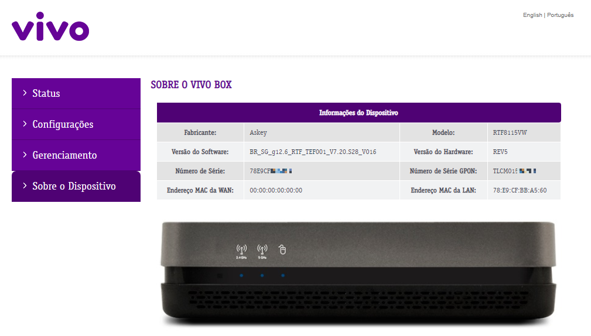
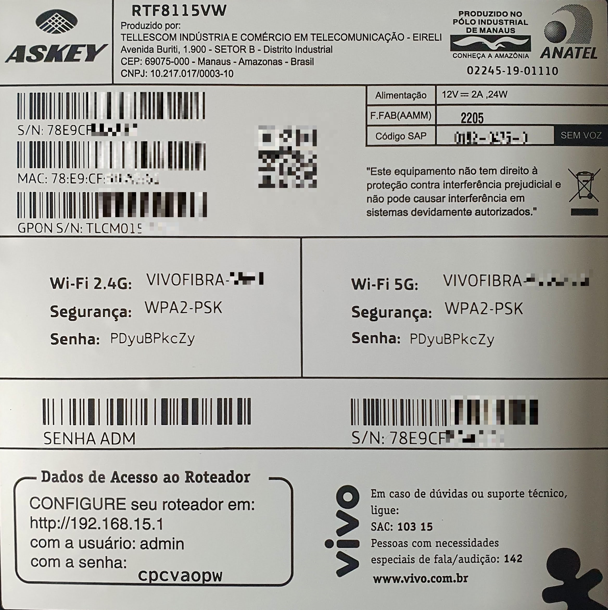
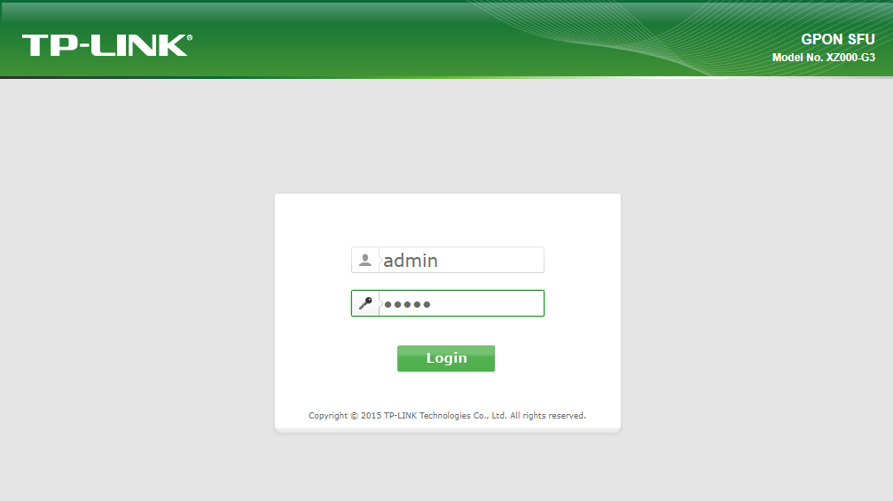
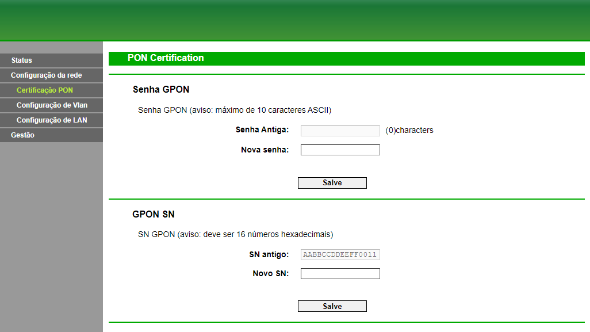
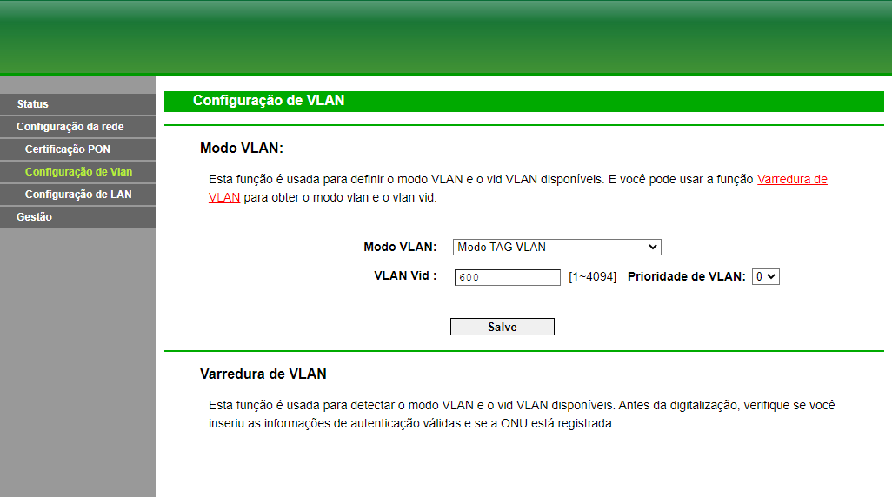
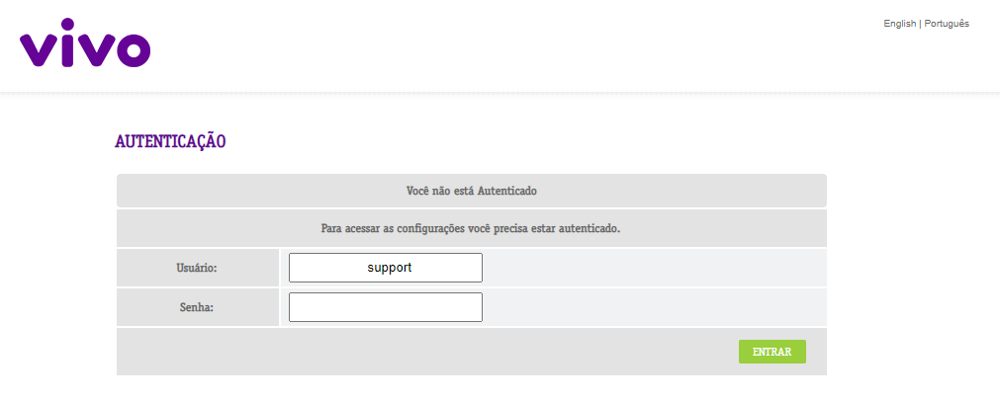
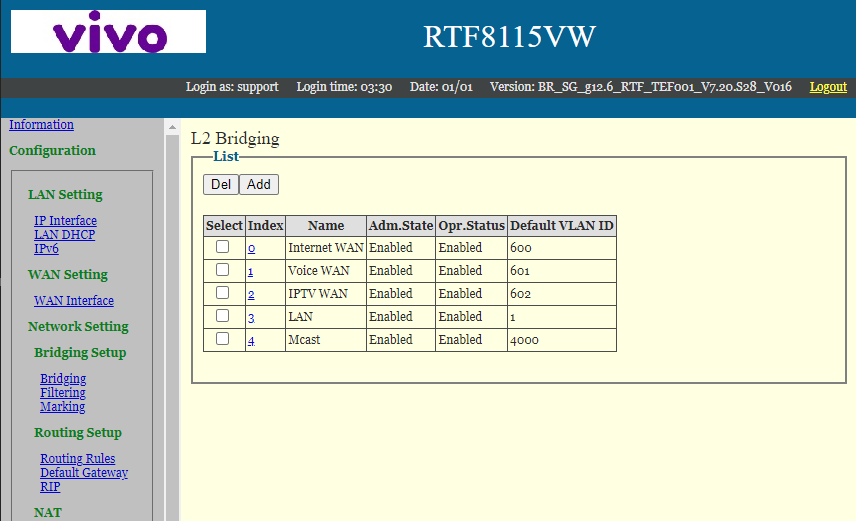
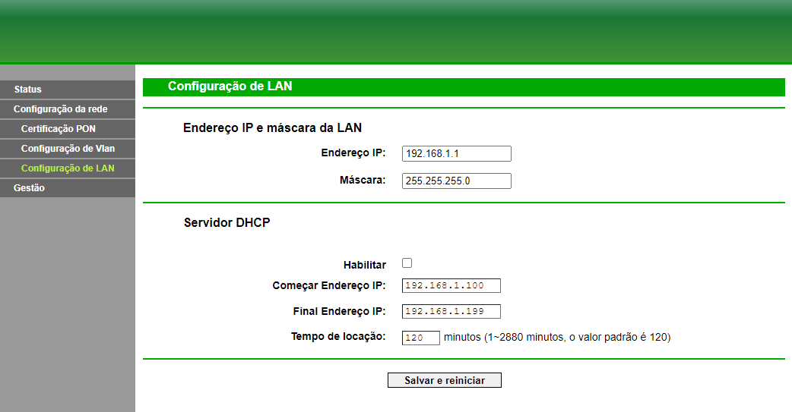
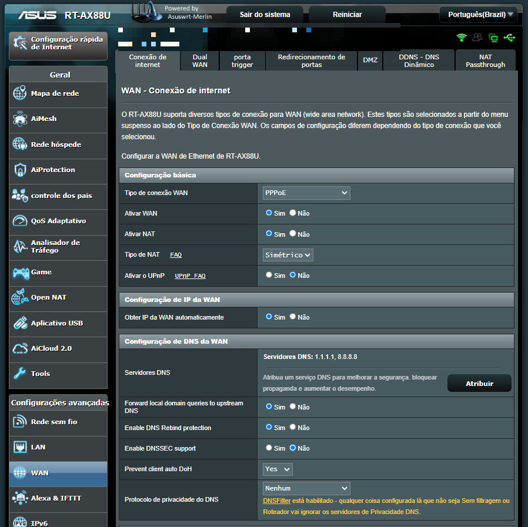
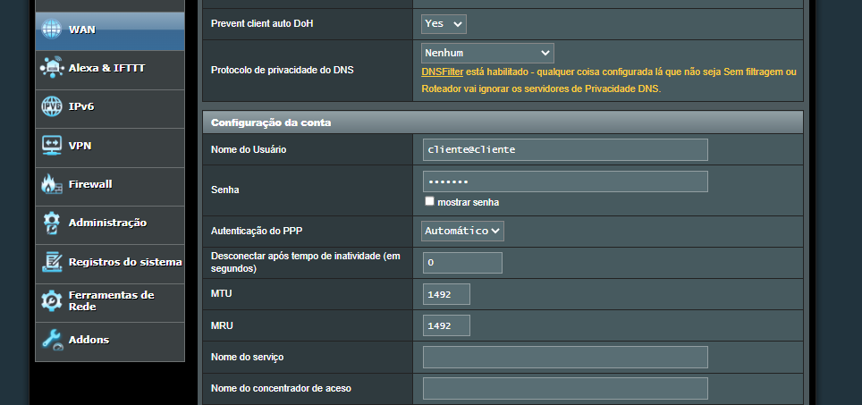

Atualmente (18/10/2022) eu utilizo a Vivo Fibra como meu provedor de internet. Estou com o plano de 300 Mbps (300 Mbps Down / 150 Mbps Up). A internet é muito boa, mas o modem que a Vivo fornece não é tão bom. 

O modelo que foi fornecido é o Askey RTF8115VW. Ele tem 4 portas LAN gigabit, 1 porta de telefone e 1 conexão para o cabo de fibra óptica. Ele tem Wi-Fi, atuando nas frequências de 2.4 GHz e 5 GHz, mas seu alcance é muito pequeno. Mas o fato que mais me incomoda é que ao reiniciar o modem, ele demora muito, cerca de 5 minutos, para ficar disponível na rede.

## Equipamentos

### Modem/ONU/GPON

Eu resolvi trocar o modem da Vivo por um próprio, comprei o [TP-LINK XZ000-G3](https://www.tp-link.com/br/service-provider/dsl-router/xz000-g3/). Ele tem 1 porta Gigabit e 1 porta de fibra óptica. É simples, mas ele liga muito mais rápido que o modem da Vivo. 

### Roteadpr Wi-Fi

Para resolver o problema do alcance do Wi-Fi, eu comprei um roteador Wi-Fi. Eu escolhi o [Asus RT-AX88U](https://www.asus.com/Networking/RT-AX88U/). Ele tem 8 portas LAN gigabit, 1 porta WAN gigabit, 2 portas USB 3.0. Ele tem Wi-Fi 6, atuando nas frequências de 2.4 GHz e 5 GHz, e seu alcance é muito maior que o do modem da Vivo.

## Configuração

Não sei dizer se a Vivo permite que você troque o modem, mas para mim deu certo (Paraná), mas pode ser que em outras regiões não seja permitido/funcione.

### Agradecimentos

As configurações abaixo foram possíveis graças ao [Rafael Mesquita](https://www.youtube.com/c/rafaelmesquitarj).

<iframe 
  width="720"
  height="480"
  src="https://www.youtube.com/embed/1ouIz32pynQ"
  title="TROCANDO MODEM DA VIVO FIBRA POR ONU TP LINK E ROTEADOR HUAWEI AX3"
  frameborder="0"
  allow="accelerometer; autoplay; clipboard-write; encrypted-media; gyroscope; picture-in-picture"
  allowfullscreen>
</iframe>

### Configuração do serial

Antes de começarmos, precisamos pegar alguns dados do movem da Vivo. Essa informação pode ser pega pela interface web do modem. Para isso, acesse o painel de controle do modem, que pode ser acessado pelo endereço `192.168.15.1` e acesse o menu `Sobre o Dispositivo`. 

Painel de controle do modem da Vivo

Nessa página precisamos pegar o número de série  GPON do modem, é um código de 12 dígitos, no meu caso é o valor `TLCM015XXXXX`.

No meu caso, essa informação também estava embaixo do modem na etiqueta, snedo o valor `GPOM S/N`.

  
Ver etiqueta

  

  
  Etiqueta do modem da Vivo

  

Com o código em mãos (`TLCM015XXXXX`), precisamos ajustar ele para que ele fique no formato correto, com 16 dígitos. Para isso, precisamos converter os primeiros 4 dígitos para hexadecimal. Para isso, podemos usar o site [hhttps://www.browserling.com/tools/text-to-hex](https://www.browserling.com/tools/text-to-hex).

No meu caso, vou converter `TLCM` para hexadecimal, nesse caso o resultado é `544C434D`. Agora precisamos adicionar os 12 dígitos restantes, que é o resto do código original, no meu caso `015XXXXX`. O resultado final é **`544C434D015XXXXX`**.

Agora precisamos acessar o painel de controle do modem TP-LINK. Para isso, acesse o endereço `192.168.1.1`, o usuário e senha padrão é `admin`.

Tela de login do modem TP-LINK

Vamos no menu `Configurações de rede` e depois em `Configuração PON`.

Configuração PON do modem TP-LINK

No campo `Novo SN`, vamos colocar o código gerado anteriormente (`544C434D015XXXXX`), e clicar em `Salve`.

### Configuração de VLan

Agora vamos configurar o VLAN, para isso vamos no menu `Configurações de rede` e depois em `Configuração de VLan`. Altere o campo `Modo VLAN` para `Modo TAG VLAN` e o `VLAN Vid` para `600`. Clique em `Salve`.

Configuração VLAN do modem TP-LINK

No modem da vivo, se você acessar o endereço `192.168.15.1/padrao`, você vai cair numa página de login, utilize o usuário `support` e a senha que está abaixo do modem. Vá no menu `Configurações de rede` e depois em `Configuração de VLAN`. Altere o campo `Modo VLAN` para `Modo TAG VLAN` e o `VLAN Vid` para `600`. Clique em `Salve`.
No meu caso o valor é `600`, mas pode ser que em outras regiões seja outro valor, mexendo no modem da Vivo, você consegue descobrir qual é o valor correto para o seu modem.

  
Ver imagens

  

  
  Tela de login do modem da Vivo

  
  Configuração de VLAN do modem da Vivo

  

### Congiguração de DHCP (opcional)

No meu caso, vou utilizar meu roteador em modo bridge, então vou configurar o DHCP do modem TP-LINK para que ele forneça um IP para o roteador. Para isso, vamos no menu `Configurações de rede` e depois em `Configuração de LAN` e desabilite o DHCP. Clique em `Salvar e reiniciar`.

Configuração VLAN do modem TP-LINK

### Asus RT-AX88U

Para finalizar, vou configurar o roteador Asus RT-AX88U em modo bridge. Para isso acesse o endereço `router.asus.com` e faça o login com o usuário e a senha que você configurou no roteador.

Em seguida vá no menu `WAN` para podermos configurar a conexão com o modem.

Configuração WAN do roteador Asus

No campo `Tipo de conexão WAN`, selecione `PPPoE` e no campo `Nome de usuário` coloque `cliente@cliente` e a senha é `cliente`. Altere o campo `MTU` e `MRU` para `1492`. Clique em `Aplicar`.

Clique em `Aplicar`.

Com essas configurações, já é para seu roteador estar acessando a internet.

## Conclusão

Após 6 meses, tudo está funcionando perfeitamente, não tive nenhum problema com a internet, nem com o roteador. A velocidade de download e upload é a mesma que eu tinha com o modem da Vivo.